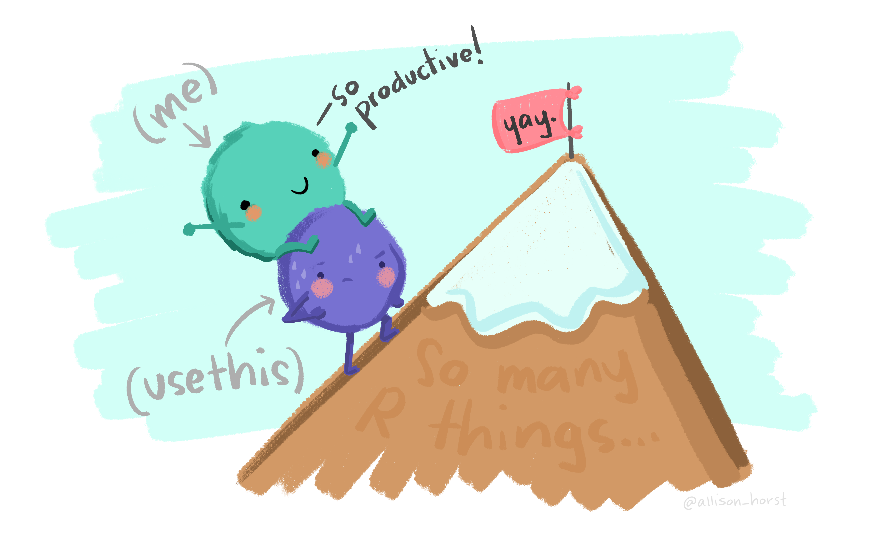

# Using R {#usingRintro}

To work through this book it is fundamental that you know your way around R. I recommend that if you do not know your way around R before hand you take some time to do so before reading the rest of the book, and this first chapter provides some resources to help.

R might seem frightening at first, but even monsters can make something look more pleasant if you look from the right angle. It is all a matter of perspective :) So I will use the help of some monsters here to convince you that this is the right thing to do!

The amazing images in this chapter are all by Allison Horst, Artwork by '@'allison_horst, and I recomend you visit Allison's github repository filled up with amazing stats and maths illustrations (https://github.com/allisonhorst/stats-illustrations), including so many amazing resources to make R look less frightening. To be honest, this chapter is actually also an homage to Allison's work.

And it is not just about stats. If you do not understand how to find the derivative of a function after looking at Artwork by @allison_horst and her amazing visualization series, just give it up, as I suspect you will never will!

Nowadays learning R by example is easy to do, with so many free online resources available to do so. 

I recomend that you do it via the RStudio environment, since it provides an integrated environment to integrate wth all R things. And there are many! And if you do so, I can guarantee that in no time you will be having funR.

The advantages of mastering R are priceless, but the learning curve can be daunting at first. 

If you want a gentle tutorial into R I have set up such a resource here:

https://github.com/TiagoAMarques/AnIntro2RTutorial

Additionally, this book is written in bookdown, and bookdown is the 4.0 version of RMarkdown, a tool that allows you to build dynamic reports based on R code, providing integrated documets that contain all that is required for a given project, from reading the data in to final results and discussion, passing through all the analysis and results. If you want a gentle introduction to RMarkdown using a hands on tutorial based on a versatile template that will do many of the things you'll need to get started, look for no more, there is also one here:

https://github.com/TiagoAMarques/RMarkdownTemplate

Actually, since this book is a bookdown book, you can easily look at it too. It is also on github:

https://github.com/TiagoAMarques/ECOMODbook

Go out and explore, litle grasshoper. You will conquer many great things if you do. You will become a code giant one day. But never forget, you need to be thankful to an entire community, and you are standing on the shoulders of giants!

