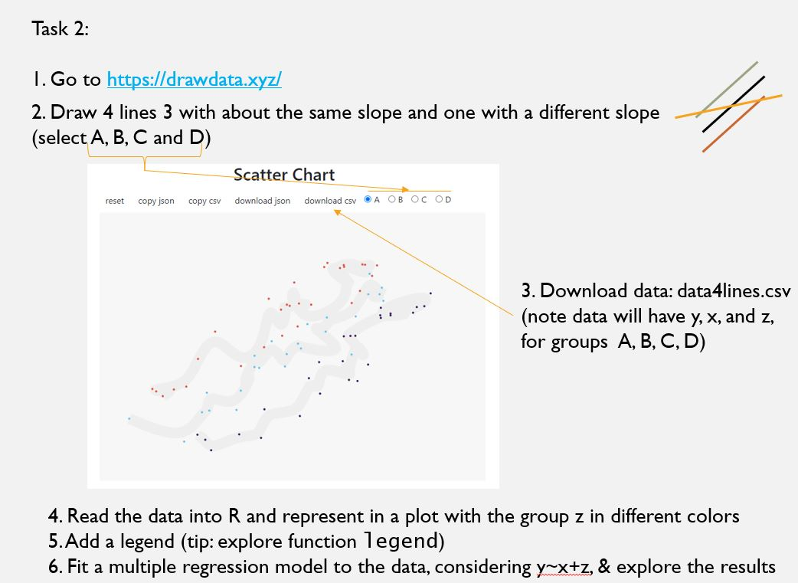
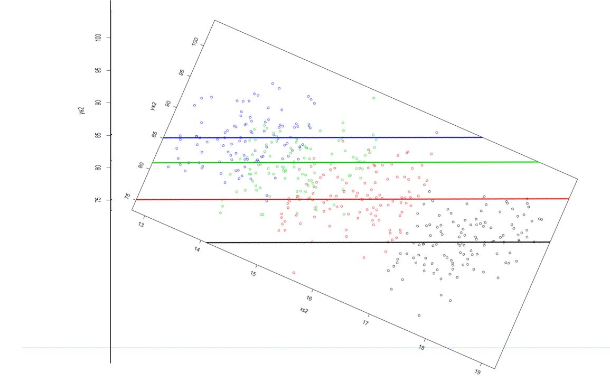

--- 
title: "Notes for Ecological Modelling"
author: "Tiago A. Marques"
date: "`r Sys.Date()`"
bibliography:
- book.bib
- packages.bib
description: This is based on Yihui Xie's a minimal example of using the bookdown package to write a book.
  The output format for this example is bookdown::gitbook.
documentclass: book
link-citations: yes
site: bookdown::bookdown_site
biblio-style: apalike
---

# Introduction

These notes were started in 2020, during the ecological modelling classes (Modelação Ecológica, ME in short) at FCUL. While it all started as just a way to teach the course, it soon became obvious that with a bit of extra effort put into it these notes might become material that would be useful to others beyond the ME students. This is being written as a bookdown project. Maybe one day it will become a book, for now, these are essentially notes I am using for my course on "Modelação Ecológica".

In particular, I have started thinking about whether this could be a book in two stages, a first part that would appeal to students in Ecologia Numérica, and a second part aimed at students from Modelação Ecológica. The former might be more focused on a traditional approach to statistics, focused on procedures and statistical tests. The second would be more about the way to think about data and how one might go about to do the best job possible regarding inferences by thinking carefully on how to model the data.

For the current version I am keeping chapters as individual lectures. Once the Ecological Modelling classes are over I might organize them into sensible chapters for a possible book on statistical models for ecological data.

Disclaimer: if you are not a student in Modelação Ecológica this material might make no sense to you in its current form.

This bookdown is hosted at:

https://bookdown.org/tiagoandremarques/ecomodbook/

<!--chapter:end:index.Rmd-->

# Preamble {#mainintro}

This is a book about Ecological Modeling. Since we are talking about a field that links Models and Ecology, we need first to think about what ecology is, and what models are. And so that is where we begin.

Ecology is the science that studies the relations between all living beings, namely how they influence each other and how they are influenced by the abiotic factors of the surrounding environment. To be able to describe those relationships there is a natural requirement to quantify the nature and strength of these relationships, and hence the need for quantitative methods becomes obvious.

Models are representations of reality. This is a fundamental aspect that one should never forget, they approximate reality, but they are not real. All models are wrong, but some are useful, is perhaps one of the most famous quotes by G.P. Box, and it is a fundamental aspect that I constantly return to, and that I tend to impose upon my students. Because unfortunately, just like artists, statisticians have the bad habit of falling in love with their models. Unlike in the celebrity world, in science there are usual worst consequences than a broken heart or an empty wallet.

Actually, as I think about this book I realize that the  "all models are wrong" is in itself wrong. There are in fact many true models, and we will use them extensively in this book. Those are the models that we simulate inside a computer. And those are perhaps some of the best models, since they are both real and extremely useful. By simulating a reality we can control all the aspects of a small world, and hence we can evaluate methods performance, we can illustrate theoretical results and we can show that things do what they say on the tin, or not!

I refer to Ecological Modeling as the art of being able to conceptualize the ecological world as a set of relations, and to be able to translate those relations into equations. Then, to be able to make these equations functions of parameters that hopefully have a meaning, and then, if lucky, to be able to obtain data that contain information about the relevant parameters of the model. To think about where in the data is information about a given aspect of a system is a crucial step. Perhaps even harder, is to perceive what are the filters that information went through, via a sampling process. And then to be able to introduce observation models to undo those filters and allow reliable inferences to be based on noisy data. Not all models do that, and most models in this book do not separate observation and process model. Those models are arguably the more useful, but you need to understand simpler models before going into those more sophisticated and hence much harder to implement models. By estimating the parameters of the models one is then able to make some informed statements, hopefully useful descriptions of the natural world, like relating the weight of a fish with the temperature of the water it lives in or the number of eggs in a nest to the nearest source of food or body of water. Beyond the scope of this book, if one is really really lucky, those models and the results they provide might then be used by others to make management decisions that will ultimately be useful to the ecosystem under study. Hopefully that will lead to a better world, and then the full circle is completed.

<!--chapter:end:00-A_Preamble.Rmd-->

# Aknowledgments

A number of colleagues have contributed with comments, upfront and foremost Susana França and Ana Sofia Reboleira, my partners in crime at FCUL, co-teachers for Modelação Ecológica and Ecologia Numérica, the courses that inspired this manuscript.

To all my students in Ecológica Numérica and Modelação Ecológica 2020/2021 which questions every time make me realize that what an ecological statistician might think is straightforward is far from it for a biologist. Without acknowledging that gap, that difference in the way brains are wired, the efforts to convey statistics to biologists are flawed from the beginning.Some students have contributed with direct input on requesting clarifications and typos: those include Diogo Raposo and Nuno Fialho.

To Dinis Pestana, the person that first made me believe that it was possible to make the biology to statistics transition.

To Russel-Alpizar Jara for the incentive to go to St Andrews, one of the epicenters of ecological statistics in the 20th century, which I might have not attempted to aim. That taught me that you should aim high, if you miss no one cares, if you get it, well, you got it. I was so fortunate to end there and to be able to be part of the fantastic family of CREEMinals. CREEM might be the best place in the world to work - I could not have wished for a better work environment. At CREEM I have been fortunate to have exposed to the minds of a set of amazing scientists and statisticians. Some deserve a special mention below.

To Steve Buckland, my PhD Supervisor at CREEM that opened to me the world of distance sampling. Steve was the best supervisor I could have asked for. Not only for the support provided, but also for all the opportunities he exposed me to during that period. Teaching in CREEM's Distance Sampling workshops during my PhD years was possibly the source of many of the great things that happened after. Point in case all the polar bear work that has been the most amazing work-life experience.

To David Borchers, the most amazing statistical brain I have ever had the pleasure to meet and work with. A generous brain that I have often picked up on, always generous with his brilliant contributions. If I could pick a brain for work, I'd pick David's!

To Eric Rexstad, with whom I was fortunate to share an office during his sabbatical at CREEM many years ago. As I was starting a PhD his constant challenges, tips and thoughts made me realize what kind of scientist I would like to become one day. Not there yet, but still trying!

To Len Thomas, an office mate at first, a colleague after, as he claims wasting my time with bad ideas during my Phd (not true!), my boss since I had a PhD and a good friend. If Carlsberg made bosses, Len would be their poster child ;) 


<!--chapter:end:00-aknowledgements.Rmd-->

# Using R {#usingRintro}

To work through this book it is fundamental that you know your way around R. I recommend that if you do not know your way around R before hand you take some time to do so before reading the rest of the book, and this first chapter provides some resources to help.

R might seem frightening at first, but even monsters can make something look more pleasant if you look from the right angle. It is all a matter of perspective :) So I will use the help of some monsters here to convince you that this is the right thing to do!

The amazing images in this chapter are all by Allison Horst, Artwork by '@'allison_horst, and I recommend you visit Allison's github repository filled up with amazing stats and maths illustrations (https://github.com/allisonhorst/stats-illustrations), including so many amazing resources to make R look less frightening. To be honest, this chapter is actually also an homage to Allison's work.


And it is not just about stats. If you do not understand how to find the derivative of a function after looking at Artwork by Allison Horst and her amazing visualization series on the topic, take it as a sign: just give it up, as I suspect you will never will!


Nowadays learning R by example is easy to do, with so many free online resources available to do so. 


I recomend that you do it via the RStudio environment, since it provides an integrated environment to integrate with all R things. And there are many! And if you do so, I can guarantee that in no time you will be having funR.


The advantages of mastering R are priceless, but the learning curve can be daunting at first. 


If you want a gentle tutorial into R I have set up such a resource here:

https://github.com/TiagoAMarques/AnIntro2RTutorial

Additionally, this book is written in bookdown, and bookdown is the 4.0 version of RMarkdown, a tool that allows you to build dynamic reports based on R code, providing integrated documents that contain all that is required for a given project, from reading the data in to final results and discussion, passing through all the analysis and results. If you want a gentle introduction to RMarkdown using a hands on tutorial based on a versatile template that will do many of the things you'll need to get started, look for no more, there is also one here:

https://github.com/TiagoAMarques/RMarkdownTemplate

Actually, since this book is a bookdown book, you can easily look at it too. It is also on github:

https://github.com/TiagoAMarques/ECOMODbook

Go out and explore, little grasshopper. You will conquer many great things if you do. You will become a code giant one day. But never forget, you need to be thankful to an entire community, and you are standing on the shoulders of giants!


<!--chapter:end:00-OnUsingR.Rmd-->

# Preliminaries {#prelim}

This book is written as a way to help biologists become more quantitative, and who knows one day ending up working primarily as ecological statisticians. In this chapter I provide a number of resources that could be used as a reading list to become an ecological statistician on your own.

These are fundamental references that I think any candidate to become an ecological statistician, even before being an ecological modeler, should know about. These are useful either for someone that develops methods to be used by practitioners, as well as for practitioners wanting to use and understand the methods. Many of these are actually useful for both sets of people.

One might prefer to read directly from the source, and in that case, the list of papers provided in section \@ref(lbtb) is a good way to do so. Warning, it will take a while to digest and read all these. In case you prefer comprehensive treatments of broad range of topics in a single source, hopefully with some ecological flavor to them, the subsequent section \@ref(ftpt) with relevant books might useful. 

## Learning by the book {#lbtb}

@Zuur2009a

@Zuur2007

@Zuur2009b

@Faraway2006

## Following the paper trail {#ftpt}


* @Hurlbert1984 introduces the concept of pseudoreplication in the context of ecological field experiments. This is an ecology classic and a fundamental paper because I suspect many of th emisconceptions around the use of statistics in ecology stem from the fact that researchers try to apply methods that were developed in a context of designed experiments but in fact most ecological studies are observational in nature. Therefore, to soem degree, there is always a degree of pseudo-replication in field observations. Understanding when we can ignore these and treat observations as independent, versus when must account for that correlation in the analysis, is a fundamental ability. Unfortunately, I would say this is much easier said than done, and the ability to do so does not come in books. It is fundamentally obtained through experience. 

* @AND2001 discuss what they refer as two fundamental aspects to consider when dealing with ecological studies. First, the need to avoid index values, or in other words, that we must account for detectability when interpreting counts of detected animals. Second, that we should  avoid at all costs convenience sampling when sampling wildlife. What you learn from sampling animals from a road in not something about the animals, but about what the animals do near roads. Understanding when the two might be, and even more important, when they might not be, the same thing, is fundamental.

* @Kass2016 present 10 principles for effective statistical analysis, and while they are all important, I think that the plea for being careful about the data (after all, garbage in. garbage out) and also for aiming to have reproducible analysis are key, often overlooked, messages for all researchers, and that includes those hoping to strive in ecological modelling.

* @King2014 reviews what is modern statitical ecology. 

* @Gimenez2014, along similar lines of @King2014, put forward the idea that ecological statistics is finally a ripe research field and describe the key topics and methods involved at the interface between ecology and statistics.

* Martinez-Abrain2007 reminds us of how many questions about whether differences exist between two populations are non-sensical. Of course there are, and the only uqestion then becoames if we manage to gather a large enough sample size to establish them statistically. Of course, that in itself migh not mean much.

* @Martinez-Abrain2008 goes on and therefore discusses a fundamental aspect that we must never forget, statistical significance does not imply biological relevance.

* @Nakagawa2007 provide an excelent review of the concepts around effect size, confidence interval and statistical significance. These represent cornerstones of statistics that must be mastered by the ecological statistician.

* @OHara2010 and why you should avoid using the log of count data (which is not the same as not using log transformations, these might be useful under many contexts)

* @Zuur2009 is a good read about startegies to avoid the most common statistical problems (this paper was a guest paper for the first issue of the Methods in ecology and Evolution journal)

* @Zuur2016 a follow up paper about what to present as outputs in a regression analysis

* @Fourcade2017 is a cautionary tale about how using variables that are unrelated to a given spatila phenomena can induce us to think that they are causing the phenomena; in fact association might be induced by spatial autocorrelation patterns present in predictors that a (too much) efficient method might pick up.

* @Steel2013 presents 18 pitfalls, and ways to avoid them, when using statistics in ecology, in other words, when doing ecological statistics.

<!--chapter:end:00-Preliminaries.Rmd-->

# About regression

Some references worth looking into.

An intro to R: [@Zuur2009a]

Models for ecological data: [@Zuur2007]

More on regression and extending the linear model (just an example): [@Faraway2006][@Zuur2009b]

## What is a regression?

Where does the word come from? Gauss and regression towards the mean.

A regression is a model that allows us to predict a response variable, often referred to as $y$ (a.k.a the dependent variable, because it depends on the other variables) as a function of the values of one or several independent variables (a.k.a. covariates, predictors or explanatory). 

While in general we are interested in modelling the mean value of a single response variable, conditional on the values of the covariates, and that is the setting we concentrate on this book, one could extend such basic regression concepts in a couple of useful ways:

1. we could model not the mean of the response but some quantile of interest, leading to quantile regression, or we could model more than just the mean, say the mean and the variance (or some other moments) of the response. For details about the former the reader can check @Cade2003, while for details about the latter the reader can explore GAMLSS models @Stasinopoulos2017. A good interface to material on such models can be found at https://www.gamlss.com/

2. we could model more than a single response variable at the same time, and there are a wide variety of examples of such models, like joint models in survival analysis, or multivariate analysis of variance (a.k.a MANOVA).

## The general linear model

A general expression for a regression model (i.e. the expression for a generalized linear model is)

$$ f[E(Y|X)] = \mu = \beta_0+\beta_1 x_1 + ... + \beta_k x_k $$
where $f$ is a function - also known as the **link function** - that links the mean value of the response, conditional on the value of the predictors, to the **linear predictor** $\beta_0+\beta_1 x_1 + ... + \beta_k x_k$ ($\mu$, a linear function of $k$ covariates). In general books tend to represent this as

$$ E(Y|X) =  f^{-1}(\beta_0+\beta_1 x_1 + ... + \beta_k x_k) $$
i.e., where what is shown is the inverse of the link function, 
and sometimes the notation ignores the formal conditioning on the values of the covariates

$$ E(Y) =  f^{-1}(\beta_0+\beta_1 x_1 + ... + \beta_k x_k) $$


Because this is a model, for any given observation we have 

$$ f{(y_i|x_i)} =  \beta_0+\beta_1 x_{1i} + ... + \beta_k x_{ki} + e_i $$

where the $e_i$ represents the residual (a.k.a. the error). 

Most people are used to see the representation when the link function is the identity and hence

$$ y_i =  \beta_0+\beta_1 x_{1i} + ... + \beta_k x_{ki} + e_i $$

The simplest form of a generalized linear model is that where there is only one predictor, the link function is the identity and the error is Gaussian (or normal). Note that is the usual simple linear regression model 

$$y_i=a+bx_i+e_i$$
with residuals

$$e_i=y_i - (a+bx_i)= y_i-\hat y_i$$

being Gaussian, i.e. $e_i$~Gau(0,$\sigma$), and where the link function is the identity (i.e. $f(E(y))=1 \times E(y)=E(y)$).


<!--chapter:end:00-Regression.Rmd-->

# Hands On Regression {#handson}

Here we come up with a story... an example about regression.

I would love to weave in an example that could also be used to illustrate Simpsons paradox, as in https://twitter.com/TivadarDanka/status/1646101110065856512

A simple regression is just the situation where we want to model a response variable as a function of a single explanatory variable. As an examples, say, the time a fish takes to react to a predator introduced in an aquarium by getting into shelter, as a function of the water temperature. Let's simulate some data that would represent this scenario, but I am not showing you the way the data was simulated just yet.

Nonetheless, let me tell you that the reaction times were created in object `react`, the temperatures in object `temp`, and these were then packed as a `data.frame` called `reaction`.

```{r reg1,echo=FALSE}
set.seed(2)
beta0<-0.8
beta1<-0.3
n<-50
noise <- 0.2
temp<-runif(n,10,20)
react<-beta0+beta1*temp+rnorm(n,sd=noise)
reaction<-data.frame(react=react,temp=temp)
write.table(reaction,file="reaction.txt")
```

The first few lines of the simulated data are shown in Table \@ref(tab:Ttab1).

```{r Ttab1, tidy=FALSE}
knitr::kable(
  head(reaction, 5), caption = 'The simulated dataset',
  booktabs = TRUE
)
```

The data is shown in figure \@ref(fig:Freg).


```{r Freg, fig.cap='An example regression data set that could be explained by a linear regression', out.width='80%', fig.asp=.75, fig.align='center'}
par(mar = c(4, 4, .1, .1))
plot(react~temp,xlab="Temperature (degrees, Celcius)",ylab="Reaction time (seconds)")
```

It seems like there is a linear relationship between the predictor (temperature) and the response (the reaction time). We could therepore model it with a simple linear regression. We can do that using R´s function `lm`. We do so here and then look at the summary of the object produced. 

The required argument for `lm` is the `formula` that defines the regression model. The symbol `~`is used to represent "as a function of". So here we will want something like "reaction time ~ water temperature".

While this might seem like a detail, it is a good policy to always fit models using explicitly the `data` argument, instead of fitting the model to objects hanging around the workspace. Learn how to be tidy!

Therefore, while the imideate result would be the same, we suggest that you do not do this

```{r reg6,eval=FALSE}
mod0<-lm(react~temp)
```

nor this

```{r reg7,eval=FALSE}
mod0<-lm(reaction$react~reaction$temp)
```

but always consider this

```{r reg8}
mod0<-lm(react~temp,data=reaction)
summary(mod0)
```

This will be easier to read for others, makes you tidy, and will save you headaches when using functions like `predict` over the resulting fitted model.

We can the estimated regression line to the above plot. I color it red to remind us of the fact that this is an estimated line, not the true line that generated the data. While in general we do not know this with real data, here I know the model that was used to simulate the data. Just for comparison I can add it to the plot to compare with the estimated regression line.


```{r reg9}
plot(react~temp,xlab="Temperature (degrees, Celcius)",ylab="Reaction time (seconds)")
abline(mod0,lty=2,col="red")
abline(beta0,beta1,lty=2,col="green")
legend("topleft",legend=c("Real model","Estimated Regression Line"),col=c("green","red"),lty=2, inset=0.05)
```

The estimated line and the true line are very similar, as expected since we have a reasonable sample size, a small error, and a model that is the reality. With real data, this will be the exception, not the rule. All models are wrong, but some are useful. The linear regression model is perhaps one of the simplest, but also one of the most widely used, and hence, one of those that has been extremely useful. But of course, its simplicity is also its major disadvantage, as we shall see.

## The assumptions are on the residuals, not the data

Imagine that you have a single variable that you are interested in modelling. This is the concentration of an enzyme in the blood of small rodents, from 4 different species. The data is created and saved as file `enzimes.txt`, but I do not show here how it is generated for dramatic effects!

This is represented in the image below \@ref(fig:figrodents).

```{r reg10,echo=FALSE}
#This is just an ANOVA, we are just not going to call it as such now!
#making sure everyone gets the same results
set.seed(12345)
#define sample size
n=2000
#define treatments
tr=c("a","b","c","d")
#how many treatments
ntr=length(tr)
#balanced design
n.by.tr=n/ntr
#generate data
type=as.factor(rep(tr,each=n.by.tr))
#if I wanted to recode the levels such that c was the baseline
#type=factor(type,levels = c("c","a","b","d"))
#get colors for plotting
cores=rep(1:ntr,each=n.by.tr)
ms=c(12,15,24,29)
#ys, not a function of the xs!!!
ys=ifelse(type=="a",ms[1],ifelse(type=="b",ms[2],ifelse(type=="c",ms[3],ms[4])))+rnorm(n,0,3)
write.table(data.frame(concentration=ys,sp=type),file="enzimes.txt")
```

```{r figrodents, fig.cap='Concentration of an enzime (mg/L) in the blood of small rodents, from 4 diffferent species', out.width='80%', fig.asp=.75, fig.align='center'}
hist(ys,breaks=0:40,xlab="Concentration of enzime (mg/L)")
```

A poor (conventional and traditional) biologist would die if shown this dataset - it looks nothing like Gaussian, what shall he do? - but the truth is there would be no reason for it. If one accounts for the different species, this is what we see. Clear differences between two groups of species. 

```{r reg11}
boxplot(ys~type,ylab="Concentration of enzime (mg/L)")
```

And further, we can see that the remaining residuals are a beautiful Gaussian. Not a surprise, since this was simulated data, from a Gaussian model :) !

```{r reg12}
hist(residuals(lm(ys~type)),main="",xlab="Residuals")
```

The take home message from the story: what the data looks like might be irrelevant. The patterns that remain in the residuals, if any, those are the ones we might need to worry about. So do not transform data just because the data looks odd. It might just be Gaussian data in disguise!


## Conditional versus marginal distribution

(I have a vague recollection I have written this somewhere else in this document before, but can't find it - if this is redundant might need to consolidate material later)

One fundamental aspect is that while the data, in other words, the distribution of the response, say $Y$, does not need to be Gaussian, the linear model assumption on the residuals implies that the distribution of the response, *conditional* on the value of the covariate(s), will be Gaussian. In other words, if we have a linear model, then

$$ y_i=\beta_0+\beta_1 X_i+e_i$$
where the $e_i$ are Gaussian with mean 0 and variance $\sigma^2_i$, then it follows that conditioning on the covariate values, i.e. given the covariate values, we know the distribution of $Y$, given by


$$Y|X=Gaussian(\beta_0+\beta_1 X,\sigma^2)$$

This highlights a different way to simulate data for a Gaussian regression


```{r reg1again}
set.seed(2)
beta0<-0.8
beta1<-0.3
n<-50
noise <- 0.2
temp<-runif(n,10,20)
react<-rnorm(n,mean=-beta0+beta1*temp,sd=noise)
reaction<-data.frame(react=react,temp=temp)
```

and you can check this leads to the exact same thing

```{r, fig.cap='An example regression data set that could be explained by a linear regression (same as above!)', out.width='80%', fig.asp=.75, fig.align='center'}
par(mar = c(4, 4, .1, .1))
plot(react~temp,xlab="Temperature (degrees, Celcius)",ylab="Reaction time (seconds)")
```

<!--chapter:end:01-HandsOnRegression.Rmd-->

# Regression inside out {#RIO}

In this section we will look at regression models from different angles. Hopefully, by the end of this section, you will have mastered the linear model and will be able to recognize that several statistical procedures with famous names (like t-tests or ANOVA) are just special cases of the linear model.

## Implementing a regression

Consider a dataset where we have the weight and lengths of lizards, and we are interested in modelling the weight as a function of the length of the available individuals. This will provide us an excuse to look at the different aspects of a linear model and the corresponding output.

The dataset is available as a text file: "lagartos.txt" . We begin by reading the data in "lagartos.txt", exploring the data and then fitting a simple regression, a linear model, to the data. Just as a detail regarding wording, which reflects what the procedure does, we fit models to data, we do not fit data to models!

We begin by reading the data in

```{r a6.1}
#folder<-"../Aula6 13 10 2020/"
folder<-"extfiles/"
lagartos <- read.csv(file=paste0(folder,"lagartos.txt"), sep="")
n <- nrow(lagartos)
```

We can see that we have observations over `r n` individuals, for which we have recorded both lengths and weights. We can plot the data, being careful to have the response variable, the weights, on the y-axis, and the explanatory variable, the lengths, on the x-axis. 


```{r a6.2}
with(lagartos,plot(peso~comp))
```

(tip begins here) 

Tip: A common "rookie" mistake is to confuse the defaul R ploting syntax, and mix the two. Note that `plot(y~x)` is equivalent to `plot(x,y)` but different from `plot(x~y)`. The latter is not what you want, ´~´ should be read as "as a function of" and so you must have the response on the left side of the tilde, but by default the first argument to the function plot is the $x$, usually by convention the explanatory variable. The next figure illustrates the differences, where I don't set the axis labels so that the consequences are transparent

```{r}
par(mfrow=c(2,2),mar=c(4,4,0.5,0.5))
with(lagartos,plot(peso~comp))
with(lagartos,plot(peso,comp))
with(lagartos,plot(comp~peso))
with(lagartos,plot(comp,peso))
```

(tip ends here) 

A linear model seems adequate to represent the weights as a function of the lengths. This is not surprising, especially since we simulated the data to be so. We fit a linear model to the data

```{r a6.3}
lmlag <- lm(peso~comp,data=lagartos)
summary(lmlag)
```

(tip begins here) 

Remember that a linear model is just a special generalized linear model (GLM):

```{r a6.4}
glmlag <- glm(peso~comp,data=lagartos,family=gaussian(link="identity"))
summary(glmlag)
```

as we can see the output looks a bit different (after all, `lm` and `glm` are different functions!), but the results are exactly the same. This does not prove it, but it illustrates by example that a linear model is just a GLM with a Gaussian response and an `identity` link function.

Lets use the results from `lm`, while noting that everything else would be the same.

(tip ends here) 

The estimated regression line is 

$$weight= a+b \times length$$
or in this case, with the estimated parameter values, 

$$ peso =`r round(summary(lmlag)$coefficients[1],2)` +`r round(summary(lmlag)$coefficients[2],2)` \times comp $$

and the estimated R-squared is  `r round(summary(lmlag)$r.squared,2)`. The standard error associated with the model is estimated to be `r round(summary(lmlag)$sigma,4)`. Below we explain in detail what each of these values correspond to, but for now bear in mind that the estimated standard error corresponds to the standard deviation of the residuals of the model, that is, the difference between the observations and the predicted values given the model. The observation we have already as data, those are the `peso`. We can obtain the predicted `peso` for each observation with the function `predict`, but here we do it manually so that we see that the errors are just the observations minus the predictions.

```{r a6.5}
#get estimated values
estimated<-with(lagartos,summary(lmlag)$coefficients[1]+summary(lmlag)$coefficients[2]*comp)
# note this would be the same as
# estimated<-predict(lmlag)
```

Now we can compute the residuals and their corresponding standard error 

```{r a6.7}
#get residuals
#erros = observações - valores previstos
# e= y- (a+bx)
# y= (a+bx) + e
resid<-lagartos$peso-estimated
sd(resid)
```

Note as `predict`, we could use just the function `residuals` with the model object as argument to get us the residuals in a single line of code.

The reason the above standard error is not exactly the same as in the model output above has to do with the degrees of freedom, a concept that is hard to explain in this applied context, but relates to the number of available independent bits of information available. So trust me when I say that we loose a degree of freedom for each parameter estimated in a model. The exact value of the standard deviation as estimated in the model must account for that loss of one extra degree of freedom (associated with estimating the slope of the line), and so the standard formula of the `sd` needs to be adjusted for the lost degree of freedom, like this:

```{r a6.8}
#Residual Standard error (Like Standard Deviation)
#the right way
#Subtract one to ignore intercept
k=length(lmlag$coefficients)-1 
#get the error sum of squares
SSE=sum(lmlag$residuals**2)
#Residual Standard Error
sqrt(SSE/(n-(1+k))) 
#equivalently
sqrt(var(resid)*(n-1)/(n-2))
```

Now we get the exact same value as above: `r round(sqrt(var(resid)*(n-1)/(n-2)),3)`.

The `summary` of the model above is very useful, but nothing like adding the estimated model to the plot with the data. We can easily add the line to the plot with function `abline`

(tip begins here) 

The `ab` in `abline` corresponds simply to the $a$ and $b$ in $y=a+bx$, but the function `abline` is "smart" enough to take other arguments than just an intercept and slope a slope as arguments. It can take

* an object of class `lm` and extract the corresponding $a$ and $b$ for plotting
* argument `v` to add vertical line(s) to an existing plot (e.g. `v=20` would add a vertical line at `x=20` to an existing plot)
* argument `h` to add horizontal line(s) to an existing plot (e.g. `h=10` would add a horizontal line at `y=10` to an existing  plot)

(tip ends here) 

```{r a6.9}
#with(lagartos,plot(peso~comp))
plot(peso~comp,data=lagartos)
#these next 3 lines are equivalent
abline(lmlag,col="orange")
abline(a=11.72234,b=1.20233,col="pink")
# y = a + bx
abline(a=summary(lmlag)$coefficients[1,1],b=summary(lmlag)$coefficients[2,1],col="brown")
```

Note the last line works because the parameter estimates are hold in a component of the `summary` of the fitted model called `coefficients`

```{r a6.10}
summary(lmlag)$coefficients
```

Additionally, we can also add the residuals in the plot (we use the very handy function `segments`, that adds segments to existing plots, to do so)

```{r a6.11}
# get estimated/predicted values with function residuals
estimated2<-predict(lmlag)
#plot the data
with(lagartos,plot(peso~comp,pch=21,bg="brown",col="green"))
abline(lmlag,col=3,lty=2)
#add residuals
with(lagartos,segments(x0 = comp,y0 = peso, x1= comp, y1=estimated,lty=2,col="red"))
```

The regression line corresponds to the line that minimizes the sum of the red distances in the plot above. That is also why it is called a minimum squares line in the special case of a Gaussian model (in PT, é a reta dos mínimos quadrados).

The residuals should, if the model is reasonable - and here that should be the case, as we are using simulated data - be well approximated by a Gaussian distribution. Note we can get the values of the residuals by the difference between the observations and the estimated values, as we did above, or just use the function `resid` over a fitted model, for simplicity. We can look at an histogram of the residuals below

```{r a6.12}
par(mfrow=c(1,2))
hist(resid,main="Residuals by hand",freq=FALSE)
#adding the theorethical density of a Gaussian with mean 0 and the
#correct standard error
lines(seq(-8,8,by=0.1),dnorm(seq(-8,8,by=0.1),mean=0,sd=summary(lmlag)$sigma))

resid2<-residuals(lmlag)
hist(resid2,main="Residuals by function residuals")

#correct standard error
lines(seq(-8,8,by=0.1),dnorm(seq(-8,8,by=0.1),mean=0,sd=summary(lmlag)$sigma))
```

It is often said that the $R^2$ represents the amount of variation in the response that the regression explains, and we are now in a position to illustrate exactly why that is the case. If you assume that all the variability in the response data, the $y_i$, as the difference between the data points and a common mean

$$\sum_{i=1}^n (y_i- \bar y)^2$$
in an image, the sum of the square of these quantities

```{r a6.14}
#plot
with(lagartos,plot(peso~comp))
abline(lmlag,col=3,lty=2)
abline(h=mean(lagartos$peso))
with(lagartos,segments(x0 = comp,y0 = peso, x1= comp, y1=mean(peso),lty=2,col=2))
```


```{r a6.15}
all.var<-sum((lagartos$peso-mean(lagartos$peso))^2)
all.var
```

and the variability that is not explained is the one that remains in the errors - for which the corresponding plot illustrating the concept geometrically was shown above, that is

$$\sum_{i=1}^n (y_i- \hat y_i)^2$$

```{r a6.16}
error.var<-sum((lagartos$peso-estimated)^2)
error.var
```

then the ratio of those two quantities is what is not explained by the regression model, and therefore, 1 minus that is what explained by the regression model:

```{r a6.17}
1-error.var/all.var
```

And that... as noted above... is the $R^2$=`r round(summary(lmlag)$r.squared,4)`. This comes from the fact that all of the variability in the data (the $y$, the response, here the `peso`) can be decomposed into the variability explained by the model, and the unexplained variability, that of the errors. In a formula

$$SS_{TOTAL}=SS_{REGRESSÃO}+SS_{ERRO}$$

Note naturally we could also represent in an image what is explained by the regression model, which is

$$\sum_{i=1}^n (\hat y_i- \bar y)^2$$

```{r a6.18}
#plot
with(lagartos,plot(peso~comp))
abline(lmlag,col=3,lty=2)
abline(h=mean(lagartos$peso))
with(lagartos,segments(x0 = comp,y0 = estimated, x1= comp, y1=mean(peso),lty=2,col=2))
```

and that naturally is obtained as

```{r a6.19}
reg.var<-sum((mean(lagartos$peso)-estimated)^2)
reg.var
```

and hence the total variability is given by the sum $SS_{REGRESSÃO}+SS_{ERRO}$

```{r a6.20}
reg.var+error.var
```

which we had already established to be the total variability in the response

```{r}
all.var
```

So, remember that 

$$SS_{TOTAL}=SS_{REGRESSÃO}+SS_{ERRO}$$

This is something that is often stated without a clear explanation of the reason why that holds. While here I show it by example, it could be easily demonstrated algebraically if one wanted that

$$\sum_{i=1}^n (y_i- \bar y)^2=\sum_{i=1}^n (\hat y_i- \bar y)^2 + \sum_{i=1}^n (y_i- \hat y_i)^2$$

If you want to see that that, this 28 minute video shows you the proof: https://www.youtube.com/watch?v=aQ32qTjqqJM

I think it could take just 5 minutes ;) but many thanks to Dmitry Leiderman for having it out there! He does it in the context of ANOVA, but ANOVA is just a special case of regression, were you have a continuous response and a single categorical explanatory variable. Therefore, have fun!

## Simulating regression data

Considering the above example, it should be possible for you to simulate similar data to that we had for the lizards, data assuming that the true relation between the weight and length of a lizard was given by

$$ peso = 12 + 1.2 * comp $$

Note that this is a luxury we never have as researchers dealing with real data, knowing what truth is. But creating data from know truth scenarios via simulation can be invaluanble, as it allows us to explore the preformance of methods wehn we know what we should expect from them. 

Here we consider that the usual length of a lizard can be between 5 and 20 cm, and the standard error is 4. As in the data we will have 97 lizards.

Then you were told to create the lengths:

```{r a6.21}
set.seed(121)
n=97
#lengths
xs=runif(n,5,20)
hist(xs,main="Lenths (cm)")
```

and then to create weights of lizards

```{r a6.22}
a=12
b=1.2
ys=a+b*xs
```

If we plot the data, all points are in a single line. Why? Because there is no randomness. Given the length of a lizard, we know the weight for sure.

```{r a6.23}
plot(xs,ys)
```

This means that if you try to run a model, it gives you a warning that the model might be unreliable

```{r a6.24}
summary(lm(ys~xs))
```

reflecting that unlike what the model assumes, there would be no stochasticity in the data.

(tip begins here)

The data stochasticity, or variability,  might be induced by process error, i.e. the model might not be perfect, hence not being deterministic as is always the case in nature, but also induced by observation error, e.g. because there is a random error in the measurement of the weights. In practice with a linear model we do not try to separate the two sources of errors, but in more advanced models that might be of interest in itself. 

(tip ends here)

Therefore, we make the data realistic, and adhering to the model, by adding some variability to the data, in particular we assume the variability can be represented by Gaussian errors with mean zero and standard deviation of 4 units. Then we plot the data:

```{r a6.25}
ys=a+b*xs+rnorm(n,0,4)
plot(xs,ys)
```

we can now fit a linear model to the data, whic we call `lmSimL` and explore the results

```{r}
SimL<-data.frame(ys,xs)
lmSimL<-lm(ys~xs,data=SimL)
summary(lmSimL)
```

We can extract from the model the relevant estimated quantities:

* the intercept is estimated to be `r coef(lmSimL)[1]` (using `coef(lmSimL)[1]`),
* the slope is estimated to be `r coef(lmSimL)[2]` (using `coef(lmSimL)[2]`),
* the residual error to be `r summary(lmSimL)$sigma` (using `summary(lmSimL)$sigma`), and
* the $R^2$ to be `r summary(lmSimL)$r.squared` (using `summary(lmSimL)$r.squared`).

All the parameters were suitably estimated, not surprising since the amount of error was moderate, reflecting that the `xs` have a good explanatory power over the `ys`.

Using the code above, experiment with changing the standard deviation of the error, and see what happens to the estimated $R^2$, to the parameter estimates, to the estimated error, and to how close the estimated regression model is to the true model.

This is the amazing advantage of a simulation, which we do not have in real data: we know what reality is, and a true model exists!. This will give you a good feeling for what a regression model is and what is does, and what it can't do. An example of what it can't give you is reliable estimates when the error is large compared to the systematic part of the model, as illustrated next

```{r a6.26}
n <- 97
#simular comprimentos
comp.sim <- runif(n,5,20)
a<-12
b<-1.2
#simular pesos
peso.sim<-a+b*comp.sim+rnorm(n,mean=0,sd=2)
data.sim=data.frame(csim=comp.sim,psim=peso.sim)
plot(psim~csim,data=data.sim)
mod.sim<-lm(psim~csim,data=data.sim)
abline(mod.sim,col="red")
summary(mod.sim)
abline(a,b,col="green")
legend("topleft",legend=c("Estimated line","True model"),col=c("red","green"),lty=1,inset=0.05)
```

### What is the effect of increasing the error: a simulation experiment

Now, let's consider there's more and less variance. We also add to each plot the real line (that with the true parameter values) and the one with the estimated parameter values.

```{r a6.27}
par(mfrow=c(2,3))
ys=a+b*xs+rnorm(n,0,1)
plot(xs,ys)
mod1=lm(ys~xs)
abline(mod1,col="red")
abline(a,b,col="green")
ys=a+b*xs+rnorm(n,0,2)
plot(xs,ys)
mod2=lm(ys~xs)
abline(mod2,col="red")
abline(a,b,col="green")
ys=a+b*xs+rnorm(n,0,4)
plot(xs,ys)
mod4=lm(ys~xs)
abline(mod4,col="red")
abline(a,b,col="green")
ys=a+b*xs+rnorm(n,0,10)
plot(xs,ys)
mod10=lm(ys~xs)
abline(mod10,col="red")
abline(a,b,col="green")
ys=a+b*xs+rnorm(n,0,20)
plot(xs,ys)
mod20=lm(ys~xs)
abline(mod20,col="red")
abline(a,b,col="green")
ys=a+b*xs+rnorm(n,0,100)
plot(xs,ys)
mod100=lm(ys~xs)
abline(mod100,col="red")
abline(a,b,col="green")
```

Not surprisingly, as the variance increases, we get data that more and more looks like it is not coming from a real linear process.

You can also look at the model summaries, and there you can see that, in fact, the models become essentially useless as the variance increases! You can see that both from the correlation, but also by the predictions generated from the model (comparing to the truth), and also the significance of the coefficients associated with the regression parameters.

Make no mistake, the reality is always the same, in terms of the fixed part of the model, it is just the variance that we observe reality with that increases. This could happen either because the model is not adequate (e.g. there are other variables than just length that explain the weight) but also because the measurement error in the weights might be larger (e.g. think about measuring the weight of whales, instead that of lizards, say).

Also, do not get confused, the different green lines might look different, but they are always exactly the same line, the same true model is constant across all plots! You can check that by forcing the y axis to span the same limits.


```{r a6.28}
par(mfrow=c(2,3))
ys=a+b*xs+rnorm(n,0,1)
plot(xs,ys,ylim=c(-400,400))
mod1=lm(ys~xs)
abline(mod1,col="red")
abline(a,b,col="green")
ys=a+b*xs+rnorm(n,0,2)
plot(xs,ys,ylim=c(-400,400))
mod2=lm(ys~xs)
abline(mod2,col="red")
abline(a,b,col="green")
ys=a+b*xs+rnorm(n,0,4)
plot(xs,ys,ylim=c(-400,400))
mod4=lm(ys~xs)
abline(mod4,col="red")
abline(a,b,col="green")
ys=a+b*xs+rnorm(n,0,10)
plot(xs,ys,ylim=c(-400,400))
mod10=lm(ys~xs)
abline(mod10,col="red")
abline(a,b,col="green")
ys=a+b*xs+rnorm(n,0,20)
plot(xs,ys,ylim=c(-400,400))
mod20=lm(ys~xs)
abline(mod20,col="red")
abline(a,b,col="green")
ys=a+b*xs+rnorm(n,0,100)
plot(xs,ys,ylim=c(-400,400))
mod100=lm(ys~xs)
abline(mod100,col="red")
abline(a,b,col="green")
```

but since then you loose all the ability to look at the actual data in some of the plots, that representation is not really that useful!

Below we tabulate the summary statistics for of each model with increasing variance, focusing on the estimated values for the parameters, their corresponding variances and the $R^2$.

```{r a6.29}
library(knitr)
model.stats<-data.frame(error=c(1,2,4,10,20,100),intercept=NA,ise=NA,slope=NA,sse=NA,sde=NA,R2=NA)
model.stats[1,2:7]<-c(coef(summary(mod1))[1,1:2],coef(summary(mod1))[2,1:2],summary(mod1)$sigma,summary(mod1)$r.squared)
model.stats[2,2:7]<-c(coef(summary(mod2))[1,1:2],coef(summary(mod2))[2,1:2],summary(mod2)$sigma,summary(mod2)$r.squared)
model.stats[3,2:7]<-c(coef(summary(mod4))[1,1:2],coef(summary(mod4))[2,1:2],summary(mod1)$sigma,summary(mod4)$r.squared)
model.stats[4,2:7]<-c(coef(summary(mod10))[1,1:2],coef(summary(mod10))[2,1:2],summary(mod1)$sigma,summary(mod10)$r.squared)
model.stats[5,2:7]<-c(coef(summary(mod20))[1,1:2],coef(summary(mod20))[2,1:2],summary(mod1)$sigma,summary(mod20)$r.squared)
model.stats[6,2:7]<-c(coef(summary(mod100))[1,1:2],coef(summary(mod100))[2,1:2],summary(mod1)$sigma,summary(mod100)$r.squared)
kable(model.stats,digits=2)
```

As an example, we can plot the $R^2$ as a function of the variance

```{r a6.30}
plot(c(1,2,4,10,20,100),c(summary(mod1)$r.squared,summary(mod2)$r.squared,summary(mod4)$r.squared,summary(mod10)$r.squared,summary(mod20)$r.squared,summary(mod100)$r.squared),xlab="R^2",ylab="Standard deviation of the error")
```

That is quite interesting actually. There seems to be a nonlinear relationship, but we only have a sample size of six different standard deviations, i.e., variances, as variance is standard deviation squared, so it is hard to tell. But we can bring in the power of a `for` loop to do this for us for many values of the errors. We can then plot the results:


```{r a6.31}
sds=seq(0.5,100,by=0.5)
nsds=length(sds)
#an object to hold the correlations
Rsqs=numeric(nsds)
for (i in 1:nsds){
  #create data
  ys=a+b*xs+rnorm(n,0,sds[i])
  #estimate model
  modi=lm(ys~xs)
  #get R-squared
  Rsqs[i]=summary(modi)$r.squared
}
#and at the end... plot results
plot(sds,Rsqs)
```

How cool is that! There seems to be evidence of a clear pattern, as anticipated. There is noise in the relation, and that comes because at each iteration there is randomness in the simulated data. Can you think of a way to reduce the noise in the pattern shown? If so, do it yourself!

This means we can model the $R^2$ as a function of the original variance! But we would not be able to model it using a linear model. While you are supposed to know about this yet, generalized linear models, which can be implemented with the help of function `gam` in package `mgcv` can come to our help. Later on we will earn more about GAM's, but for now you can take a look at Noam Ross's outstanding online free course on them (https://noamross.github.io/gams-in-r-course/) if you can't wait for it. 

Here I will just use it as is, you might see the syntax is quite similar to that of the `lm` function, we simply add syntax to reflect that we have non-linear, smooth terms of covariates (say e.g. `s(x)`).

```{r a6.32}
library(mgcv)
gam1=gam(Rsqs~s(sds),link=log)
#make predictions to plot the estimated GAM model
predRsqs=predict.gam(gam1,newdata = list(sds=sds),type="response")
plot(sds,Rsqs)
lines(sds,predRsqs,col="red")
```

While we have not yet talked about it, intuitively it seems like the model over-fitted to the data. In other words, the model is too much flexible. Therefore, I constrain the GAM to be not as wiggly (while it might sound like a funny made-up word, the "wiggliness" of a GAM is a technical term used even in publications) by changing the argument `k` which defines the degrees of freedom in the smooth term.

```{r a6.33}
library(mgcv)
gam1=gam(Rsqs~s(sds,k=3),link=log)
#make predictions to plot the estimated GAM model
predRsqs=predict.gam(gam1,newdata = list(sds=sds),type="response")
plot(sds,Rsqs)
lines(sds,predRsqs,col="red")
```

That was too much constraining, so now we are under-fitting, the model in not flexible enough to fit the data. We increase the allowed level of wiggliness again

```{r a6.34}
library(mgcv)
gam1=gam(Rsqs~s(sds,k=6),link=log)
#make predictions to plot the estimated GAM model
predRsqs=predict.gam(gam1,newdata = list(sds=sds),type="response")
plot(sds,Rsqs)
lines(sds,predRsqs,col="red")
```

but that is already over-fitting... conclusion, the GAM might not be the right tool here :) Perhaps we could consider a model that embeds some understanding about the process between the two quantities, which is presumably possible to achieve by exploring analytically what said relation should be. 

Being happy with the visual illustration of the relation and the preview of how the use of a more flexible approach than a linear model might be useful to fit models to data, we will leave that implementation for readers which might find it an interesting (but quite likely to be found non-trivial) exercise.

## Two tasks to further understand regression

In this section we continue exploring regression models, but we are going to increase their complexity. We are no longer just thinking about the simple linear model `a+bx`, but we add more explanatory variables. In particular, we will also add a factor covariate. And then we look under the hood to understand what that means in practice and how to interpret the regression coefficients.

We do this based on a couple of tasks. Implementing the tasks allows the students to see hands on what is behind the regression model.

### Task 1

The first task the students were faced was to use some code to explore, by simulation, the impact of having variables in the model that are not relevant to explain the response. In particular, we wanted to identify when there would be no errors, or when there would be type I (a variable not relevant to explain the response is found relevant) and type II (a relevant variable to explain the response is not considered relevant) errors. 

For the sake of this example we consider a significance level of 5%, but remember there is nothing sacred about $\alpha=0.05$. The significance level should be chosen by a researcher given proper consideration of the implications of a type I error in the considered setting.

The guidelines provided were: "Using the code below, and while changing the `seed` (`******` to begin with, so the code does not run as is!), explore how changing the parameters and the error leads to different amounts of type I and type II errors."

```{r a7.1,eval=FALSE}
# xs1 and xs2 wrong - type II error, xs3 and xs4 ok
seed<-******
set.seed(seed)
#define parameters
n<-50;b0<-5;b1<-3;b2<--2;error <- 4
#simulate potential explanatory variables
xs1=runif(n,10,20)
xs2=runif(n,10,20)
xs3=runif(n,10,20)
xs4=runif(n,10,20)
#simulate response
ys=b0+b1*xs1-b2*xs2+rnorm(n,sd=error)
#plot data
plot(xs1,ys)
#a model missing a variable, xs2
#summary(lm(ys~xs1))
#the true model
#summary(lm(ys~xs1+xs2))
#a model including irrelevant variables
summary(lm(ys~xs1+xs2+xs3+xs4))
```

The first thing to notice is that the model we simulate from only includes `xs1` and `xs2`. So, `xs3` and `xs4` do not have any impact on the response `y`. In other words, if we find that `xs3` and/or `xs4` are relevant to explain the response we have a type I error, as we have identified an effect where there was none. On the other hand, if we do not find `xs1` and `xs2` to be relevant to explain the response, we have a type II error, as we failed to identify a real effect.

So we try different values for the seed and check what happens. Let's just try `seed<-1`


```{r a7.2,eval=FALSE}
seed<-1
set.seed(seed)
#define parameters
n<-50;b0<-5;b1<-3;b2<--2;error <- 4
#simulate potential explanatory variables
xs1=runif(n,10,20)
xs2=runif(n,10,20)
xs3=runif(n,10,20)
xs4=runif(n,10,20)
#simulate response
ys=b0+b1*xs1-b2*xs2+rnorm(n,sd=error)
#plot data
plot(xs1,ys)
#look at model summary
summary(lm(ys~xs1+xs2+xs3+xs4))
```

All good, no errors. That is, `xs1` and `xs2` are considered statistically significant at th 5% level and `xs3` and `xs4` are not found relevant to explain the response. Now, we keep changing `seed`


```{r a7.3,eval=FALSE}
seed<-4
set.seed(seed)
#define parameters
n<-50;b0<-5;b1<-3;b2<--2;error <- 4
#simulate potential explanatory variables
xs1=runif(n,10,20)
xs2=runif(n,10,20)
xs3=runif(n,10,20)
xs4=runif(n,10,20)
#simulate response
ys=b0+b1*xs1-b2*xs2+rnorm(n,sd=error)
#plot data
plot(xs1,ys)
#look at model summary
summary(lm(ys~xs1+xs2+xs3+xs4))
```

We find our first type I error, `xs4` is found statistically significant, but we know it has no effect on the response. The same happens with `seed` being e.g. 9, 10. When we try `seed <- 11` we get another type I error, this time on `xs4` 

```{r a7.4}
seed<-11
set.seed(seed)
#define parameters
n<-50;b0<-5;b1<-3;b2<--2;error <- 4
#simulate potential explanatory variables
xs1=runif(n,10,20)
xs2=runif(n,10,20)
xs3=runif(n,10,20)
xs4=runif(n,10,20)
#simulate response
ys=b0+b1*xs1-b2*xs2+rnorm(n,sd=error)
#plot data
plot(xs1,ys)
#look at model summary
summary(lm(ys~xs1+xs2+xs3+xs4))
```

However, even after several runs, we never make a type II error. That must mean this setting has a large power, i.e. the ability to detect a true effect when one exists. Well, there are many ways to decrease power, like having a smaller sample size, increase the error or lower the true effect. Let's try to increase the error, instead of the 4 used above, let's pump it up10 fold to 40

```{r a7.5}
seed<-100
set.seed(seed)
#define parameters
n<-50;b0<-5;b1<-3;b2<--2;error <- 40
#simulate potential explanatory variables
xs1=runif(n,10,20)
xs2=runif(n,10,20)
xs3=runif(n,10,20)
xs4=runif(n,10,20)
#simulate response
ys=b0+b1*xs1-b2*xs2+rnorm(n,sd=error)
#plot data
plot(xs1,ys)
#look at model summary
summary(lm(ys~xs1+xs2+xs3+xs4))
```

That was an overkill, now there is so much noise must seeds we use do not allow us to find an effect, let's cut that in half to 20

```{r a7.6}
seed<-100
set.seed(seed)
#define parameters
n<-50;b0<-5;b1<-3;b2<--2;error <- 20
#simulate potential explanatory variables
xs1=runif(n,10,20)
xs2=runif(n,10,20)
xs3=runif(n,10,20)
xs4=runif(n,10,20)
#simulate response
ys=b0+b1*xs1-b2*xs2+rnorm(n,sd=error)
#plot data
plot(xs1,ys)
#look at model summary
summary(lm(ys~xs1+xs2+xs3+xs4))
```

back to all correct. Now, let's change seed again

```{r a7.7}
seed<-103
set.seed(seed)
#define parameters
n<-50;b0<-5;b1<-3;b2<--2;error <- 20
#simulate potential explanatory variables
xs1=runif(n,10,20)
xs2=runif(n,10,20)
xs3=runif(n,10,20)
xs4=runif(n,10,20)
#simulate response
ys=b0+b1*xs1-b2*xs2+rnorm(n,sd=error)
#plot data
plot(xs1,ys)
#look at model summary
summary(lm(ys~xs1+xs2+xs3+xs4))
```

Bang on, a type II error, as `xs2` is no longer considered statistically significant. I am sure you can now play with the relevant model parameters, `b1`, `b2`, to incleare and decreese the actual effect, and with sample size `n` or as above with the `error` and explore the consequences of changing the balance in effect size, error and sample size on the ability of incurring in errors when doing regression. But remmeber the key, the reason we are able to see if an error is made or not is because we simulated reality. In this case, as it is never the case in an ecological dataset, we know the true model, which was

$$y=\beta_0+\beta_1 xs_1+\beta_2 xs2$$

That is the luxury of simulation, allowing you to test scenarios where "reality" is known, hence evaluating methods performance. 

```{r a7.8}
folder<-"extfiles/"
#folder<-"../Aula7 14 10 2020/"
d4l <- read.csv(file=paste0(folder,"data4lines.csv"))
n <- nrow(d4l)
```


### Task 2

The second task the students were faced was to create some regression data and the explore fitting models to it. 



The data was simulated via this website: https://drawdata.xyz/ and was named `data4lines.csv`. Each student had its own dataset, here I work with my example.

We begin by reading the data in and plot it

```{r a7.9}
#read the data
folder<-"extfiles/"
data4lines <- read.csv(file=paste0(folder,"data4lines.csv"))
#plot all the data
plot(y~x,data=data4lines)
```

Now, to turn this a bit more interesting, we come up with a narrative. 

These correspond to observations from weights and lengths of a sample of animals, fish from the species *Fishus inventadicus*. We could fit a regression line to this data and see if we can predict weight from length

```{r a7.10}
#plot all the data
plot(y~x,data=data4lines)
#fit model to pooled data
lmlinesG<-lm(y~x,data=data4lines)
abline(lmlinesG,lwd=3,lty=2)
summary(lmlinesG)
```

and it looks like we can indeed predict the weight of the species from its length. The length is highly statistically significant. Not surprisingly, the longer the fish the heavier it is.

Now, the plot thickens. These animals actually came from 4 different museums, and are assumed to be the same species. However, a scientist decides to look at whether there are differences in the data from the 4 museums. So he colors the data by museum

```{r a7.11}
#plot all the data
plot(y~x,col=as.numeric(as.factor(z)),data=data4lines,pch=1)
legend("topleft",inset=0.05,legend=letters[1:4],col=1:4,pch=1)
```

We see a pattern in the data, the data from the different museums tend to cluster. He decides to investigate. Note folks providing names to museum in this country are a bit boring, and the museums are called "a", "b", "c" and "d".


Our smart researcher says: "well, it seems like the relationship might be different in each museum". Then, maybe I should fit a model that includes museum as a covariate `weight~length+museum`. 

$$y=\beta_0+\beta_1 \times length +\beta_2 \times museum$$


And so he does and plots it

```{r a7.12}
#fit model per group
lmlines<-lm(y~x+z,data=data4lines)
summary(lmlines)
```

The output shows that the length is relevant, but the museum is relevant too. The relationship might be different per museum! In the output we see the `x`, the length, but not the `z`, it has been transformed into `zb`, `zc` and `zd`. Why is that? That is a mystery that we shall unfold now!

While the model we are fitting might be represented by `weight~length+museum`, the design matrix being fitted replaces the `museum` (a factor with 4 levels) with 3 dummy variables (a factor with k levels required k-1 dummy variables). So the real model being fitted is really

$$y=\beta_0+\beta_1 \times length + \beta_{2b} \times zb + \beta_{2c} \times zc + \beta_{2d} \times zd$$

Wait, but where is the level `a`? It is in the intercept, and if I had an euro for each time that confused a student, I would not be here but in a beach in the Bahamas having a piña colada :)

But let's unfold the mistery, shall we? By default, R takes 1 level of (each/a) factor and uses it as the intercept. Here it used `a` (the choice is in this case by alphabetical ored, but one can change that, which might be useful if e.g. you want to have as the intercept a control level, say; look e.g. into function `factor` help to see how you can change the baseline `level` of a factor).

Hence, the intercept for museum `a` is `r lmlines$coefficients[1]`. What about the intercep of the othe rmuseums? They are always reported with `a` as the reference. Look at the equation above, what happens when say zc is 1 and zd and zb are 0, it becomes 

$$y=\beta_0+\beta_1 \times length + \beta_{2c} \times zc $$
$$y=(\beta_0+\beta_{2c})+\beta_1 \times length = intercep + slope \times length$$

and so, from the above output, that equates to `y=lmlines$coefficients[1]+lmlines$coefficients[4],lmlines$coefficients[2]` or `r lmlines$coefficients[1]+lmlines$coefficients[4]`+`r lmlines$coefficients[2]` $\times$ `length`.

So now we can add all these estimated regression lines to the plot

```{r a7.13}
#plot all
plot(y~x,col=as.numeric(as.factor(z)),data=data4lines)
legend("topleft",inset=0.05,legend=c(LETTERS[1:4],"all"),col=c(1:4,1),lty=c(rep(1,4),2),lwd=c(rep(1,4),3))
#these are the wrong lines... why?
abline(lmlinesG,lwd=3,lty=2)
abline(lmlines$coefficients[1],lmlines$coefficients[2],col=1)
abline(lmlines$coefficients[1]+lmlines$coefficients[3],lmlines$coefficients[2],col=2)
abline(lmlines$coefficients[1]+lmlines$coefficients[4],lmlines$coefficients[2],col=3)
abline(lmlines$coefficients[1]+lmlines$coefficients[5],lmlines$coefficients[2],col=4)
```

note that, not surprisingly, all these lines have the same slope. Or in other words, the model we considered assumes that the slope of the model is the same across museums (which, remember, we know if not true!). We can easily check that the intercepts (i.e. where the lines cross when length=x=0) of all lines are indeed easy to get from the model's output

```{r a7.14}

#plot all
plot(y~x,xlim=c(-10,700),ylim=c(0,450),col=as.numeric(as.factor(z)),data=data4lines)
legend("topleft",inset=0.05,legend=c(LETTERS[1:4],"all"),col=c(1:4,1),lty=c(rep(1,4),2),lwd=c(rep(1,4),3))
#these are the wrong lines... why?
abline(lmlinesG,lwd=3,lty=2)
abline(lmlines$coefficients[1],lmlines$coefficients[2],col=1)
abline(lmlines$coefficients[1]+lmlines$coefficients[3],lmlines$coefficients[2],col=2)
abline(lmlines$coefficients[1]+lmlines$coefficients[4],lmlines$coefficients[2],col=3)
abline(lmlines$coefficients[1]+lmlines$coefficients[5],lmlines$coefficients[2],col=4)


abline(v=0,lty=2)
abline(h=45.51813,lty=2,col=1)
abline(h=45.51813+54.92376,lty=2,col=2)
abline(h=45.51813+128.20339,lty=2,col=3)
abline(h=45.51813+22.82412,lty=2,col=4)
```

Now, the smart biologist then says that he could also fit a separate line to each museum's data. And so he does, and that looks like this:

```{r a7.15}
#plot all the data
plot(y~x,col=as.numeric(as.factor(z)),data=data4lines,pch=1)
#completely independet regression lines
abline(lm(y~x,data=data4lines[data4lines$z=="a",]),col=1,lty=4)
abline(lm(y~x,data=data4lines[data4lines$z=="b",]),col=2,lty=4)
abline(lm(y~x,data=data4lines[data4lines$z=="c",]),col=3,lty=4)
abline(lm(y~x,data=data4lines[data4lines$z=="d",]),col=4,lty=4)
legend("topleft",inset=0.05,legend=letters[1:4],col=1:4,pch=1)
```

Naturally, now the lines do not have the same slope, and we can compare all these in a single plot. This plot is really messy, as it includes the pooled regression (the thick black line), the regressions fitted to independent data sets, one for each museum (the solid lines), and the regressions resulting from the model with museum as a factor covariate (dotted-dashed lines).

```{r a7.16}
#plot all the data
plot(y~x,col=as.numeric(as.factor(z)),data=data4lines,pch=1)
#completely independet regression lines
abline(lm(y~x,data=data4lines[data4lines$z=="a",]),col=1,lty=4)
abline(lm(y~x,data=data4lines[data4lines$z=="b",]),col=2,lty=4)
abline(lm(y~x,data=data4lines[data4lines$z=="c",]),col=3,lty=4)
abline(lm(y~x,data=data4lines[data4lines$z=="d",]),col=4,lty=4)
#these are the wrong lines... why?
abline(lmlinesG,lwd=3,lty=2)
abline(lmlines$coefficients[1],lmlines$coefficients[2],col=1)
abline(lmlines$coefficients[1]+lmlines$coefficients[3],lmlines$coefficients[2],col=2)
abline(lmlines$coefficients[1]+lmlines$coefficients[4],lmlines$coefficients[2],col=3)
abline(lmlines$coefficients[1]+lmlines$coefficients[5],lmlines$coefficients[2],col=4)
```

But what is the best model to describe the data? That is a mystery that will remain to unfold. For that we will need and additional complication in a regression model: interactions.

But note one thing to begin with. The pooled model uses just 2 parameters, one slope and one intercept. The independent lines use 8 parameters, 4 slopes and 4 intercepts, one line for each museum. And the single model with `length` and `museum` uses 5 parameters, the intercept, the slope for `length`, and 3 parameters associated with the $k-1=3$ levels of `museum` (remember, one level of each factor is absorbed by the regression intercept). 

So the choice of what is best might be not straightforward. While we created the data by hand, we do not know the true model! Choosing the best model requires choosing between models with different complexity, i.e. different number of parameters. We will need a parsimonious model, one that describes the data well, but with a number of parameters that is not too high for the available data. That will also require selection criteria.

Stay tuned for the next episodes on our regression saga!

<!--chapter:end:02-LinearRegressionInsideOut.Rmd-->

# t-tests and ANOVAs are just linear models {#ttestANOVAasLMs}

The objective of this chapter is to explore different regression models and to see how they relate to statistical procedures one might not at first associate with a regression, when in fact, they are just special cases of a standard linear models, i.e. special cases of regression models.

## A one sample t-test is the simplest possible linear model

When you want to test whether a sample might have been taken from a population with a mean equal to a given value, say $\mu_0$, then one can use a simple t-test. That t-test is in fact a linear model in disguise. 

```{r}
set.seed(123)
n1<-100
mean1<- 1.5
sd1<-0.5
ys<-rnorm(n1,mean=mean1,sd=sd1)
mu1<-0
```

Here is an example, where we generate a sample of size `r n1` Gaussian values, with mean `r mu1` and standard deviation `r sd1`. Then we test if the mean is equal to `r mu1`, which given the way the data was simulated, is therefore false.

```{r}
t.test(ys,mu=mu1)
```

Then, we can implement a linear model without covariates and check the exact same p-values comes associated with the intercept term

```{r}
summary(lm(ys~1))
```

this is not a mathematical proof, of course, but you can convince yourself that this is the same by induction. Just change the `set.seed` value above, as well as the values for `n`, the mean and the standard deviation of the Gaussian and the value of the mean unde H0 and convince yourself that these are one and the same. Gaining such insights from simulation is a great way to fully understannd in practice what is going on behind the simplest of regression models: `y~1`

## The t-test

While we did not do the t-test in class,  this is useful because it allows you to see how a simple t-test is just a linear model too, and acts as a building block for the next examples. The two sample t-test allows us to test the null hypothesis that two samples have the same mean.

Create some data

```{r a8.1}
#Making up a t-test
#making sure everyone gets the same results
set.seed(980)
```

Then we define the sample size and the number of treatments

```{r a8.2}
#define sample size
n=100
#define treatments
tr=c("a","b")
#how many treatments - 2 for a t test
ntr=length(tr)
#balanced design
n.by.tr=n/ntr
```

Now, we can simulate some data. First, the treatments

```{r a8.3}
type=as.factor(rep(tr,each=n.by.tr))
cores=rep(1:ntr,each=n.by.tr)
```

Then we define the means by treatment - note that they are indeed different, so the null hypothesis in the t-test, that the mean of a is equal to the mean of b, is known to be false in this case.

```{r a8.4}
#define 4 means
ms=c(3,4)
```

Then, the key part, the response variable, with a different mean by treatment. Note the use of the `ifelse` function, which evaluates its first argument and then assigns the value of its second argument if the first is true or the value of the second if its first argument is false. An example

```{r a8.5}
ifelse(3>4,55,77)
ifelse(3<4,55,77)
```

So now, generate the response data

```{r a8.6}
ys=ifelse(type=="a",ms[1],ms[2])+rnorm(n,0,1.5)
```

Look at the data

```{r a8.7}
plot(ys~type)
```

Now, we can run the usual t-test, note below we use a formulation where the function `t.test` uses two arguments, each of the samples to compare the means, and in the second, it uses the model formulation, more akin to the henceforth use of the linear model

```{r a8.8}
t.test(x=ys[type=="a"],y=ys[type=="a"])
t.test(ys~type)
```

So now we can do it the linear regression way

```{r a8.9}
lm0=lm(ys~type)
summary(lm0)
```

and as you can see, we get the same result for the test statistic. It is the same thing! And we can naturally get the estimated means per group. The mean for a is just the intercept of the model. To get the mean of the group b we add the mean of group b to the intercept, as

```{r a8.10}
#mean of ys under treatment a
summary(lm0)$coefficients[1]
#mean of ys under treatment b
summary(lm0)$coefficients[1]+lm0$coefficients[2]
```

This is required because in a linear model, all the other parameters associated with levels of a factor will be compared to a reference value, that of the intercept, which happens to be the mean under treatment a. Below you will see more examples of this. 

Note we were able to detect the null was false, but this was because we had a decent sample size compared to the variance of the measurements and the magnitude of the true effect (the difference of the means). If we keep the sample size constant but we increase the noise or decrease the magnitude of the difference, we might not get the same result, and make a type II error!

```{r a8.11}
#define 2 means
ms=c(3,4)
#increase the variance of the process
ys=ifelse(type=="a",ms[1],ms[2])+rnorm(n,0,5)

```

Look at the data, we can see much more variation

```{r a8.12}
plot(ys~type)
```

Now, we can run the usual t-test

```{r a8.13}
t.test(ys~type)
```

and now we can do it the linear regression way

```{r a8.14}
lm0=lm(ys~type)
summary(lm0)
```

and as you can see, we get the same result for the test statistic, but now with a non significant test. 
The same would have happened if we decreased the true difference, while keeping the original magnitude of the error

```{r a8.15}
#define 2 means
ms=c(3,3.1)
#increase the variance of the process
ys=ifelse(type=="a",ms[1],ms[2])+rnorm(n,0,1.5)

```

Look at the data, we can see again lower variation, but the difference across treatments is very small (so, hard to detect!)

```{r a8.16}
plot(ys~type)
```

Now, we can run the usual t-test

```{r a8.17}
t.test(ys~type)
```

and now we can do it the linear regression way

```{r a8.18}
lm0=lm(ys~type)
summary(lm0)
```

A word of caution regarding the equivalence of the linear model and the `t.test`. They are really only strictly equivalent if the assumption of equal variances across groups is made. This means in the case of a `t.test`, that we would use the argument `var.equal=TRUE`. The default in R is `var.equal=FALSe`, in other words, the t.test performs a Welsh test which does not assume the same variance for both samples. This is a slight detail but important for the sake of the rigour associated with the equivalence. The impact of the diference is typically small especially if sample sizes are large. Here is an example 

```{r a8.17.b}
t.test(ys~type)
t.test(ys~type,var.equal=TRUE)
```

## ANOVA

We move on with perhaps the most famous example of a statistical test/procedure, the ANOVA. An ANOVA is nothing but a linear model, where we have a continuous response variable, which we want to explain as a function of a factor (with several levels, or treatments).

There is a slight difference in the way we can code the dummy variables that might be worth to explore (this relates to contrasts, but perhaps beyond what I want to let the students know? cf. https://www.theanalysisfactor.com/why-anova-and-linear-regression-are-the-same-analysis/).

Here we simulate a data set, beginning by making sure everyone gets the same results by using `set.seed`

```{r a8.19}
#Making up an ANOVA
#An ANOVA
#making sure everyone gets the same results
set.seed(12345)
```

Then we define the sample size and the number of treatments

```{r a8.20}
#define sample size
n=2000
#define treatments
tr=c("a","b","c","d")
#how many treatments
ntr=length(tr)
#balanced design
n.by.tr=n/ntr
```

now, we can simulate some data. First, the treatments, but we also generate a independent variable that is not really used for now (`xs`).

```{r a8.21}
#generate data
xs=runif(n,10,20)
type=as.factor(rep(tr,each=n.by.tr))
#if I wanted to recode the levels such that c was the baseline
#type=factor(type,levels = c("c","a","b","d"))
#get colors for plotting
cores=rep(1:ntr,each=n.by.tr)
```

Then we define the means by treatment - note that they are different, so the null hypothesis in an ANOVA, that all the means are the same, is false.

```{r a8.22}
#define 4 means
ms=c(3,5,6,2)
```

Then, the key part, the response variable, with a different mean by treatment. Note the use of the `ifelse` function, which evaluates its first argument and then assigns the value of its second argument if the first is true or the value of the second if its first argument is false. An example

```{r a8.23}
ifelse(3>4,55,77)
ifelse(3<4,55,77)
```

Note these can be used nested, leading to possible multiple outcomes, and I use that below to define 4 different means depending on the treatment of the observation

```{r a8.24}
ifelse(3<4,55,ifelse(3>2,55,68))
ifelse(3>4,55,ifelse(3>2,666,68))
ifelse(3>4,55,ifelse(3<2,666,68))
```

So now, generate the data

```{r a8.25}
#ys, not a function of the xs!!!
ys=ifelse(type=="a",ms[1],ifelse(type=="b",ms[2],ifelse(type=="c",ms[3],ms[4])))+rnorm(n,0,3)
```

We can actually look at the simulated data

```{r a8.26}
par(mfrow=c(1,1),mar=c(4,4,0.5,0.5))
plot(ys~type,col=1:4)
#abline(h=ms,col=1:4)
```

finally, we can implement the linear model and look at its summary

```{r a8.27}
lm.anova=lm(ys~type)
summary(lm.anova)
```

note that, again, we can manipulate any sub-components of the created objects

```{r a8.28}

#see the parameters
lm.anova$coefficients
#see the third parameter
lm.anova$coefficients[3]
```

Not surprisingly, because the means were different and we had a large sample size, everything is highly significant. Note that the ANOVA test is actually presented in the regression output, and that is the corresponding F-test

```{r a8.29}
summary(lm.anova)$fstatistic
```

and we can use the F distribution to calculate the corresponding P-value (note that is already in the output above)

```{r a8.30}
ftest=summary(lm.anova)$fstatistic[1]
df1=summary(lm.anova)$fstatistic[2]
df2=summary(lm.anova)$fstatistic[3]
pt(ftest,df1,df2)
```

OK, this is actually the exact value, while above the value was reported as just a small value (< 2.2 $\times$ 10$^{-16}$), but it is the same value, believe me!

Finally, to show (by example) this is just what the ANOVA does, we have the NAOVA itself

```{r a8.31}
summary(aov(lm.anova))
```

where everything is the same (test statistic, degrees of freedom and p-values).

Conclusion: an ANOVA is just a special case of a linear model, one where we have a continuous response variable and a factor explanatory covariate. In fact, a two way ANOVA is just the extension where we have a continuous response variable and 2 factor explanatory covariates, and, you guessed it, a three way ANOVA means we have a continuous response variable and a 3 factor explanatory covariates.

Just to finish up this example, we could now plot the true means per treatment, the estimated means per treatment

```{r a8.32}
par(mfrow=c(1,1),mar=c(4,4,0.5,0.5))
plot(as.numeric(type),ys,col=as.numeric(type),xlab="Treatment",xaxt="n")
axis(1,at=1:4,letters[1:4])
#plot the estimated line for type a
abline(h=lm.anova$coefficients[1],lwd=3,col=1)
#plot the mean line for type a
abline(h=mean(ys[type=="a"]),lwd=1,col=1,lty=2)
#plot the real mean for type a
abline(h=ms[1],lwd=2,col=1,lty=3)
#and now for the other types
abline(h=lm.anova$coefficients[1]+lm.anova$coefficients[2],lwd=3,col=2)
abline(h=mean(ys[type=="b"]),lwd=1,col=2,lty=2)
#plot the real mean for type b
abline(h=ms[2],lwd=2,col=2,lty=3)
abline(h=lm.anova$coefficients[1]+lm.anova$coefficients[3],lwd=3,col=3)
abline(h=mean(ys[type=="c"]),lwd=1,col=3,lty=2)
#plot the real mean for type c
abline(h=ms[3],lwd=2,col=3,lty=3)
abline(h=lm.anova$coefficients[1]+lm.anova$coefficients[4],lwd=3,col=4)
abline(h=mean(ys[type=="d"]),lwd=1,col=4,lty=2)
#plot the real mean for type a
abline(h=ms[4],lwd=2,col=4,lty=3)
legend("topright",c("Estimated","Mean of data","True"),lwd=c(4,1,2),lty=c(1,3,2),inset=0.03)

```

It's not easy to see because these overlap (large sample size, high precision) but the estimated means are really close to the real means. It's a bit easier to see if we separate in 4 plots and zoom in on the mean of each treatment, but still the blue lines are all on top of each other, since the mean value was estimated real close to truth (truth=2, estimated = `r mean(ys[type=="d"])`).

```{r a8.33}
#see this in 4 plots, less blur
par(mfrow=c(2,2),mar=c(4,4,0.5,0.5))
plot(as.numeric(type),ys,col=as.numeric(type),xlab="Treatment",xaxt="n",ylim=mean(ys[type=="a"])+c(-0.5,0.5))
axis(1,at=1:4,letters[1:4])
#plot the estimated line for type a
abline(h=lm.anova$coefficients[1],lwd=3,col=1)
#plot the mean line for type a
abline(h=mean(ys[type=="a"]),lwd=1,col=1,lty=2)
#plot the real mean for type a
abline(h=ms[1],lwd=2,col=1,lty=3)
#and now for the other types
plot(as.numeric(type),ys,col=as.numeric(type),xlab="Treatment",xaxt="n",ylim=mean(ys[type=="b"])+c(-0.5,0.5))
axis(1,at=1:4,letters[1:4])
abline(h=lm.anova$coefficients[1]+lm.anova$coefficients[2],lwd=3,col=2)
abline(h=mean(ys[type=="b"]),lwd=1,col=2,lty=2)
#plot the real mean for type b
abline(h=ms[2],lwd=2,col=2,lty=3)
plot(as.numeric(type),ys,col=as.numeric(type),xlab="Treatment",xaxt="n",ylim=mean(ys[type=="c"])+c(-0.5,0.5))
axis(1,at=1:4,letters[1:4])
abline(h=lm.anova$coefficients[1]+lm.anova$coefficients[3],lwd=3,col=3)
abline(h=mean(ys[type=="c"]),lwd=1,col=3,lty=2)
#plot the real mean for type c
abline(h=ms[3],lwd=2,col=3,lty=3)
plot(as.numeric(type),ys,col=as.numeric(type),xlab="Treatment",xaxt="n",ylim=mean(ys[type=="d"])+c(-0.5,0.5))
axis(1,at=1:4,letters[1:4])
abline(h=lm.anova$coefficients[1]+lm.anova$coefficients[4],lwd=3,col=4)
abline(h=mean(ys[type=="d"]),lwd=1,col=4,lty=2)
#plot the real mean for type a
abline(h=ms[4],lwd=2,col=4,lty=3)
#legend("bottomright",c("Estimated","Mean of data","True"),lwd=c(4,1,2),lty=c(1,3,2),inset=0.05)
```

Now we can check how we can obtain the estimated means from the actual parameters of the regression model (yes, that is what the regression does, it calculates the expected mean of the response, conditional on the treatment).

This is the estimated mean per treatment, using function `tapply` (very useful function to get any statistics over a variable, inside groups defined by a second variable, here the treatment)

```{r a8.34}
tapply(X=ys,INDEX=type,FUN=mean)
```

and checking these are obtained from the regression coefficients. 
An important note. When you fit models with factors (like here), the intercept term will correspond to the mean of the reference level of the factor(s). Hence, to get the other means, you always have to sum the parameter of the corresponding level to the intercept. So we do it below

```{r a8.35}
#check ANOVA is just computing the mean in each group
lm.anova$coefficients[1]
lm.anova$coefficients[1]+lm.anova$coefficients[2]
lm.anova$coefficients[1]+lm.anova$coefficients[3]
lm.anova$coefficients[1]+lm.anova$coefficients[4]
```

and we can see these are exactly the same values.

## A two way ANOVA, and beyhond (ex Task: do it yourself!)

The dataset `penguins` in the package `palmerpenguins` is very useful to illustrate ANOVA's. It includes body size measurements (bill length and depth, flipper length and body mass) by sex for adult foraging penguins near Palmer Station, Antarctica, for 3 different islands. 

I found out about this data in this twitter post by Trevor Branch (\@\ TrevorABranch, https://twitter.com/TrevorABranch/status/1333844966632607745). This dataset was made as an R package by Allison Horst (yes, the same person that makes the amazing R abd RStudio related artwork that we used before, https://www.allisonhorst.com/). Here we brighten up our book with Allison's artwork again, for a reminder that the residuals of the ANOVA should be approximately Gaussian, with constant variance! If they are not Gaussian, you might more elaborate models, like a GLM, say.


Looking at the dataset in question, explore the two way ANOVA as a linear model, and then, we move way past beyhond that into a bit of how to interpret a multiple regression output.

```{r a8.36}
library(palmerpenguins)
data(penguins)
```

Just to make it easier, we remove some records of penguins for which there is no sex. Always think about what might be the impact of removing data, but here we assume these are missing at random and hence would not bias inferences.

```{r a8.37}
penguins<-penguins[!is.na(penguins$sex),]
```

Lets check how many animals we have in each treatment (a treatment is jargon for the level of a factor covariate, or for a combination of levels in a factorial experiment).

```{r a8.38}
barplot(with(penguins,table(species,sex)))
```


Perhaps surprisingly given this is observational data, the number of animals per island is balanced across sexes. On the other hane, more animals are coming from Adelie than from Gentoo, and Chinstrap presents overall a lower number of animals.

Imagine you are researcher wanting to explain how the flipper length depends on the animal's sex and species. Given that we have a response variable as a function of two factor covariates, an interaction plot comes in handy. This visualization, available through function `interaction.plot`, allows us to see how the data varies as a function of the level of multiple factors. The interaction plot below illustrates the data of the flipper length (in millimeters) as a function of sex and species. 

```{r a8.39}
with(penguins,interaction.plot(x.factor=species,trace.factor=sex,response=flipper_length_mm,ylab="Flipper length (mm)"))
```

Looking at this plot tells us little about whether the two variables are significant or not, because we do not really have a notion of variability associated with it. But it does seem like size might be different by sex and by species, with males being apparently larger than females, and animals from Gentoo being considerably larger than those from Adelie and Chinstrap. There do not seem to be strong interactions, but whether possible interactions are present or not remains to be seen. If the lines are parallel then there are by definition no interactions, i.e., the effect of a variable does not depend on the effect of another, and vice versa. The problem is that looking at the plot alone tells us nothing about how much those lines deviate from being parallel or not.

Note that strictly the interaction plot needs to be interpreted with care because the lines are not in any way supposed to be taken as if the relationship is continuous. The slope of the lines dows give us however an idea about the differences between the different treatments.

We can actually look at the observation in each of the treatments (i.e. combinations of sex and island)

```{r a8.40}
par(mar=c(10,4,0,0))
with(penguins,boxplot(flipper_length_mm ~ species + sex,las=2,xlab="",col=c(1,2,3,1,2,3)))
```

This plot does allow us to see the variability of the data, and it is likely that several terms will be considered statistically significant. We can implement the linear model that corresponds to the two way ANOVA to formally test that

```{r a8.41}
lm2wayANOVA<-lm(flipper_length_mm~species+sex,data=penguins)
summary(lm2wayANOVA)
```

we can actually implement this same model as a standard ANOVA

```{r a8.42}
summary(aov(lm2wayANOVA))
```

and even conduct post hoc comparisons

```{r a8.43}
TukeyHSD(aov(lm2wayANOVA))
```

Everything is statistically significant from everything else, but what does it all mean? In fact, the two way ANOVA is just a really fancy way of estimating the mean in each one of the 6 treatments, while assuming a constant variance (since we are using a simple linear model). The coeficiet estimates are these

```{r a8.44}
coefs<-coef(lm2wayANOVA)
coefs
```

Therefore, the estimate of the mean of the flipper for a female penguin from Adelie island is (just the intercept!)

```{r a8.45}
as.numeric(coefs[1])
```

for a male in Adelie you need to add the male coefficient

```{r a8.46}
as.numeric(coefs[1]+coefs[4])
```

for a female in Chinstrap and in Gentoo their respective island parameters

```{r a8.47}
as.numeric(coefs[1]+coefs[2])
as.numeric(coefs[1]+coefs[3])
```

and for the males in these two islands just need to add the male effect, respectively

```{r a8.48}
as.numeric(coefs[1]+coefs[2]+coefs[4])
as.numeric(coefs[1]+coefs[3]+coefs[4])
```

We can contrast these with the empirical mean in each group. These are given by

```{r a8.49}
with(penguins,tapply(X=flipper_length_mm,INDEX=paste0(species,sex),mean))
```

The minor differences in the estimated values for the means arise given that the number of animals per group are not perfectly balanced. Hence these are simply slightly different estimators of the same quantities, the treatment means. If the sample size per group were exactly the same these would coincide exactly (challenge: show that with a simulation!).

We could now formally assess whether the interaction term was required, in other words, if the influence of sex and species on the length of the flipper is independent or the effect of one variable depends on the level of the other. This is implemented as

```{r a8.50}
lm2wayANOVA.I<-lm(flipper_length_mm~species+sex+species:sex,data=penguins)
summary(lm2wayANOVA.I)
```

Note that in an R model formula, `y~x*z` is a shortcut for `y~x+z+x:z`, i.e. a model with both main effects, `x` and `z`, and the interaction term between `x` and `z`.

Considering the usual significance levels, the interaction term is significant

```{r a8.51}
summary(aov(lm2wayANOVA.I))
```

The interpretation is as follows, and was naturally apparent in the interaction plot above. The length of the flipper depends on sex (males are larger) and species (Gentoo larger than Chinstrap larger than Adelie), but the interaction means that the difference between males and females in Adelie is actually smaller than that in Chinstrap and Gentoo.

And now we've done all this, let's jump a few steps forward and think about all this in an integrated way. This dataset contains also the weight of the penguins (`body_mass_g`). Let's see how all the other variables explain those weights

```{r a8.52}
summary(lm(body_mass_g~.,data=penguins))
```

Interestingly, but not surprisingly, everything seems to be relevant to explain the weights of the animals, except, the islands they come from. It makes sense, given we know the species, sex and some measurements on beak and flippers, we can predict the weight really well. But now, the cautionary tale... what if we didn't record all this, and we only had measurements from  different islands

```{r a8.53}
summary(lm(body_mass_g~island,data=penguins))
```

WoW!?! So actually, island is very important to explain the weights... or is it? It is actually probably not. The truth is probably already stated above. Other things explain the weights, namely sex and species, as we saw above. 

But since different islands might have different compositions in terms of sex ratio and species, and hence, if we do not have those true drivers of weight variation, and only know the island form where each penguin came from, we might believe the differences are across islands. In some sence they are, but really mediated by the other covariates.

This is a cautionary tale about interpreting data from ecological studies, typically observational studies, where the balance across unmeasured variables might induce patterns that do not exist.

<!--chapter:end:03-ttestANOVAasLMs.Rmd-->


# ANCOVA is (also) just a linear model {#ANCOVAasLM}

We move on to Analysis of Covariance, a.k.a. ANCOVA, which is essentially like an ANOVA to which we add a continuous explanatory covariate to the factor covariate in our attempt to explain the response.

The ANCOVA was traditionally used to compare means of an outcome variable between two or more groups taking into account (or to correct for) variability of other variables, called covariates. In other words, ANCOVA allows to compare the adjusted means of two or more independent groups. It is just… another linear model with a fancy name! Words adapted from this link https://www.datanovia.com/en/lessons/ancova-in-r/!

This is an extremely common situation in biology/ecology data. Consider, as an example, you are trying to explain how the weight of a fish depends on its length, but you want to see if that relationship changes per year or site.

Also, remember the dataset we considered in class 7. The data was simulated via this website: https://drawdata.xyz/ and was named `data4lines.csv`. Those had (about) the same slope in 3 groups, and a different slope in a forth group. That could be analyzed as an ANCOVA, and we will look at it that way at the end.

Lets simulate some relevant data and fit the models

## Common slope, different intercepts per treatment

We begin with a situation where there are different intercepts per group, but a common slope across all groups. Contrast this with what we saw under the previous class, under chapter \@ref(RIO).

To make it interesting, assume that we are simulating weights for 4 different species, and that weights depend on length (as they almost always do!).

This would be interesting and could be some real data if say  one wanted to compare the weights of the fishes of 4 different species, we had captured 50 animals from each species. But we know that the fish lengths across species might be different to begin with, and yet our key interest would be say the weight by species, and in that sense the length was essentially a confounding factor. 

```{r a9.1}
#all slopes the same, different intercepts - no interactions
set.seed(1234)
n<-200
nbygroup<-50
xs <- runif(n,10,20)
tr <- c("a","b","c","d")
type <- rep(tr,each=nbygroup)
cores <- rep(1:4,each=nbygroup)
a<-3
b<-4
error<-4
ys <- a+b*xs+
ifelse(type=="a",5,ifelse(type=="b",8,ifelse(type=="c",10,12)))+rnorm(n,0,4)
```

We plot the data, all together, per group, and at the end adding the generating line to the plot. It's not easy to make sense of it!

```{r a9.2}
par(mfrow=c(2,3),mar=c(4,4,0.5,0.5))
#all the data - uma salganhada!
plot(xs,ys,col=cores,cex=0.8)
#plot the data
#par(mfrow=c(2,2),mar=c(4,4,0.5,0.5))
plot(xs[type=="a"],ys[type=="a"],col=cores[type=="a"])
abline(3+5,4,lwd=3,col=1)
plot(xs[type=="b"],ys[type=="b"],col=cores[type=="b"])
abline(3+8,4,lwd=3,col=2)
plot(xs[type=="c"],ys[type=="c"],col=cores[type=="c"])
abline(3+10,4,lwd=3,col=3)
plot(xs[type=="d"],ys[type=="d"],col=cores[type=="d"])
abline(3+12,4,lwd=3,col=4)
#the data with each line added to it
#par(mfrow=c(1,1),mar=c(4,4,0.5,0.5))
plot(xs,ys,col=cores,cex=0.2)
abline(3+5,4,lwd=3,col=1)
abline(3+8,4,lwd=3,col=2)
abline(3+10,4,lwd=3,col=3)
abline(3+12,4,lwd=3,col=4)
```

While not the best to look at the data, note that to visually confirm the value of the intercepts we can zoom out on the plot.

```{r a9.3}
plot(xs,ys,col=cores,xlim=c(0,20),ylim=c(0,150))
abline(3+5,4,lwd=3,col=1)
abline(3+8,4,lwd=3,col=2)
abline(3+10,4,lwd=3,col=3)
abline(3+12,4,lwd=3,col=4)
abline(h=c(3+5,3+8,3+10,3+12),v=0,col=c(1,2,3,4,1),lty=2)
```

Now we run the corresponding linear model

```{r a9.4}
#fit the model
lm.ancova1 <- summary(lm(ys~xs+type))
lm.ancova1
```

We can check the model intercept coefficients

```{r a9.5}
#estimated values of each intercept
lm.ancova1$coefficients[1]
lm.ancova1$coefficients[1]+lm.ancova1$coefficients[3]
lm.ancova1$coefficients[1]+lm.ancova1$coefficients[4]
lm.ancova1$coefficients[1]+lm.ancova1$coefficients[5]
```

and the common slope

```{r a9.6}
lm.ancova1$coefficients[2]
```

Check how these values are similar (they are estimates) to those we simulated above, slope was 4, and the intercepts were respectively 3+5,3+8,3+10 and 3+12.

We can plot the estimated regression lines

```{r a9.7}
par(mfrow=c(1,1),mar=c(4,4,2.5,0.5))
plot(xs,ys,col=cores,main="Estimated regression lines")
abline(lm.ancova1$coefficients[1],lm.ancova1$coefficients[2],col=1,lwd=2)
abline(lm.ancova1$coefficients[1]+lm.ancova1$coefficients[3],lm.ancova1$coefficients[2],col=2,lwd=2)
abline(lm.ancova1$coefficients[1]+lm.ancova1$coefficients[4],lm.ancova1$coefficients[2],col=3,lwd=2)

abline(lm.ancova1$coefficients[1]+lm.ancova1$coefficients[5],lm.ancova1$coefficients[2],col=4,lwd=2)
legend("topleft",legend = tr,lwd=2,col=1:4,inset=0.05)
```

But because we are in a simulation setting, we can contrast the estimated values against the reality (the real model).

```{r a9.8}
#In a simulated scenario, we can see we are close to the real values
plot(xs,ys,col=cores)

#plot the lines
abline(a+5,b,lwd=2,col=1)
abline(a+8,b,lwd=2,col=2)
abline(a+10,b,lwd=2,col=3)
abline(a+12,b,lwd=2,col=4)
#group a
abline(lm.ancova1$coefficients[1],lm.ancova1$coefficients[2],lwd=1,col=1,lty=2)
#group b
# intercept+slope*xs+intercept especifico do group b
# (intercept+intercept especifico do grupo b)+ slope
abline(lm.ancova1$coefficients[1]+lm.ancova1$coefficients[3],lm.ancova1$coefficients[2],lwd=1,col=2,lty=2)
#group c
abline(lm.ancova1$coefficients[1]+lm.ancova1$coefficients[4],lm.ancova1$coefficients[2],lwd=1,col=3,lty=2)
#group d
abline(lm.ancova1$coefficients[1]+lm.ancova1$coefficients[5],lm.ancova1$coefficients[2],lwd=1,col=4,lty=2)
```

As we can see, they are quite close. The error is small compared with the effect sizes, and the sample size is large enough we can estimate the parameters reasonably well.

But how exactly do we get the predicted intercepts? 

(note to TAM: this should come much before and not "lost" as a detail in the middle of this ANCOVA section)

To understand where they come from we need to see what R does (or, for that matter, what any other software would need to do!) in the background to fit a model with a factor covariate. Remember what the data is

```{r a9.9}
#the data
head(data.frame(ys=ys,xs=xs,type=type),10)
```

and in particular that the factor covariate `type` has 4 levels

```{r}
barplot(table(as.factor(type)))
```

Before fitting a factor covariate, we need to replace it by dummy variables ($k-1$ dummy variables, where $k$ is the number of levels of the factor). Below we look at a set of data lines that allow us to see observations from the different `type`s considered

```{r a9.10}
#explaining it
data.frame(ys=ys,xs=xs,type=type,typeb=ifelse(type=="b",1,0),typec=ifelse(type=="c",1,0),typed=ifelse(type=="d",1,0))[c(1,49,50,51,99,100,101,149,150,151,200),]
```

So R first builds what is known as the design matrix. Notation wise Y= parameters $\times$ design matrix, or Y = $\beta$X (see e.g. https://en.wikipedia.org/wiki/Design_matrix)

```{r a9.11}
#the design matrix
head(data.frame(xs=xs,typeb=ifelse(type=="b",1,0),typec=ifelse(type=="c",1,0),typed=ifelse(type=="d",1,0)))
```

and that is what is used for the fitting. Therefore, if we want to know the intercept of say `type` c, we need to sum the common intercept with the parameter associated with the dummy variable `typec`. The overall model formula becomes 

$$Y= \alpha + \gamma_b × typeb + \gamma_c × typec + \gamma_d × typed +  \beta × xs$$
This would be an ANCOVA, and here we would conclude that the mean of the response was different for the different levels of $z$ , once accounting for the fact that the $xs$ varied. this is evident since all the coefficients estimates and associated precision in the summary of the model above would lead to rejecting the null hypothesis that their value was 0, as can be seen by the corresponding very small p-values. Not a surprise, since we simulated them as different and the errors were small.

Task: Increase the simulated error or lower the coefficients until you get type II errors. Change also sample sizes and effect sizes to see the impacts on the model performance!

## ANCOVA encore {#ANCOVAe}

Here we present an ANCOVA encore, that is, we look again at the ANCOVA model presented in chapter \@ref(ANCOVAasLM), but under a different perspective. This material was created as a bonus for students, to understand why the ANCOVA is what it is. Additionally, this also provides a cautionary tale about the dangers of non-random sampling, or more generally, confounding due to unmeasured factors that might affect our response variable.

### Same story, another spin

As we noted above, the ANCOVA would be an useful model in a classical setting to compare means of an outcome variable between two or more groups taking into account (or to correcting for) variability induced by other variables, often called covariates. In other words, ANCOVA allows to compare the adjusted means of two or more independent groups.

Here we tell the same story from chapter \@ref(ANCOVAasLM) under said perspective. We will do so with the help of two unlikely characters. This is the story of two friends: a biologist that is exploring the weights of lizards, and his friend, a former biologist that decided to take an MSc in Ecological Statistics!

The biologist will be the hero of our story. He has a great name. George Ramsey Ernest Armitage Turner. Note that he has 5 names, unusual in the Anglosaxonic world, but not that uncommon is say Portugal. To make it easier, we'll call him just by his initials. So... let's call him Great :) Great's friend, whom also happens to be a great friend, is simply called John. Boring, but hey, names are not something you can choose (are they?) and when you are just the sidekick on the story, you cannot complain!

Great went on a great journey to a distant Archipelago where there are 4 islands, each potentially with a different species of lizard that Great has great interest in. The folks providing names to islands where not has imaginative as Great's parents, so the islands are called just A, B, C and D. Imagine that Great did a great job and collected a great sample of lizards in each island. Great is also interested in the amount of insects available for the lizards in each of the islands. He thinks they might determine the weight of the lizards. Weight is related to individual condition, condition to fecundity and survival, and so on. 

Imagine Great wanted to compare the weights of lizard specimens he collected in each of the 4 islands. He happen to capture a number of animals in each island, and we will label them as A to D, as per the islands they came from.

(note, since this is a story, this time I am not showing you how the data was created (=simulated), for narrative reasons!)

```{r a10.1,echo=FALSE}
#all slopes the same, different intercepts - no interactions
set.seed(1234)
n<-200
nbygroup<-50
xs <- runif(n,10,20)
xs<-sort(xs)
islands <- c("A","B","C","D")
type <- rep(islands,each=nbygroup)
cores <- rep(1:4,each=nbygroup)
a<-3
b<-4
error<-8
ys <- a+b*xs+rnorm(n,0,error)
```

Great created a plot of the weights, in grams (g), of the captured lizards. These look like this:

```{r a10.2}
hist(ys,main="Lizards pooled across 4 islands",xlab="Weight (g)")
```

The distribution is unimodal and about symmetrical. When lizards are separated by island, they look like this

```{r a10.3}
boxplot(ys~type,ylab="Weight (g)",xlab="Island")
```

There seem to be clear differences in the weights per species, as a standard linear model (e.g. an ANOVA, see \@ref(aula8)) will show:

```{r a10.4}
summary(lm(ys~type))
```

Great is happy, he had seen different amounts of insects in each island and so he is already thinking about a paper he will write about how the size of the lizards depends on food availability.

Further, he just had a great thought. He calls these GGTs: Great's great thoughts. He is thinking about proposing that these correspond to different species in each island, and he is already dreaming about the names of his new species: he is considering naming them "slimus", "normalis", "fatis", "fattissimus", for animals in islands A, B, C and D, respectively. The plot would then read just like this, which looks... you guessed it... great.

```{r a10.5}
spnames <- c("slimus", "normalis", "fatis", "fattissimus")
boxplot(ys~type,ylab="Weight (g)",xlab="Island",
names=spnames)
```

Unfortunately, he goes to the pub and tells John about his findings. John has been doing some modelling courses at University and is very interested about sampling. John asks Great a great set of questions: "How did you selected the lizards you captured? What about the lengths of the lizards? Were the animals from each island of about the same length? In other words, did you control the weights for length? Because longer animals will tend to be heavier, you know?"

Great had not thought about that yet, indeed. He's feeling dizzy, might be the beers he had, might be the questions he was just asked! He rushes home and looks at the data. And in fact, the different lizards from the  different islands have very different lengths to begin with, as we can see in the plot below.

```{r a10.6}
boxplot(xs~type,ylab="Length",xlab="Species")
summary(lm(xs~type))
```

In his mind Great has a vague memory of a teacher in Numerical Ecology saying that one should explore the data before modelling. He would have avoided this embarrassment if he only had done that. Before leaving the pub he heard John saying he should look into ANCOVA's. Something about "you need to test for the weights, accounting for differences in lengths!". 

He goes into his books and finds that ANCOVA is just a linear model, where you model a response (weight, he realizes) as a function of a factor covariate (say, island) and a continuous covariate (say length). He implements the models and, much to his despair, realizes that, once he accounts for the length, the weights are not different per island. The damn lizards are exactly the same weight in the different islands once you account for their length.

```{r a10.7}
summary(lm(ys~xs+type))
```

He sees his paper further and further farther away. This is what we saw: the same line explains all the data, irrespective of the island it comes from. In other words, there is not a different relationship per species between weight and length! His great ecological theory goes to the bin!

```{r a10.8}
plot(ys~xs,col=cores)
abline(a,b,lwd=3,lty=2)
```

Now, that is dismaying, but interesting. So Great returns to the pub and he asks John: "Would the opposite be possible? Say things looked just the same, yet they were different after accounting for a confounding factor?". 

"Yes", John replied: "I have heard about that situation, but have never seen it in a real data set before. Of course that is hard to happen, because *the stars need to align*. But it can happen in theory. Imagine the situation where the relationship between length and weight is different per group. However, out of a strange confounding circumstance, the observed weights happen to be similar, because we sampled (just the right, in this case, wrong!) different lengths in each species."

By now Great has a great headache, but he wants to see this with his own eyes, so he goes back home, sits in front of the computer, opens R and decides: "I will simulate this example". That is what we will do here.

Imagine the following example:

The lizards relationship between weight and length is different per island. Say, akin to what we saw before. Just by (simulation) magic, we have access to all the lizards in the island.

```{r a10.9}
#all slopes the same, diferent intercepts - no interactions
set.seed(12345)
n<-2000
nbygroup<-500
xs <- runif(n,10,20)
island <- c("A","B","C","D")
type <- rep(island,each=nbygroup)
cores <- rep(1:4,each=nbygroup)
a<-12
b<-4
error<-4
ys <- a+b*xs+
ifelse(type=="A",5,ifelse(type=="B",12,ifelse(type=="C",18,22)))+rnorm(n,0,4)
plot(xs,ys,col=cores)
abline(12+5,4,lwd=3,col=1)
abline(12+12,4,lwd=3,col=2)
abline(12+18,4,lwd=3,col=3)
abline(12+22,4,lwd=3,col=4)
```

Now imagine, for the sake of argument, that in all islands we captured lizards with lengths spanning about 2 cm, but in island A we caught animals with about 18 cm, in B with about 16 cm, in c with about 15 cm and in D with about 14 cm, on average. We can simulate that non-random sampling process with respect to length.

```{r a10.10}
sampled.a<-which(xs>17 & xs<19 & type=="A")
sampled.b<-which(xs>15 & xs<17 & type=="B")
sampled.c<-which(xs>14 & xs<16 & type=="C")
sampled.d<-which(xs>13 & xs<15 & type=="D")
sample.all<-c(sampled.a,sampled.b,sampled.c,sampled.d)
#select a biased sample!
xs2<-xs[sample.all]
ys2<-ys[sample.all]
type2<-type[sample.all]
cores2<-cores[sample.all]
table(type2)
```

Now, if this is our sample, what happens when we look at the weights alone? First, let's look at the previous plot with the sampled data highlighted in colors and the non sampled data grayed out.

```{r a10.11}
plot(xs,ys,pch=".",col="grey")
points(xs2,ys2,col=cores2,cex=0.5)
#abline(12+5,4,lwd=3,col=1)
#abline(12+12,4,lwd=3,col=2)
#abline(12+18,4,lwd=3,col=3)
#abline(12+22,4,lwd=3,col=4)
```

That was really not a random sample. And non-random samples always ask for trouble. Lets see what happens here. If we look at weights per island, there seems to be no effect:

```{r a10.12}
boxplot(ys2~type2)
```

If we test formally for it with an ANOVA, it seems like there is absolutely no effect on weight from the different islands

```{r a10.13}
summary(lm(ys2~type2))
```

This is where we need to be smart. If we conduct the correct analysis, one that includes and adjusts for the effect of length, the differences in the length to weight relationship are clear. The intercepts of the different lines are all different from each other.

```{r a10.14}
summary(lm(ys2~type2+xs2))
```

Note this corresponds to first comparing weights while not accounting for differences (in lengths), and then comparing weights while accounting for those differences. In other words, we are interested in different intercepts in the left plot below, not in the boxplots of the right plot, that ignore the effect of length.

```{r a10.15}
par(mfrow=c(1,2))
plot(xs2,ys2,col=cores2)
abline(12+5,4,lwd=3,col=1)
abline(12+12,4,lwd=3,col=2)
abline(12+18,4,lwd=3,col=3)
abline(12+22,4,lwd=3,col=4)
boxplot(ys2~type2)
```

Actually, what the ANCOVA model does is equivalent to looking at the data by rotating the left plot above and see it in the "axis" we care about. That corresponds to the axis such that the slope of the regression lines are aligned with the x-axis of the Cartesian referential.

I want to do this by implementing angular rotation but I am running out of time. That will involve implementing these transformations:

https://en.wikipedia.org/wiki/Rotation_of_axes

The plot will look just like this!



Naturally these were forced examples, carefully chosen to illustrate a point. But this was really interesting because it:

* illustrates how an ANCOVA is when we test for differences in a response (weight) as a function of a factor (island) while accounting for differences in a quantitative variable (length)

* shows the dangers of testing univariate hypothesis when several (in reality, usually many more than those we can record!) factors have an influence in the response.


<!--chapter:end:04-ANCOVAasLM.Rmd-->


# ANCOVA with different slopes: interactions {#ANCOVAdifslopes}

In the previous section we saw an ANCOVA, but we assumed all groups would have the same slope. So the rate of change of the response with the continuous covariate would not depend on the level of the factor covariate. Here we extend that model to consider different slopes per group, and for that we will need interactions.

## About interactions

Interactions are useful when the influence of a covariate on the response variable depends on the level of a second covariate. As an example, consider two different diets that we are trying to assess the efficacy on terms of weight gain. We record weight gains for both sexes.

```{r a11.1}

#--------------------------------------------------------
#Interactions
#### with factor covariates
#--------------------------------------------------------
set.seed(123)
n=100
sexo=rep(c("M","F"),each=n)
dieta=rep(c("Controlo","Nova"),times=n)
ys=10+3*(sexo=="M")+2*(dieta=="Nova")-4*(sexo=="M")*(dieta=="Nova")+rnorm(2*n,mean=0,sd=2)
plot(ys~as.factor(paste0(sexo,dieta)))
lmSDi=lm(ys~sexo*dieta)
summary(lmSDi)

par(mfrow=c(1,2),mar=c(4,4,0.2,0.2))
interaction.plot(x.factor=sexo, trace.factor=dieta, response=ys)
interaction.plot(x.factor=dieta, trace.factor=sexo, response=ys)
```

We can see what these interaction plots might look like for different realities. 

```{r a11.2}
#interaction plots
set.seed(121)
# different interactions and abcense of interaction
par(mfcol=c(2,4),mar=c(4,4,0.2,0.2))
#large negative interaction
ys=10+3*(sexo=="M")+2*(dieta=="Nova")-4*(sexo=="M")*(dieta=="Nova")+rnorm(2*n,mean=0,sd=2)
interaction.plot(x.factor=sexo, trace.factor=dieta, response=ys)
interaction.plot(x.factor=dieta, trace.factor=sexo, response=ys)
#positive interaction
ys=10+3*(sexo=="M")+2*(dieta=="Nova")+4*(sexo=="M")*(dieta=="Nova")+rnorm(2*n,mean=0,sd=2)
interaction.plot(x.factor=sexo, trace.factor=dieta, response=ys)
interaction.plot(x.factor=dieta, trace.factor=sexo, response=ys)
#no interaction
ys=10+3*(sexo=="M")+2*(dieta=="Nova")+rnorm(2*n,mean=0,sd=2)
interaction.plot(x.factor=sexo, trace.factor=dieta, response=ys)
interaction.plot(x.factor=dieta, trace.factor=sexo, response=ys)
#small negative interaction
ys=10+3*(sexo=="M")+2*(dieta=="Nova")-2*(sexo=="M")*(dieta=="Nova")+rnorm(2*n,mean=0,sd=2)
interaction.plot(x.factor=sexo, trace.factor=dieta, response=ys)
interaction.plot(x.factor=dieta, trace.factor=sexo, response=ys)
```

## Task 1 Implementing the ANCOVA with different slopes

The previous model, explored in Chapter \@ref(ANCOVAasLM), assumed that the slopes were the same across the different groups. But that might not be the case in many scenarios.

What would change if they were different? We extend the previous case to the scenario where the slope of the relationship is also different per treatment.

We simulate treatments and data, just in the same way as before, but this gives us the option to change things later in this chapter only, and do it separately if we want.

```{r a11.3}
#----------------------------------------------------------------
#all slopes different
set.seed(1234)
n<-200
xs <- runif(n,10,20)
tr <- c("a","b","c","d")
type <- rep(tr,each=n/4)
cores <- rep(1:4,each=n/4)
```

Now we simulate the response

```{r a11.4,eval=FALSE}
ys=3+
ifelse(type=="a",5,ifelse(type=="b",8,ifelse(type=="c",10,12)))+
4*xs+ifelse(type=="a",0.2,ifelse(type=="b",0.5,ifelse(type=="c",1,2)))*xs+
rnorm(n,0,4)
```

If the above code is opaque, we present a different implementation below. Note the code that follows is just the same as the code above, but it might be simpler to understand that the setting implies that we have both  different intercepts and slopes per treatment.

```{r a11.5}
#same as
intercept=3+ifelse(type=="a",5,ifelse(type=="b",8,ifelse(type=="c",10,12)))
slope=xs*(4+ifelse(type=="a",0.2,ifelse(type=="b",0.5,ifelse(type=="c",1,2))))
ys=slope+intercept+rnorm(n,0,4)
```

We can look at the resulting data, as well as the real model that generated the data (as usual, data is the sistematic component induced by the assumed model to which we add some random error) 

```{r a11.6}
par(mfrow=c(1,2),mar=c(4,4,0.5,0.5))
plot(xs,ys,col=cores)
abline(3+5,4+0.2,lwd=3,col=1)
abline(3+8,4+0.5,lwd=3,col=2)
abline(3+10,4+1,lwd=3,col=3)
abline(3+12,4+2,lwd=3,col=4)
```

As before, it is actually not that easy to confirm the slopes and intercepts are different, as the intercept is not shown in the above plot. We can zoom out the plot to show us the intercepts (Figure \@ref(fig:FCR)), which are by definition, where the lines cross the vertical dashed line, i.e., when x=0 in the Cartesian referential.


```{r FCR, fig.cap='Zooming out on the data so that the (fifferent) intercepts are visible', out.width='80%', fig.asp=.75, fig.align='center'}
plot(xs,ys,col=cores,xlim=c(0,20),ylim=c(0,150))
abline(3+5,4+0.2,lwd=3,col=1)
abline(3+8,4+0.5,lwd=3,col=2)
abline(3+10,4+1,lwd=3,col=3)
abline(3+12,4+2,lwd=3,col=4)
abline(h=c(3+5,3+8,3+10,3+12),v=0,col=c(1,2,3,4,1),lty=2)
```

Now, we implement the ANCOVA linear model, but with an *interaction* term between the `type` and `xs`. An interaction between two variables, say `A` and `B`, is defined in R syntax as `A*B`, and so for the corresponding linear model we specify

```{r a11.7}
lm.ancova2=lm(ys~xs+type+xs*type)
sum.lm.ancova2=summary(lm.ancova2)
```

We can look at the output of the model

```{r a11.8}
sum.lm.ancova2
```

This is an output similar to the corresponding ANOVA table (implemented via `aov`, the R function that produces ANOVA tables from expressions akin to linear models). The difference is that in such a case the outputs come in terms of the variables, not their levels. This would be

```{r a11.9}
summary(aov(ys~xs+type+xs*type))
```

Note that the overall F statistic from the regression model has an F-statistic of 
`r round(sum.lm.ancova2$fstatistic[1],1)`, with 
`r round(sum.lm.ancova2$fstatistic[2],1)` and 
`r round(sum.lm.ancova2$fstatistic[3],1)` degrees of freedom. That corresponds to the composite test with the null hypothesis "are all parameters equal to 0", which in the ANOVA table, is separated in 3 testes, one for each parameter, with 1, 3 and 3 degrees of freedom each. The residual degrees of freedom are naturally the same in all these tests.

Naturally, we can now evaluate the values of the estimated coefficients, and in particular we can use them to estimate the corresponding regression lines per group. For type `a` we have this

```{r a11.10}
#type a
lm.ancova2$coefficients[1];lm.ancova2$coefficients[2]
```

in other words, `ys`=`r lm.ancova2$coefficients[1]`+`r lm.ancova2$coefficients[2]` $\times$ `xs`  , for type `b` we have this

```{r a11.11}
#type b
lm.ancova2$coefficients[1]+lm.ancova2$coefficients[3];lm.ancova2$coefficients[2]+lm.ancova2$coefficients[6]
```

in other words, `ys`=`r lm.ancova2$coefficients[1]+lm.ancova2$coefficients[3]`+`r lm.ancova2$coefficients[2]+lm.ancova2$coefficients[6]` $\times$ `xs`,  for type `c` we have this

```{r a11.12}
#type c
lm.ancova2$coefficients[1]+lm.ancova2$coefficients[4];lm.ancova2$coefficients[2]+lm.ancova2$coefficients[7]
```

in other words, `ys`=`r lm.ancova2$coefficients[1]+lm.ancova2$coefficients[4]`+`r lm.ancova2$coefficients[2]+lm.ancova2$coefficients[7]` $\times$ `xs`, and for type `d` we have this

```{r a11.13}
#type d
lm.ancova2$coefficients[1]+lm.ancova2$coefficients[5];lm.ancova2$coefficients[2]+lm.ancova2$coefficients[8]
```


in other words, `ys`=`r lm.ancova2$coefficients[1]+lm.ancova2$coefficients[5]`+`r lm.ancova2$coefficients[2]+lm.ancova2$coefficients[8]` $\times$ `xs`.

we can now add these to the earlier plots, to see how well we have estimated the different lines per treatment

```{r a11.14}
#real lines
par(mfrow=c(1,1),mar=c(4,4,0.5,0.5))
plot(xs,ys,col=cores)
abline(3+5,4+0.2,lwd=3,col=1)
abline(3+8,4+0.5,lwd=3,col=2)
abline(3+10,4+1,lwd=3,col=3)
abline(3+12,4+2,lwd=3,col=4)
#estimated lines
#type a
abline(lm.ancova2$coefficients[1],lm.ancova2$coefficients[2],lty=2,col=1,lwd=3)
#type b
abline(lm.ancova2$coefficients[1]+lm.ancova2$coefficients[3],
lm.ancova2$coefficients[2]+lm.ancova2$coefficients[6],lty=2,col=2,lwd=3)
#type c
abline(lm.ancova2$coefficients[1]+lm.ancova2$coefficients[4],
lm.ancova2$coefficients[2]+lm.ancova2$coefficients[7],lty=2,col=3,lwd=3)
#type b
abline(lm.ancova2$coefficients[1]+lm.ancova2$coefficients[5],
lm.ancova2$coefficients[2]+lm.ancova2$coefficients[8],lty=2,col=4,lwd=3)
legend("topleft",legend = tr,lwd=2,col=1:4,inset=0.05)
legend("bottomright",legend =paste("Estimated",tr),lwd=3,lty=2,col=1:4,inset=0.05)
```

Remember, if this was a real analysis, you would not know the truth, so at best, you would be able to see the predicted lines, but not the real lines, just as in the plot below

```{r a11.15}
# In real life, we only see this
plot(xs,ys,col=cores)
#plot the lines
abline(lm.ancova2$coefficients[1],lm.ancova2$coefficients[2],lwd=1,col=1,lty=2)
abline(lm.ancova2$coefficients[1]+lm.ancova2$coefficients[3],lm.ancova2$coefficients[2]+lm.ancova2$coefficients[6],lwd=1,col=2,lty=2)
abline(lm.ancova2$coefficients[1]+lm.ancova2$coefficients[4],lm.ancova2$coefficients[2]+lm.ancova2$coefficients[7],lwd=1,col=3,lty=2)
abline(lm.ancova2$coefficients[1]+lm.ancova2$coefficients[5],lm.ancova2$coefficients[2]+lm.ancova2$coefficients[8],lwd=1,col=4,lty=2)
legend("bottomright",legend =paste("Estimated",tr),lwd=1,lty=2,col=1:4,inset=0.05)
```

In the previous image the estimated lines were very consistent with the known truth. This would be different if we had less information, i.e., less data. The following image represents the same scenario, but where instead of `r n` observations in total, we only had 

```{r}
#all slopes different
set.seed(1234)
n<-20
xs3 <- runif(n,10,20)
tr <- c("a","b","c","d")
type3 <- rep(tr,each=n/4)
cores3 <- rep(1:4,each=n/4)
ys3=3+
ifelse(type3=="a",5,ifelse(type3=="b",8,ifelse(type3=="c",10,12)))+
4*xs3+ifelse(type3=="a",0.2,ifelse(type3=="b",0.5,ifelse(type3=="c",1,2)))*xs3+
rnorm(n,0,4)
lm.ancova3=lm(ys3~xs3+type3+xs3*type3)
#real lines
par(mfrow=c(1,1),mar=c(4,4,0.5,0.5))
plot(xs3,ys3,col=cores3)
abline(3+5,4+0.2,lwd=3,col=1)
abline(3+8,4+0.5,lwd=3,col=2)
abline(3+10,4+1,lwd=3,col=3)
abline(3+12,4+2,lwd=3,col=4)
#estimated lines
#type a
abline(lm.ancova3$coefficients[1],lm.ancova3$coefficients[2],lty=2,col=1,lwd=3)
#type b
abline(lm.ancova3$coefficients[1]+lm.ancova3$coefficients[3],
lm.ancova3$coefficients[2]+lm.ancova3$coefficients[6],lty=2,col=2,lwd=3)
#type c
abline(lm.ancova3$coefficients[1]+lm.ancova3$coefficients[4],
lm.ancova3$coefficients[2]+lm.ancova3$coefficients[7],lty=2,col=3,lwd=3)
#type b
abline(lm.ancova3$coefficients[1]+lm.ancova3$coefficients[5],
lm.ancova3$coefficients[2]+lm.ancova3$coefficients[8],lty=2,col=4,lwd=3)
legend("topleft",legend = tr,lwd=2,col=1:4,inset=0.05)
legend("bottomright",legend =paste("Estimated",tr),lwd=3,lty=2,col=1:4,inset=0.05)
```

As expected, in this plot the different estimated lines are considerably further away from the real lines. It is nonetheless quite remarkable how with only 5 points per group, we still obtain estimates not that far from the truth. However, if one looks at the summary of the model 

```{r}
summary(lm.ancova3)
```

none of the interaction terms would be considered relevant at the usual significance levels. In other words, with such few data we would not be able to distinguish that the slope was different in the different groups, and a common slope model would be preferred.

```{r}
lm.ancova3b=lm(ys3~xs3+type3)
AIC(lm.ancova3,lm.ancova3b)
```

It is interesting to note that the slopes were in general closer to the true values than the intercepts. 

```{r a11.16}
library(knitr)
#true intercepts
TI<-unique(3+ifelse(type=="a",5,ifelse(type=="b",8,ifelse(type=="c",10,12))))
#true slopes
TS<-unique(4+ifelse(type=="a",0.2,ifelse(type=="b",0.5,ifelse(type=="c",1,2))))
#estimated intercepts
EI<-round(c(lm.ancova2$coefficients[1],lm.ancova2$coefficients[1]+lm.ancova2$coefficients[3],lm.ancova2$coefficients[1]+lm.ancova2$coefficients[4],lm.ancova2$coefficients[1]+lm.ancova2$coefficients[5]),2)
#estimated slopes
ES<-round(c(lm.ancova2$coefficients[2],lm.ancova2$coefficients[2]+lm.ancova2$coefficients[6],lm.ancova2$coefficients[2]+lm.ancova2$coefficients[7],lm.ancova2$coefficients[2]+lm.ancova2$coefficients[8]),2)
#pooled table
kable(cbind(c("Type","Intercept (true)","Intercept (estimated)","Slope (true)","Slope (estimated)"),rbind(unique(type),TI,EI,TS,ES)))
```


Can you think about an intuitive reason for that being the case? The answer lies in figure \@ref(fig:FCR). There is no data near the intercept, so there is actually more information about the slope than about the intercept. Things could have been different if the data  for the continous response was also available around the value 0.

## Task 2 Modeling a data set 

In a given dataset we might want to explain a continuous variable as a function of a couple of explanatory variables, specifically a continuous variable and a factor. As we have seen before, this could be attempted via an ANCOVA, with or without an interaction term.Therefore, a relevant question might be to know if the interaction is needed or not, or in other words, if the different lines expressing the relationship between the continuous covariate and the response might be have different slopes per level of the factor covariate, or if on the other hand, a common slope might be possible, with different per level of the factor covariate. A third even simpler model is the one where the factor covariate is not relevant at all, or, in other words, single line would be the most parsimonious way to model the data.

We illustrate that with the data set `data4lines.csv` that we considered before in chapter \@ref(aula7), which was created using the website https://drawdata.xyz/. 

```{r a11.17,echo=FALSE}
sizeo<-300
```


To make our story a bit more intersting we again come up with a narrative. A biologist is interested in estimating what might have been the weight of a fish for which he found an operculum in the in the stomach of a dead otter (*Lutra lutra*). The operculum was `r sizeo` mm in diameter. He knows the fish was a barbel (genera: *Barbus*). We will call this biologist Carlos. His wife is called Conceição, and Conceição enjoys thinking about hard questions. She thinks *stongly* about all the hard questions, and when she does her eyebrows raise in a way that Carlos fears. Carlos found the dead otter in the margins of the Guadiana river in Portugal. It seems hard to believe that the otter might have eaten such a large fish. It might have been the largest fish ever eaten by a *Lutra lutra*, which the biologist would love to report in the next Ichtiology congress. To answer his question he visited the museum and he was able to find a sample of fish from the genus *Barbus*. Therefore he labouriosly weighed fish and measured opeculuns... The resulting data are our data!

Carlos reads the data in

```{r a11.18}
folder<-"extfiles/"
#folder<-"../Aula7 14 10 2020/"
d4l <- read.csv(file=paste0(folder,"data4lines.csv"))
n <- nrow(d4l)
```

He plots the data ad he sees a pattern that seems to be somewaht linear. He knows about linear regression and he fits a line to the data, and then shows the resulting plot with data, model and predictions to Conceição. 

```{r a11.19}
lm0 <- lm(y~x,data=d4l)
```


Carlos is winning, claiming that unfortunately, he suspects that the fish was not the largest ever reported. A Spanish ictiologist reported an otter having eaten a fish with 220 grams. And with his model, he predicts the opperculum belonged to a fish with a weight of about `r round(lm0$coefficients[1]+lm0$coefficients[2]*sizeo,1)` gr (\@ref(fig:wod)).

```{r wod, fig.cap='Pooled model of fish weight as a function of operculum diameter. Dashed lines represent predictions for a fish with a 300 mm operculum.', out.width='80%', fig.asp=.75, fig.align='center'}
#plot all the data
plot(y~x,xlab= "Operculum diameters (mm)",ylab="Fish length (gr)",data=d4l)
abline(lm0,lty=1,lwd=3)
abline(v=sizeo,h=lm0$coefficients[1]+lm0$coefficients[2]*sizeo,lty=2)
```

Conceição looks at the plots, wonders once again why she married Carlos, and asks: "What was the actual species of the operculum in your dead otter? And by the way, please, for the last time, can you put the dead otter in the garbage? It is the second time that I confuse it with a rabbit in the freezer...! One day you might have a bad surprise for dinner!". Carlos thinks about this as says, it was *Barbus sclateri*. And Maria says: "Well, is the relationship between operculum diameter and fish length the same for all the species?". Carlos - perhaps not the sharpest tool in the box as we by now have come to realize - nonetheless manages to realize what Conceição is asking about. He knows the animals in the museum were identified to the species level, and he redoes the plot coloring the points by species.

```{r a11.20}
plot(y~x,col=as.numeric(as.factor(z)),data=d4l,pch=1)
```

And the question that now arises in Carlos mind is, what might the best model to represent this data set, where he has measurements of two numeric variables, `weight~diameter` across 4 groups of observations, defined by `species`.

Carlos decides he can fit a linear model with both `x` and `z` as independent variables, without an interaction. Note this is the conventional ANCOVA model, just as we did before.

```{r a11.21}
#fit model per group
lmANC<-lm(y~x+z,data=d4l)
summary(lmANC)
```

Maria reminds him again that life is more complicated than what he'd like to imagine: "Why don't you try a model with an interaction term between opperculum diameter and species?". And so he does.

```{r a11.22}
#fit model per group, with interaction
lmlinesI<-lm(y~x+z+x:z,data=d4l)
summary(lmlinesI)
```

It seems like, based on AIC, the model with the interaction is the most parsimonious (remember: most parcimonious model is the one with lowest AIC)! 

```{r a11.23}
AIC(lm0,lmANC,lmlinesI)
```

Which if you ignore the story for a moment, makes total sence, since that indeed we had one line for one of the groups (`z`) that had a different slope! And that is the significant interaction term above, indicating it is different from the slope of group `a`.

Now lets go back to the data. Remember a plot we had on this dataset before?We noted the plot was messy, including the pooled regression (the thick black line), the regressions fitted to independent data sets, one for each species (museums before!) (the solid lines), and the regressions resulting from the model with species as a factor covariate (dotted-dashed lines).

```{r a11.24}
#plot all the data
plot(y~x,col=as.numeric(as.factor(z)),data=d4l,pch=1)
#completely independet regression lines
abline(lm(y~x,data=d4l[d4l$z=="a",]),col=1,lty=4)
abline(lm(y~x,data=d4l[d4l$z=="b",]),col=2,lty=4)
abline(lm(y~x,data=d4l[d4l$z=="c",]),col=3,lty=4)
abline(lm(y~x,data=d4l[d4l$z=="d",]),col=4,lty=4)
#fit model to pooled data
lmlinesG<-lm(y~x,data=d4l)
#these are the wrong lines... why?
abline(lmlinesG,lwd=3,lty=2)
abline(lmANC$coefficients[1],lmANC$coefficients[2],col=1)
abline(lmANC$coefficients[1]+lmANC$coefficients[3],lmANC$coefficients[2],col=2)
abline(lmANC$coefficients[1]+lmANC$coefficients[4],lmANC$coefficients[2],col=3)
abline(lmANC$coefficients[1]+lmANC$coefficients[5],lmANC$coefficients[2],col=4)
```

Now we can remove the independent lines (to clean it up a bit!) and just leave the no interaction model estimated values, then add the estimated lines from the interaction model below. Remember, AIC says its the ones from the interactioon model that are the best representation of the data.

```{r a11.25}
#plot all the data
plot(y~x,col=as.numeric(as.factor(z)),data=d4l,pch=1)
# #completely independent regression lines
# abline(lm(y~x,data=d4l[d4l$z=="a",]),col=1,lty=4)
# abline(lm(y~x,data=d4l[d4l$z=="b",]),col=2,lty=4)
# abline(lm(y~x,data=d4l[d4l$z=="c",]),col=3,lty=4)
# abline(lm(y~x,data=d4l[d4l$z=="d",]),col=4,lty=4)
# no interaction lines
abline(lmANC$coefficients[1],lmANC$coefficients[2],col=1)
abline(lmANC$coefficients[1]+lmANC$coefficients[3],lmANC$coefficients[2],col=2)
abline(lmANC$coefficients[1]+lmANC$coefficients[4],lmANC$coefficients[2],col=3)
abline(lmANC$coefficients[1]+lmANC$coefficients[5],lmANC$coefficients[2],col=4)
# model with interaction lines
abline(lmlinesI$coefficients[1],lmlinesI$coefficients[2],col=1,lty=5)
abline(lmlinesI$coefficients[1]+lmlinesI$coefficients[3],lmlinesI$coefficients[2]+lmlinesI$coefficients[6],col=2,lty=5)
abline(lmlinesI$coefficients[1]+lmlinesI$coefficients[4],lmlinesI$coefficients[2]+lmlinesI$coefficients[7],col=3,lty=5)
abline(lmlinesI$coefficients[1]+lmlinesI$coefficients[5],lmlinesI$coefficients[2]+lmlinesI$coefficients[8],col=4,lty=5)
```

Likewise, we could compare the lines from independent lines to those of the interaction model.

```{r a11.26}
#plot all the data
plot(y~x,col=as.numeric(as.factor(z)),data=d4l,pch=1)
#completely independent regression lines
abline(lm(y~x,data=d4l[d4l$z=="a",]),col=1,lty=4)
abline(lm(y~x,data=d4l[d4l$z=="b",]),col=2,lty=4)
abline(lm(y~x,data=d4l[d4l$z=="c",]),col=3,lty=4)
abline(lm(y~x,data=d4l[d4l$z=="d",]),col=4,lty=4)
# model with interaction lines
abline(lmlinesI$coefficients[1],lmlinesI$coefficients[2],col=1,lty=5)
abline(lmlinesI$coefficients[1]+lmlinesI$coefficients[3],lmlinesI$coefficients[2]+lmlinesI$coefficients[6],col=2,lty=5)
abline(lmlinesI$coefficients[1]+lmlinesI$coefficients[4],lmlinesI$coefficients[2]+lmlinesI$coefficients[7],col=3,lty=5)
abline(lmlinesI$coefficients[1]+lmlinesI$coefficients[5],lmlinesI$coefficients[2]+lmlinesI$coefficients[8],col=4,lty=5)
```

It is interesting to see that they are not very different, which is perhaps surprising but... actually... not surprising. Both use exaclty 8 parameters to describe the data... it's the same thing!!! Linear models are cool :) 

OK, I have completely forgoten about Carlos and Conceição... or maybe it's too late and I am just sleepy. But if the right model for *Barbus sclatery*, which happens to correspond to the "green" species, is the one based on the interaction term, then... the fish weight might be `r round(lmlinesI$coefficients[1]+lmlinesI$coefficients[4]+(lmlinesI$coefficients[2]+lmlinesI$coefficients[7])*sizeo,1)`, as shown below. 

Carlos might have something to present at the congress after all! He goes to sleep, happy. As he is starting to dream with his "best talk" award he still manages to hear Conceição saying something in the distance like "... have you... considered... variability ... prediction... maybe not realy larger than 220 gr...". The last thought that goes through his mind before the dream turns into a nightmare where he is on that congress naked is... "Why did I married that woman"?

```{r a11.27}
#plot all the data
plot(y~x,col=as.numeric(as.factor(z)),data=d4l,pch=1)
#completely independent regression lines
abline(lmlinesI$coefficients[1],lmlinesI$coefficients[2],col=1,lty=5)
abline(lmlinesI$coefficients[1]+lmlinesI$coefficients[3],lmlinesI$coefficients[2]+lmlinesI$coefficients[6],col=2,lty=5)
abline(lmlinesI$coefficients[1]+lmlinesI$coefficients[4],lmlinesI$coefficients[2]+lmlinesI$coefficients[7],col=3,lty=5)
abline(lmlinesI$coefficients[1]+lmlinesI$coefficients[5],lmlinesI$coefficients[2]+lmlinesI$coefficients[8],col=4,lty=5)
abline(v=300,h=lmlinesI$coefficients[1]+lmlinesI$coefficients[4]+(lmlinesI$coefficients[2]+lmlinesI$coefficients[7])*sizeo,col="green")
```


<!--chapter:end:05-ANCOVAdifslopes.Rmd-->

# Interactions between continous covariates {#ContinousInteractions}

The examples in previous chapters considered interactions between variables, where at least one of the variables was a factor. This was for convenience, not for necessity, and  interactions can occur also across strictly continuous variables. An example follows. Imagine we are interested in modelling the length of a fish species as a function of water temperature `temp` and `pH`. 

We make up some example data below. Note in passing if those were real values for some water pH... all the fish would probably be dissolved!

```{r a12.1}
#--------------------------------------------------------
#Interactions
#### With continous covariates
#--------------------------------------------------------
#sample size
set.seed(121)
n=100
#get a response variable
xs1=runif(n,30,90)
#get a second variable
xs2=rgamma(n,10,10)
#define the linear predictor
ys=20+2*xs1-4*xs2+3*xs1*xs2+rnorm(n,2)

#to make it easier
xs12=xs1*xs2

par(mfrow=c(1,3))
plot(xs1,ys,ylab="Length (mm)",xlab="Temperature")
plot(xs2,ys,ylab="Length (mm)",xlab="pH")
plot(xs12,ys,ylab="Length (mm)",xlab="Temperature * pH")
```

We can fit different models to such data, namely those that consider just the `xs1` (temperature), just the `xs2` (pH), or even just a new variable called `xs1xs2`, the product between `pH` and temperature (temperature $\times$ pH), and those with both variables with and without the interaction. 

Note that the variable `xs1xs2`  is just the product of the main effects, and as we will exemplify below, fitting that product alone is equivalent to fitting the interaction term alone.

Models without the interaction term

```{r a12.2}
#-----------------------------------
#models without the interaction term
mx1x2=lm(ys~xs1+xs2)
mx1=lm(ys~xs1)
mx2=lm(ys~xs2)
```

Models with the interaction term

```{r a12.22}
#-----------------------------------
#models with interaction
#just the interaction term
mI=lm(ys~xs1:xs2)
#same as just the interaction term
mI.b=lm(ys~xs12)
#model with main effects and interaction
mx1x2I=lm(ys~xs1+xs2+xs1:xs2)
#same as mx1x2I
mx1x2I.b=lm(ys~xs1*xs2)
```

To begin with, check what we commented above is true. Models `mx1x2I` and `mx1x2I.b` are equivalent, 


```{r a12.3}
summary(mx1x2I)
summary(mx1x2I.b)
```

and `mI` and `mI.b` are equivalent.


```{r a12.4}
summary(mI)
summary(mI.b)
```


Now, we plot the single variable models

```{r a12.5}
#ploting the data and (single variable) models
par(mfrow=c(1,3),mar=c(4,4,0.2,0.2))
plot(xs1,ys)
abline(mx1,lty=2)
plot(xs2,ys)
abline(mx2,lty=2)
plot(xs12,ys)
abline(mI,lty=2)
```

Note that if we ignore the interaction, we make the wrong conclusion, we conclude that `xs2` has the wrong effect compared to reality: it seems to have a positive influence, when we know that influence is negative! This happens if we ignore the relevant interaction term, irrespective of wether we consider the `xs2` as the single predictor or jointly with `xs1`

```{r a12.6}
summary(mx1x2)
```

```{r a12.61}
summary(mx2)
```

When we look at the model that really makes sense here - i.e. the true model that we know generated the data - we get the right decisions for all the terms in the model: `xs1` has a positive effect and `xs2` has a negative effect in the response, with a significant positive effect on the interaction between the two.

```{r a12.7}
summary(mx1x2I)
```

The cautionary tale's moral follows: failing to include significant interactions could lead one to wrongly conclude the influence of the main effects on a response. Here, `xs2`, a variable that in reality has a negative effect on the response, happens to be seens as having a significant positive impact on the response. This is induced by the effect of the ignored interaction.

Note that, reassuringly, even if we had no idea about the true model, as would happen in any real life scenario, it would be the model preferred by AIC, by a long shot. All is good when all ends well, which if we have lots of useful data and low error,  is not unexpected. 

The real danger lies in real life data, where by definition we do not know what reality actually is, so we cannot contrast our predictions to it. In particular, the real danger lies in situations were we have failed to collect the relevant variables that explain a response - like `xs1` here - and then we have no way to tell whether the effects we are finding are really about the variables measured or just the consequence of us having missed the right variables to explain the response. This is where notions about causal inference come into play. All these models, based on observations, are just correlation stories. And correlation does not imply causation. To tell stories about causation is a story for another book. As a taster, a good introduction to causal inference can be found in @Hernan2020. But reading that book might come to you as a shock. Most of what we do in ecology, fitting models to observational data, seems rather far from what causal inference advocates defend. 

```{r a12.8}
#compare models using say AIC
AIC(mx1,mx2,mI,mx1x2,mx1x2I)
```

The previous example was a 2-way interaction. It showed us that exploring important interactions is important, and failing to include relevant ones might cause errors. On the other hand, including interactions in models when those are not real, might also mask some real effects, as illustrated in the next session's example. One can think about 3-way interactions, or even higher order interactions. While these might still be useful for predictions, interpreting those models will become extremely challenging. I have never seen anyone trying to interpret more than a 3 way interaction, and even then, it becomes rather confusing to do so.

## Larger order interactions

Just for fun (yeah.. fun !) we look at an example where we have more than just 2 variables available to fit. In fact, we have 4 covariates, meaning we could fit up to a 4th order interaction. Do not try that at home alone folks, only trained professionals should. To do so with a 4th order interaction, and to try to interpret it, probably only trained professionals that went a bit crazy at some point!

Our true model will be of the form

$ys=20+2*xs1-4*xs2+3*xs1*xs2+xs3+xs4$

implying that all four variables have an influence in the response, but only the 2nd order interaction between `xs1` and `xs2` is relevant. Nonetheless, as usual, to begin with we put ourselves in the position of a researcher that does not know the true model.

```{r a12.9}

#--------------------------------------------
# A 4 way interaction model
#but in reality there is only 1 second order interaction
#--------------------------------------------
set.seed(123)
#get a response variable
xs1=runif(n,30,90)
#get a second variable
xs2=rgamma(n,10,10)
#get a response variable
xs3=runif(n,3,6)
#get a second variable
xs4=rgamma(n,4,4)
#define the linear predictor
ys=20+2*xs1-4*xs2+3*xs1*xs2+xs3+xs4+rnorm(n,2)
```

After having created the data, we can fit a couple of models to it. Here we restrict ourselves to a wrong model with all the interactions possible, and one with just the correct (=true, since we know the data generating model) 2 way interaction between `xs1` and `xs2`.

```{r a12.10}
modW=lm(ys~xs1*xs2*xs3*xs4)
modR=lm(ys~xs1+xs2+xs3+xs4+xs1:xs2)
```

If we look at the 4 way interaction model

```{r a12.11}
summary(modW)
```

we see several errors, namely type II errors associated with `xs2`, `xs3` and `xs4`! In other words, including interactions which are not real masked the true influence of relevant variables. It seems like the information available in the data is being spread too thin, with a fierce competition between multiple useless parameters, trying to explain the data and hence remain in the final model. Once the dust settles parameters that would not be different from 0 (and hence truly not relevant to explain the response) managed to capture some of the variability in the data and seem apparently useful to explain it.

When we look at the right model, these spurious relations go away, and all the main effects as well as the correct second order interaction are considered significant at the usual significance levels.

```{r a12.12}
summary(modR)
```

Reassuringly, when these two models are compared, the right model is preferred in terms of AIC

```{r a12.13}
AIC(modW,modR)
```

What would happen if we had not recorded some of the variables? Or if we considered different second order or even 3 order interactions? I experiment below just as an example creating additional 10 wrong models.

```{r a12.14}
modW1=lm(ys~xs1+xs2*xs3)
modW2=lm(ys~xs2+xs3*xs4)
modW3=lm(ys~xs1*xs2*xs3)
modW4=lm(ys~xs1*xs3*xs4)
modW5=lm(ys~xs1+xs2+xs3)
modW6=lm(ys~xs1+xs3+xs4)
modW7=lm(ys~xs2+xs3+xs4)
modW8=lm(ys~xs1*xs2)
modW9=lm(ys~xs1*xs3)
modW10=lm(ys~xs1*xs4)
```


```{r a12.15}
library(knitr)
kable(AIC(modW,modW1,modW2,modW3,modW4,modW5,modW6,modW7,modW8,modW9,modW10,modR))
```

If we had all the 4 relevant variables available, we would possibly most of the time - here, considering just a random selection of 10 models - get the correct model. Nonetheless, this was just a single example, and I did not implement a full search over the possible model space. I leave it as a task for the reader. If some of the truly relevant variables were not recorded, or if some new variables not relevant to explain the response were collected instead, some errors might occur. Your task now is to create a few additional variables, not related to the response, and explore how often you make mistakes, and what do these mistakes tend to depend on, when you have available a partial subset of the variables that explain the response, plus a subset of variables that do not. Have fun!

## Conclusion on linear regression

### Conclusion

The material in previous sections allows you to fully understand the outputs of simple regression models, and to see how some statistical models that you know by other names, like an ANOVA or a the t-test, are just simple special cases of a linear model.

It also helps you understand how the parameter values represent just features of the data and its generating process, and how we can recover estimates of the original relationships between the variables from said set of parameters.

You were also introduced to interactions, and how you might need to think about them when modelling real data.

I recommend you explore the code and output above, and that in particular you experiment with changing means (parameter values for the real models), variances (the precision of how you would measure variables) and sample sizes (which gives you an indication of how much information you have to estimate the underlying reality). Understanding the outputs under these new scenarios is fundamental for progressing towards more complex regression models, like GLMs or GAMs, of which the above cases are just particular cases.

The reader could find it interesting to read @Boldina2016, focussing on the use of the linear model in marine ecology..

Many additional interesting online resources are available online about linear models, including many tutorials. This is just one of them:

https://data-flair.training/blogs/r-linear-regression-tutorial/

Naturally, there will be many scenarios in which a linear model will not be enough. Under those settings, one might need other tools from our modelling toolbox. A discussion of th elimits of the linear model in ecological contexts is provided by @Zuur2009c (available for free [https://www.researchgate.net/publication/226835875_Limitations_of_Linear_Regression_Applied_on_Ecological_Data](here)).


<!--chapter:end:05-bContinousInteractions.Rmd-->


# Real life examples using linear models {#LMinPractice}

In previous sections we explored the different aspects of linear models, evaluating their performance and properties leveraging highly on simulated data. Simulated data represents a fantastic way to look at models knowing what reality is, and hence evaluate their properties under known scenarios, but naturally represent constrained realities that are rarely encountered in practice. Therefore, here, we use all that we have learned before to try to use linear models applied to real data. Therefore, while we will have no idea how well we are doing, this will be akin to what a researcher might have to do when working its own data.

An important aspect to highlight is that there are certain decisions, especially those related to what variable one should measure when trying to explain a given response variable, which are fundamental to the model performance but which are heavily dependent on a researcher's knowledge about is specific knowledge domain. Here we assume that the variables available in the datasets would be a reasonable subset of variables to consider in modelling the response, but we note that the importance of that choice, as well as of the survey design and field methods considered to obtain the data, cannot be overstated.

## RIKZ data

This dataset contains the abundance of 75 species of invertebrates at 45 sites across 9 beaches in the Netherlands. Each data row represents a site. Columns 2 to 76 contain species and their abundances. In the following columns several explanatory variables are available.

The data was originally used in @Zuur2007 and is freely available at said book website.  The dataset is used in several chapters of @Zuur2007, in particular chapter 27 @Janssen2007 where it is used to illustrate a set of both univariate and multivariate analysis. The data was later also used by @Zuur2009b, in particular to explore the notion of random effects in a mixed model context. Here, we simply use it to try to model the number of species per site, usually referred to as species richness by ecologists, as a function of available covariates assuming a linear model. This does not mean that the linear model would be the best tool in practice - it would not, for multiple reasons, see the discussion at the end - but it is a useful dataset to illustrate fitting a linear model to data.

We begin by reading the data

```{r}
RIKZlm <- read.delim("extfiles/RIKZlm.txt")
```

and noting that it contains:

* a first column with a site indicator variable
* columns 2 to 76 contain the abundances per species
* the remaining columns contain potential explanatory variables, including
    - `week`: the week of sampling of a given beach, corresponding to the week each beach was sampled. Values varie from 1 to 4; 
    - `angle1`: an angle measured at the site level 
    - `angle2`: an angle measure at the beach level 
    - `exposure`: a measure of exposure at the beach level     
    - `salinity`:  salinity, in parts per 1000, at the beach level 
    - `temperature`:  temperature, in ºC, at the beach level 
    - `NAP`:  a measure of how much a site is submerged during the tidal cycle, corresponding to the height of the sampling site relative to the mean tidal level
    - `penetrability`: A measure of how much the substrate is permeable,  at the site level
    - `grainsize`: a measure of substrate granularity,  at the site level
    - `humus`: percentage of organic material, at the site level
    - `chalk`: percentage of chalk, at the site level
    - `sorting1`: no idea what this is!
    - `Beach`: the beach indicator (a factor covariate, levels 1 to 9)        

We begin by creating the response variable, which is conveniently obtained by summing across rows, i.e. per site, how many species had 1 or more individuals:

```{r}
RIKZlm$nsp<-rowSums(RIKZlm[,2:76]>0)
```

The first thing to do in any statistical modelling exercise is to look at the data, so we begin by exploring the response variable, noting that we had on average `r round(mean(RIKZlm$nsp),2)` species present per site, ranging from `r min(RIKZlm$nsp)` to `r max(RIKZlm$nsp)` species per site. While counts like these should be treated as such, hence using at the very least a generalized linear model with a count response, we ignore that fact here.

```{r}
hist(RIKZlm$nsp,xlab="Species richness",main="")
```

Next, it seems relevant to explore the available covariates to be used to explain species richness. Beach and week are rather uninteresting for our current objectives - even though they might be fundamental for the full story behind this dataset - and so we ignore them here. We can distinguish variables available at the beach level, hence with only 9 different measurements for each variable, for which we have four

```{r}
par(mfrow=c(2,2),mar=c(4,4,0.5,0.5))
hist(RIKZlm$angle2,main="")
hist(RIKZlm$exposure,main="")
hist(RIKZlm$salinity,main="")
hist(RIKZlm$temperature,main="")
```

from those at the site level, for which we have eight, hence with 45 measurements each. Presumably the later might be more useful to explain the species richness, since there is variability within beach on the number of species present at a site


```{r}
par(mfrow=c(4,2),mar=c(4,4,0.5,0.5))
hist(RIKZlm$angle2,main="")
hist(RIKZlm$NAP,main="")
hist(RIKZlm$penetrability,main="")
hist(RIKZlm$grainsize,main="")
hist(RIKZlm$humus,main="")
hist(RIKZlm$chalk,main="")
hist(RIKZlm$sorting1,main="")
```

Finally, we can explore the correlations betweeen the diferent covariates between themselves and with the response variable, and for that `corrplot` can be most useful.

```{r}
#get a simpler data.frame for modelling
RIKZ4m <- RIKZlm[,-c(2:76)]
library(corrplot)
corrplot(cor(RIKZ4m[,-1]), type = "upper", order = "hclust", tl.col = "black", tl.srt = 45)
```

We can see that variables `NAP` and `exposure` seem negatively related to the response, while `salinity` and `humus` seem positively related to the response. We can also note some explanatory variables are considerably correlated, as an example, `salinity` with `exposure` or `exposure` with `temperature.` That could create instability in models including these pairs of variables.

Just to start exploring models, we fit univariate models of the apparent best single predictors.

```{r}
modNAP<-lm(nsp~NAP,data=RIKZ4m)
modExp<-lm(nsp~exposure,data=RIKZ4m)
modSal<-lm(nsp~salinity,data=RIKZ4m)
modHum<-lm(nsp~humus,data=RIKZ4m)
summary(modExp)
summary(modNAP)
summary(modSal)
summary(modHum)
```

on their own, all these would seem like relevant predictors. If we only had one of them, we might be happy enough. But here we have several. What happens if we use a pair of them, say `NAP` and `exposure`:

```{r}
modNAPExp<-lm(nsp~NAP+exposure,data=RIKZ4m)
summary(modNAPExp)
```

The model seems to have improved. What should we try next? Perhaps `salinity`

```{r}
modNAPExpSal<-lm(nsp~NAP+exposure+salinity,data=RIKZ4m)
summary(modNAPExpSal)
```

it seems like we have again improved model fit. What if we try `humus`

```{r}
modNAPExpSalHum<-lm(nsp~NAP+exposure+salinity+humus,data=RIKZ4m)
summary(modNAPExpSalHum)
```

it seems like, given the previous 3 variables, `humus` is no longer relevant, even if it was apparently random on its own. That should not be a surprise. Just most of your friends might be useful in explaining you to me, they became redundant once I ask your best to explain you to me!

Imagine for a second we would have started from a full model

```{r}
modFull<-lm(nsp~.,data=RIKZ4m[,-1])
summary(modFull)
```

in such a case, several of the variables we think are relevant seem irrelevant, and only `NAP` stands out. Using the friends analogy, if I ask ten of your friends, including your best friend, about yourself, all the chatter across the 9 friends just seems contradictory, and only your best friend might be reliable. The problem with data is that you never know to begin whom our best friend might be, in other words, who might be the best in explaining the response.

One possible approach might be to consider all possible model combinations. Here, excluding interaction terms for now, with 11 potential covariates, that would be a large number of models to fit to the data, namely 1 model with no variables, 11 models with 1 variable, plus combinations of 11, 2 by 2, of two variables, and hence forth, up to combinations of 11, 10 by 10 variables (that's 11 again!), plus 1 model with all covariates. That corresponds to `r choose(11,0)+choose(11,1)+choose(11,2)+choose(11,3)+choose(11,4)+choose(11,5)+choose(11,6)+choose(11,7)+choose(11,8)+choose(11,9)+choose(11,10)+choose(11,11)` (=$2^{11}$) models, which is a lot to run manually.

We can leverage the ability of function `bestglm` from package `bestglm` to do so and report on the best model across all of them, conditional on some model performance metric. This package requires the data to be in a single `data.frame` with all variables named, and one of them, the response, named `y`. We do so here

```{r}
names(RIKZ4m)[names(RIKZ4m)=="nsp"]<-"y"
```

and then run the procedure, selecting here AIC (Akaike's Information Criteria) as the criteria for selecting the most parsimonious model.

```{r}
library(bestglm)
bestGML1<-bestglm(RIKZ4m[,-1], family = gaussian, IC = "AIC")
```

The most parsimonious model according to AIC is 

```{r}
bestGML1
```

which was actually the model we had stopped at above.

Note that in fact `bestglm` does not, by default, run all models. You can do so by turning the argument `RequireFullEnumerationQ`,  by default `FALSE`, to be `TRUE`. However, not that might take some time to run. By default the function uses an algorithm, named the leaps algorithm, to search the model space. In general that provides the best model, under some conditions that are too technical for me to want to discuss them here.

This section needs some more details, it currently just reproduces what I did in class with the students. Students are challenged to help me complete it.

<!--chapter:end:05-bdLMinPractice.Rmd-->

# Class 13: 10 11 2020 Maximum likelihood and all that {#MLEs}

We have been fitting regression models, using say function `lm`. While this might seem rather ordinary and uninteresting to a seasoned statistician, it is quite remarkable for the average person. So remarkable that I would suggest the analogy of a cell phone to most of us. We do not really think about it, since we do it all the time, but wait a second: can you imagine all the things that must happen inside that little device so that your cousin Maria João having her honey moon in Hawaii can share with you a 2-second delay live of the fantastic romantic dinner she is having, while you are actually 10000 meters above ground on a plane preparing to land in Siberia? I dare to say that for about 99.9 % of the readers, you cannot imagine it! And I do not plan on telling you here all the technological hurdles that had to ve overcome to make it possible - and I hope by now you have realized that is beyond the purpose of this book. On the contrary, telling you what happens behind the scenes when a function like `lm` reports some maximum likelihood estimates of a given model parameters is the task that lays ahead. "Brace brace!", as they might say when facing strong turbulence on your plane that, remember, is currently landing in Siberia.

What `lm` does under the hood is, conditional on a given parametric form to describe reality, a model, estimate the best value of the model parameters, given the data. We illustrate it here using the standard linear model, with a single covariate $x$ to explain the response $y$. We have encountered the model a few times before, the model itself is just the equation of a line, that we assume might be a good descriptor of how a response variable `Y` depends on a predictor `X`. Given some observations of `X` and `Y`, we can relate the response as a function of the predictor, and because no model is perfect, there are diferences between the observed values for the response and what we would predict them to be based on the model alone 

$$y_i=\alpha+\beta x_i+e_i$$

where $e_i \sim Gau(0,\sigma^2)$. Given some data, the `lm` function can help us find the best values of $\alpha$, $\beta$ and $\sigma$. Those we call estimators, and denote them by $\hat \alpha$, $\hat \beta$ and $\hat \sigma$. After collecting a sample, we fit the model and we get the estimates. Remember estimates are observed values, or realizations based on the sample, of estimators.

The way `lm` finds the estimates is via maximum likelihood. Actually, this happens despite the fact that the line is widely know as the minimum squares line. Why is it called that? Because as we saw in chapter ?, that line is the line that minimizes the sum of the squares of the deviations between the observations and the predictions conditional on the best line. Formally, that is the line that minimizes the following quantity

$$\sum_{i=1}^n (y_i-\hat y_i)^2=\sum_{i=1}^n (y_i-(\hat \alpha+ \hat \beta x_i))^2.$$

In the simple case of a line, the minimum square parameter estimates and the maximum likelihood parameters estimates are the same. But what is the likelihood and how does it work? We will introduce the concept using an example. Imagine a biologist, lets call her Andreia. Andreia is interested in estimating the probability that a pair of jays will produce eggs before the first of June. 

She sets out to find a random sample of blue jay nests, and defines a random variable $X$ representing the egg status of a nest on the 1$^{st}$ of June. We assume that all eggs laid before 1 June will not have fledged yet, so she observes the variable of interest without error. Andreia decides that $X$ will take:

* the value 1 if eggs are present, which she will call a success, and she assumes that happens with probability $\theta$, 
* the value 0, which she calls a failure, representing no eggs present, with probability 1-$\theta$. 

Assuming that the probability of different nests having eggs is independent, each of these is a Bernoulli trial, and there are $N$ trials, of which we could say $n$ will be successes, and $N-n$ will be failures. The Bernoulli is a special case of a Binomial random variable, with a single trial and probability of success $\theta$. In fact, when you consider all the nests together that is indeed a Binomial with parameters $N$ and $p$. This is true provided indepedence across nests and that the probability of success is constant, which might not be a reasonable assumption, but we will keep that complication aside until later. A small detour to justify this statement: there is a theoretical result that demonstrates that the sum of $K$ independent Binomials $X_k$, each with $N_k$ trials, with constant probability of success $p$, is a Binomial($N,p$), where $N=\sum_{k=1}^K N_k$. Therefore, the sum of $k$ Bernoulli trials, i.e. $k$ Binomial(1,p) independent random variables, is also a Binomial($K,p$).

So this is a model with a single parameter, $\theta$. (since we know $N$, the number of trials!) 

Andreia goes out and about in the field and finds 5 nests. The first has eggs, the second hasnone, and third as eggs again, and the forth and fifth do not. By this time Andreia is tired and decides to call it a day, with her sample $x$ collected:  $x=c(1,0,1,0,0)$.

```{r ch13.1}
#a 1 represents a nest with eggs, a 0 represents a nest without eggs
nests=c(1,0,1,0,0)
```

Note that in this case the number of successes n is `r sum(nests==1)` and the number of failures `N-n` is `r sum(nests==0)`.

Then she asks a friend doing an MSc in biostatistics how she can estimate the value of $\theta$. Unfortunately, her friend has just started her classes, and she too is a bit unsure about what to do too. But she does know how to calculate the probability of the observed sample. 

$$P(x|\theta)=\theta (1-\theta) \theta (1-\theta)  (1-\theta)=\theta^2 (1-\theta)^3$$

If only we knew what the value of $\theta$ was we could evaluate this probability. Imagine that it was 0.2, then the probability of the sample would be $0.2^2 0.8^3$=`r 0.2^2*0.8^3`. What if it was 0.8, then the probability of the data would be $0.8^2 0.2^3$=`r 0.8^2*0.2^3`. This is a considerably lower probability.

And here's when Andreia's friend has a great idea. What if we turn it around and look at this as a function of theta, conditional on the data

$$P(\theta|x)=\theta (1-\theta)  \theta (1-\theta) (1-\theta)=\theta^2 (1-\theta)^3$$

Then we could evaluate the expression for a set of possible values for $\theta$, and the largest probability will intuitively correspond to the most likely value of $\theta$.

```{r ch13.2}
library(knitr)
thetas<-seq(0.05,0.95,by=0.1)
pthetas<-thetas^2*(1-thetas)^3
kable(cbind(thetas,pthetas),col.names = c("theta","P(theta)"))
```

The largest values are observed for the trial values of $\theta$ of 0.35 and 0.45. What if we calculate that probability for an even finer grid of values possible for $\theta$ and represent it in a plot. This is what follows, and we add to the plot a dashed vertical line representing the value of $\theta$ for which that function is maximized.

```{r ch13.3}
thetas <- seq(0.01,0.99,by=0.01)
pthetas<-thetas^2*(1-thetas)^3
plot(thetas,pthetas,ylab="P(\theta|x)",xlab="theta")
abline(v=thetas[pthetas==max(pthetas)],lty=2)
```

You will probably not be too surprised to find out that $\hat \theta$=`r thetas[pthetas==max(pthetas)]` is indeed the maximum likelihood estimate (MLE). This should not have come as a surprise. Remember we had 2 successes in 5 trials, and that corresponds to an empirical proportion of success of `r thetas[pthetas==max(pthetas)]`. In fact, for a binomial proportion we can show analytically that the maximum likelihood estimator (err... also MLE) of $\theta$ corresponds to the the number of successes divided by the number of trials. Note that in general it will be from the context that one can say if MLE stands for an estimate, which corresponds to a random realization of the estimator, or for the estimator itself. 

Andreia asks her friend what was the point of the exercise then. If the MLE was just the empirical proportion, 2/5=0.4, why going through all this trouble? There are at least 3 good reasons for that:

* This way we understand why an MLE is
* If you look at the figure above, we not only have an estimate of the parameter $\theta$, but we also have an idea about the precision around that estimate. That comes from the shape of the likelihood profile. We get back to this below. 
* by embedding it in the concept of a likelihood, we open the door to generalize this procedure to any other, potentially far more complicated, situation for which closed form analytic estimators do not exist. As examples of additional sophistication, we could easily:
    - consider several parameters at once; as an example, we could be considering instead of a Bernoulli a complex model that describes how a whale dives, with 17 parameters that we want to maximize at once. Rarely closed form estimators will be available then;
    - make the parameters a function of observed covariates. In the case of our nests, the height of the nest could be a relevant covariate to model the probability of success of a nest, say. In such a case, we could have an estimate for $\theta$ that would be dependent of the height `h`, e.g by defining that $\theta_h=f(h)$. Naturally we would choose the link function f such that $\theta$ would be constrained to be between 0 and 1, the possible values for a probability. The logit link function comes to mind here. But that will be a story for later.

To illustrate the point above regarding being able to estimate the precision around the parameter estimate from the likelihood function, lets consider that we had not 5 samples, but many more. In the figure below we contrast the small sample size to a set of increasing sample sizes: 50, 100 or 1000.

```{r ch13.4,fig.height=8}
par(mfrow=c(4,1),mar=c(4,4,0.5,0.5))
thetas <- seq(0.01,0.99,by=0.005)
pthetas<-thetas^2*(1-thetas)^3
plot(thetas,pthetas,ylab="P(\theta|x)",xlab="theta (n=5)",type="l")
abline(v=thetas[pthetas==max(pthetas)],lty=2)
# sample size 50
pthetas<-thetas^20*(1-thetas)^30
plot(thetas,pthetas,ylab="P(\theta|x)",xlab="theta  (n=50)",type="l")
abline(v=thetas[pthetas==max(pthetas)],lty=2)
# sample size 100
pthetas<-thetas^40*(1-thetas)^60
plot(thetas,pthetas,ylab="P(\theta|x)",xlab="theta  (n=100)",type="l")
abline(v=thetas[pthetas==max(pthetas)],lty=2)
# sample size 1000
pthetas<-thetas^400*(1-thetas)^600
plot(thetas,pthetas,ylab="P(\theta|x)",xlab="theta  (n=1000)",type="l")
abline(v=thetas[pthetas==max(pthetas)],lty=2)
```

As we increase the sample size, and hence we increase the amount of information available to estimate $\theta$, the likelihood profile becomes more spiky. It can be demonstrated that the curvature of the likelihood profile allows us to quantify the precision on our estimate of the parameter. Naturally, the steeper the curve, the better, in the sense that the more certain we are. On the other hand, when the likelihood surface is very flat, we might hit problems in terms of the numerical maximization of the likelihood.

## Maximizing a likelihood algebraically

Above we were able to maximize the likelihood function via a "grid" search. We divided the possible range of values that the parameter could take, also know as the parameter space, into a large number of candidate values. Then we evaluated the likelihood at each one of these, and picked the value of the parameter for which the function was maximum: the maximum likelihood estimate.

Grid search can become very inefficient very fast, and hence there are other ways to maximize a likelihood. One is to analytically find what is the maximum of that function. How can we do that? Straightforwardly for our example. You differentiate the function, find the point at which the first derivative is 0, and by definition that point is a maximum or a minimum. If you are unsure the second derivative would tell you which. Considering the above

$$\frac{d(f(\theta))}{d \theta}=\frac{d(\theta^n (1-\theta)^{N-n})}{d \theta}$$

Then by solving 

$$\frac{d(f(\theta))}{d \theta}=0$$

we get that $\hat \theta = n/N$, which is just the empirical proportion (i.e. the observed proportion of successes in the sample).

(note to self: add detail to these derivations above, AND MAKE IT CORRECT - CORRENTLY WE IGNORE THE binomial CONSTANT IN THE LIKELIHOOD, WHICH IS strictly WRONG!)

However, like the grid search, this is not a problem free procedure. The above expression was simple enough that derivation was trivial. That will not be the rule, but the exception, so we need an alternative approach for when models are more complex than our Bernoulli example. That will be the norm in real ecological models.

## Numerically Maximizing a likelihood

Here we look at using a numerical maximization procedure, which means that we will derive a procedure, an algorithm, that will find the maximum of a function computationally. The analogy with the real world is simple. Imagine that you were somewhere in the most boring country in the world, Boredomnesia. It happens to be a square with a single mountain at the center, as depicted  in the image below, and you wanted to start walking and reaching the highest point in the country. Boredomnesia happens to also be the foggiest country in the world, so you manage to see about 3 meters around you, at most!

```{r country, fig.cap='Ilustrating a likelihood. This would be Boredomnesia, the most boring country in the world. You want to to find a way to reach its highest point amidst the dense fog that characterizes it. How can you do it? Just keep moving up!', out.width='80%', fig.asp=.75, fig.align='center'}
# need mvtnorm package
library("mvtnorm")
range = seq(-5,5,0.1)
mean = c(0,0)
Sigma = matrix(c(1, .5, .5, 1), 2)
out = matrix (rep(0,101*101),101)

for (i in 1:length(range)){
	for (j in 1:length(range)){
		out[i,j] = dmvnorm(c(range[i],range[j]),mean=mean,sigma=Sigma)
	}
}
 persp(out,theta = 30,phi = 20,col="lightblue",xlab = "Latitude",ylab="Longitude",zlab="Elevation")
#add an emoji that is a small man to it!
```

But you actually have no idea about the orography of the country, and you can only see so much as the country is always a bit foggy. To make sure you manage, you could set up a set of rules for yourself:

1. starting where you are (this seems like a lame first step, but you will see surprisingly that is actually one of the hardest things to do for a computer!). Then, until you cannot find a higher point, repeat the following steps:
2. evaluate the height where you are currently
3. evaluate the height at 8 directions around you (like North, South, East, West and the 4 intermediate directions, say), say at 1 m from you
4. move toward the steepest highest of those directions
5. the step length you move should be proportional to the expected change in height as you move
6. stop when you are not really changing much your altitude anymore each time you move

If you do these steps above, when you stop you are for sure close to the top. Well done, you made it, you are the king of the world (well, at least, Boromdesia)! Note that how close you are to the highest point, i.e. the real top, just depends on your specific stopping rule and how much you were moving at each step. 

Naturally, this assumes the terrain of the country you are in is relatively simple. More precisely, that there is only one mountain in the country, and there are no valleys (or in a likelihood world, no local maxima). Basically, you would not like to be Dane, or Dutch, as there are no mountains there to begin with, and definitely you would not want to be near the Grand Canyon (Figure X), or even in Scotland (Figure X), where the Munro's would certainly defeat you. As we will see below, this has very important implications in the likelihood world!


Now... what happens inside a computer? The above example makes more sense if we are maximizing a likelihood with respect to two parameters, so that the likelihood surface is a bi-dimensional surface. Imagine a Gaussian, for which we want to estimate the mean $\mu$ and the standard deviation $\sigma$. In the real world the analogy is latitude is equivalent to $\mu$, longitude is equivalent to $\sigma$, and the altitude is the likelihood. So now we look at how a computer does it. 

There are many algorithms one could use, and here we will use some standard R functions to do the job for us. We will consider a couple, `optimize`, when we are only considering a single parameter, and `optim`, for when more than one parameter is at stake. An alternative to `optim` might be `nlm` (from package `stats`). There are many other options in and outside R.

The first thing we need to do is to write up the likelihood function. This will often be the hardest part. That would be like having a detailed map of the country such that we can evaluate altitude at any given set of cooredinates. We know that takes a lot of work to do. 

To use optim/optimize, the likelihood function must be a function which the first argument is the parameter(s), typically the second is the data. Then other additional parameters might follow, or not. Let us build, step by step, a likelihood for the example of the Bernoulli case for the nests we were looking at in the previous section.

Recall the probability of $\theta$, given the data 1,0,1,0,0.

$$P(\theta|x)=\theta (1-\theta) (1-\theta) \theta (1-\theta)=\theta^2 (1-\theta)^3$$
Recall also that this is not the probability of a sample having two successes and three failures, since different permutations of the observations might be possible, but that the number of samples generating that same outcome is not really relevant for the likelihood, since it does not provide information about $\theta$.

We can write a bespoke function of $\theta$ to evaluate this probability

```{r ch13.5}
liktheta1=function(theta){
  lik<-theta^2*(1-theta)^3
  return(lik)
}
```

Now we use it, job done

```{r ch13.6}
liktheta1(0.35)
```
just as in the table above, we are good. But this is not really what we want, because the data, our sample was hardwired, we need a function that could cope with any sample. We need to be able to compute the relevant statistics from the sample. Andreia realizes that she can do that easily by summing successes and failures in the table

```{r ch13.7}
sum(nests==1)
sum(nests==0)
```

and hence she suggests this new formulation 

```{r ch13.8}
liktheta2=function(theta,dados){
  # This function calculates (a value proportional to) the likelihood for 
  # a sample given the value for the parameter theta 
  # Input:
  #       theta: parameter value
  #       dados: the observations (assume um vector de 0's e 1's)
  # Output:
  #       lik: a value, the likelihood for theta
  # get number of successes
  n1<-sum(dados==1)
  # get number of faillures
  n0<-sum(dados==0)
  # get likilihood
  lik=(theta)^n1*(1-theta)^n0
  # produce the output
  return(lik)
  }
```

that she tries out

```{r ch13.9}
liktheta2(0.35,nests)
```

and she gets the same value as above. She is happy, as she can now calculate the likelihood for (1) any parameter value and (2) any sample. Excited, she shows how this would be the case for 11 nests, with just 1 success, assuming a $\theta$ of 0.35

```{r ch13.10}
liktheta2(0.35,c(1,rep(0,10)))
```

All seems to work. Now, she is really excited and she has a dream where she samples 500 eggs, and 1500 successes. She wakes up and wants to know the likelihood of $\theta=0.35$ under that scenario

```{r ch13.11}
dreameggs<-c(rep(1,500),rep(0,1500))
liktheta2(0.35,dreameggs)
```
Ups, something went terribly wrong, the likelihood is now... 0. This is unhelpful, one cannot climb a mountain if... there is no mountain! She scratches her head for a while and she realizes what is going on. She is multiplying 10000 probabilities. Even if those were high probabilities, the number becomes smaller and smaller each time a new probability is multiplied by the current product, and the computer will eventually round them to 0.

Andreia calls another good friend, and he says that he will give her some clues about logs that might help. And then he says:

1. If you apply the log to a function, the logged function will have the same maximum as the untransformed function, and

2. $log(a \times b) = log(a)+log(b)$, and

3. $log(a^b) = b~log (a)$

Andreia hangs up the phone and takes a mental note: "I need to find better, more useful, friends"! But during the night she has an epiphany. If she logs the function, a product of probabilities, she will get a sum of log probabilities. Log probabilities are smaller than probabilities, but there is a small miracle in the process. The sum of small numbers does not tend (i.e., does not converge to) 0! And so she tries a new function, where she adds the log probabilities

```{r ch13.121}
logliktheta=function(theta,data){
  # This function calculates (a value proportional to) the likelihood for 
  # a sample given the value for the parameter theta 
  # Input:
  #       theta: parameter value
  #       dados: the observations (assume um vector de 0's e 1's)
  # Output:
  #       lik: a value, the likelihood for theta
  # get number of successes
  n1<-sum(data==1)
  # get number of faillures
  n0<-sum(data==0)
  # get log likelihood note log(a^b) = b log (a)
  loglik=sum(n1*log(theta)+n0*log(1-theta))
  # produce the output
  return(loglik)
  }
```

She calculates the function that gave her grief above, and the egg dream meets the epiphany

```{r ch13.13}
logliktheta(0.35,dreameggs)
```
Then, she just needs to call the `optimize`, where `interval` defines the plausible parameter space, and we make sure that `maximum` is TRUE because by default the function `optimize` minimizes (That is why we sometimes use a function that is `-log(likelihood)`, that means the minimum is the point we want!) the function `f` with respect to its first parameter, given any other arguments provided to `f`. In this case those other parameters are just the `data`, the second argument for `liktheta`. Those you will recognize as our data.

```{r ch13.14}
MLEtheta<-optimize(f=logliktheta,interval=c(0.01,0.99),data=c(0,1,0,1,0),maximum=TRUE)
MLEtheta
```

Now we can actually calculate the MLE for $\theta$ in the case of Andreia's dream sample.

```{r ch13.15}
MLEthetadream<-optimize(f=logliktheta,interval=c(0.01,0.99),data=dreameggs,maximum=TRUE)
MLEthetadream
```

So the output of `optimize` has two components, $maximum$ and $objective$. What are these? 
The two components of this object are the MLE of the parameter, in this case `r MLEtheta$maximum` and the value of the function at that point for $\theta$, in this case `r MLEtheta$objective`. This will be the actual value of the likelihood at this point and might be useful later, but for now we ignore it. Note that `r MLEtheta$maximum` is just a numeric approximation of the real value, that we know analytically to be `r 2/5`. The value of the log-likelihood function and the value of $\theta$ for which it is maximized are illustrated below:

```{r ch13.16}
#valores possiveis para thetas
thetas<-seq(0.01,0.99,by=0.01)
#object to hold the values of the likelihood
nthetas <- length(thetas)
loglikthetas<-numeric(nthetas)
#para cada theta
for(i in 1:nthetas){
  loglikthetas[i] <- logliktheta(thetas[i],nests)
}
plot(x=thetas,y=loglikthetas,ylab="Log likelihood",xlab="theta")
abline(v=MLEtheta$maximum,h=MLEtheta$objective,col="green")
```

Note that if one considered the minus log-likelihood function, we would want to minimize rather than maximizing the corresponding function. The visual illustration of how maximizing the likelihood, the log-likelihood or minus the log-likelihood should be obvious from the following image where the 3 functions are shown for our original example of 5 nests.

```{r ch13.169}
par(mfrow=c(3,1),mar=c(4,4,0.1,0.1))
#valores possiveis para thetas
thetas<-seq(0.01,0.99,by=0.01)
#object to hold the values of the likelihood
nthetas <- length(thetas)
likthetas<-numeric(nthetas)
#para cada theta
for(i in 1:nthetas){
  likthetas[i] <- liktheta2(thetas[i],nests)
}
plot(x=thetas,y=likthetas,ylab="Likelihood",xlab="theta")
abline(v=MLEtheta$maximum,h=MLEtheta$objective,col="green")

plot(x=thetas,y=loglikthetas,ylab="Log likelihood",xlab="theta")
abline(v=MLEtheta$maximum,h=MLEtheta$objective,col="green")

plot(x=thetas,y=-loglikthetas,ylab="- Log likelihood",xlab="theta")
abline(v=MLEtheta$maximum,h=MLEtheta$objective,col="green")
```

As a task, what would it require to change the above code to calculate the value of theta if we had 78 trials and 43 sucesses? You got it, just need to change the data

```{r ch13.17}
MLEtheta<-optimize(f=logliktheta,interval=c(0.01,0.99),data=c(rep(1,43),rep(0,78-43)),maximum=TRUE)
MLEtheta
```

So, now we know all about likelihoods, but Andreia wonders. Why all the trouble, if she could just have calculated the exact value of the MLE as the observed empirical proportion? To reach a situation where an analytic expressions is not available, showuing us the full potential of maximizing numerically a likelihood, we need to continue with Andreia's explorations.

## The case of a Gaussian

Lets now look at situation where Andreia is interested in characterizing how far away from the nearest river, in a straight line, are the nests from water. She assumes that these might be hypothetically described by a Gaussian random variable. That will be the basis for constructing a likelihood. For her 5 nests, those distances in kilometers are

```{r ch13.18}
dists<-c(0.78,1.73,0.54,1.32,2.12)
```

Then she thinks about what might the likelihood look like for a Gaussian. She knows R can evaluate the probability density function of a Gaussian via `dnorm`, and so she suggests the following minus log likelihood function:

```{r ch13.19}
minuslogliknorm=function(pars,data){
  media=pars[1]
  desvio=pars[2]
  minusloglik=-sum(log(dnorm(data,mean=media,sd=desvio)))
  return(minusloglik)
}
```

She tests the function on simulated data, 10000 fake distances with mean 2 and standard deviation 2.7. Note since the function involves two parameters, she can no longer use optimize. The function `optim` comes in handy. A key difference between `optimize` and `optim` is while in the former you must define the range of values the function can search over, in the latter you need instead to define the starting values for each parameters the function to be evaluated at.  

So she does it and, either a small miracle happened, or she got it right at first try: 

```{r ch13.20}
#simulated sample size
n<-10000
# simulated mean
mG<-2
# simulated standard deviation
sdG<-0.7
# simulated sample
xs=rnorm(n,mean=mG,sd=sdG)
# MLE of the parameters
MLEGau<-optim(par=c(1,1),fn=minuslogliknorm,data=xs)
MLEGau
```

Note she now has more than 1 parameter, so `optimize` was not an option, and had to use function `optim`. This requires starting values via argument `par`, but the rest is similar to `optimize`, the `data` and the function to maximize is `fn`. The output is a bit messier, but we note that the object returned by optim has the following components

* `par` - the parameter estimates
* `value` - the value of the function at the parameter estimates
* `counts` - the number of times the function was evaluated
* `convergence` - if 0, the procedure converged. If not zero, look into `?optim` so that you can see the details
* `message` - if the convergence code is not 0, the message might help you uinderstand what went worng

As a task, try starting the function in a different part of the parameter space, to see the impact on the parameter estimates. In general, the parameter estimates should be insensitive to where the function starts, with minor changes being expected, since it is a numerical procedure, but these small changes should be negligible at the scale that the parameters might be relevant. This is the case for well behaved likelihoods, but in patholocicla cases, that might not be the case. Therefore, a key aspect when maximizing likelihoods numerically, is to make sure the results do not depend on the starting values.

If we evaluate the above likelihood using a brute force grid approach, this is what we get

```{r ch13.21}
# to implement later
# students: you are challenged to do this for me :)
# note the expand.grid function might com in handy
```

Notice how the above image reminds us of Boredomnesia! Now, we know how to do this for more than one parameter, but why would we? After all, if I wanted to estimate the MLE of a Gaussian, actually, these are also algebraically available, since these correspond to the sample mean `mean(xs)`=`r mean(xs)` and the sample standard deviation `sd(xs)`=`r sd(xs)`, respectively. So the above values obtained by `optim` for $\mu$ and $\sigma$, the MLEs, `r MLEGau$par[1]` and `r MLEGau$par[2]` respectively, are really just numerical approximations of the real analytically obtainable MLE's `r mean(xs)` and `r sd(xs)`, respectively (note: need, strictly, to refer to minor detail regarding denominator of the standard deviation, considering n, the MLE, or n-1, not MLE but unbiased; ME students can ignore detail for now!). These are themselves, in this case where we know reality, estimates of the true simulated values generating our data, `r mG` and `r sdG`, respectively. So all quite reasonable and close to the know truth, really, what is not surprising given the large sample size.

Now, what about based on the distances Andreia had for the 5 nests

```{r ch13.22}
dists
```

```{r ch13.23}
MLEGaud<-optim(par=c(1,1),fn=minuslogliknorm,data=dists)
MLEGaud
```

Note that, as it might be interesting for later, that nests with eggs were closer to the water. But remember also that with such a small sample size, believing in that as being some indication of reality, rather than just a fluke, is a matter of faith.

```{r ch13.24}
plot(dists,nests,ylab="nest with eggs",xlab="Distance to water (km)")
```

```{r}
dists
nests
```


We get some estimates, despite the fact that it is yet unclear why we should do it this way and not just use `mean` and `sd`. To see why, we continue our story, and the plot thickens...

## The case of a linear model

We started by talking about `lm`, so, what is happening behind `lm`. 

Let's us imagine that for each nest, Andreia measured not only the distance to the water, but also the size of the nest. The observed size of the nests, let us say the diameter, in cm, were

```{r ch13.25}
size<-c(17,19.3,13.2,21.2,25)
```

Andreia is interested in describing, modeling, explaining how nest size changes as a function of distance to the water.

We can visualize the relationship between the distance to the water and the nest diameter

```{r ch13.26}
plot(dists,size,xlab="Distance (km)",ylab="Nest diameter (cm)")
```

So now Andreia needs a likelihood. Since the above relation seems linear, she remembers that the linear model is given by

$$y_i=a+b x_i+e_i$$

where the $e_i$ are a Gaussian with mean 0 and constant variance $\sigma^2$. And then she has another epiphany and realizes that she can construct data for which a likelihood can be derived. Because if she rearranges the above expression, she obtains

$$e_i=y_i-(a+b x_i)=y_i-\hat y_i$$
where, remember, by the assumptions of the linear model, the $e_i$ are Gaussian with mean 0 and constant variance $\sigma^2$. And so we can build a likelihood that exploits that Gaussian density for the observed errors, as

```{r ch13.27}
liklm=function(pars,data){
  #data must be a data.frame with columns y and x
  a=pars[1]
  b=pars[2]
  sigma=pars[3]
  ps=dnorm(data$y-(a+b*data$x),mean=0,sd=sigma)
  #minus loglik
  loglik=-sum(log(ps))
  return(loglik)
}
```

Now we can use it over our sample

```{r ch13.28}
lmMLE<-optim(par=c(2,1,1),fn=liklm,data=data.frame(y=size,x=dists))
lmMLE
```


and so we get as estimates of $a$, $b$ and $\sigma$ of `r lmMLE$par[1]`, `r lmMLE$par[2]` and `r lmMLE$par[3]`, respectively. So finally, Andreia uses her estimated values for $a$ and $b$ and overlays the resulting estimated line over the above plot of the data

```{r ch13.29}
plot(dists,size,xlab="Distance (km)",ylab="Nest diameter, cm")
abline(lmMLE$par[1],lmMLE$par[2],lty=2,lwd=2,col="blue")
```

Now, we know that `lm` does this kind of stuff very efficiently, so how do these compare across? We can look at the outcome of the `lm` call 

```{r ch13.30}
lm0<-lm(size~dists)
summary(lm0)
```

and when we add these to the above plot, we see we were bang on: the two lines are indistinguishable by eye.

```{r ch13.30.5}
plot(dists,size,xlab="Distance (km)",ylab="Nest diameter, cm")
abline(lmMLE$par[1],lmMLE$par[2],lty=2,lwd=2,col="blue")
abline(lm0,lty=3,lwd=2,col="green")
```

So, but still, why would we do it this way, since `lm` does it with less hassle, faster, and probably better? For a number of reasons, including:

1. because it allows us a framework that is generalizable to any model for which we can define the likelihood, so it works for more than standard regression models
2. because it allows us to really understand what is happening in the background, as an example, we can relate the profile of the likelihood to the variance around the parameter estimates

So to complete this chapter, lets see an example for which a dedicated function like `lm` is not available off-the-shelf, and we would really need to write down our own likelihood to get meaningful ecological inferences.

## The really interesting case

Imagine now that we were interested in relating the probability for a nest being successful with the distance of the nest to a body of water. A possible ecological explanation for there being a negative relationship between the distance and the success probability might be that near water bodies there are usual more insects, and hence more food which means improved body condition and hence incentives for attempting reproduction. We could therefore hypothesize that

$$\theta_i=f(d_i)$$

and that this function is such that for a given nest $i$, the larger the distance $d_i$ the smaller the probability of success $\theta_i$.

A possible way to conceptualize that relationship might be by choosing $f$ in a way that forces $\theta$ to be in the plausible range for a probability. One such way is to assume a logistic relationship between the probability and the distance

$$\theta_i=\frac{1}{1+exp(-(\alpha+\beta d_i))}$$

We can easily code up this expression in R as

```{r ch13.31}
thetafd<-function(alpha,beta,d){
  res<-1/(1+exp(-(alpha+beta*d)))
  return(res)
}
```

We can visualize what that function might look like for some arbitrary values for $\alpha$ and $\beta$. After some poking around, I choose the following values

```{r ch13.32}
alpha<-12
beta <- -8
```

These values imply that the probability of a nest near a body of water having eggs is relatively high, in fact, if just by the water ($d=0$) then around `r round(thetafd(alpha,beta,0),2)`, and around 1km it will be `r round(thetafd(alpha,beta,1),2)` but by about 5km from the water the probability is down at effectively `r round(thetafd(alpha,beta,5),2)`. If we overlay the data on top, there is a really good agreement between the proposed function and the observed success data, not so much with the faillure data

```{r ch13.33}
alldists<-seq(0,5,by=0.05)
plot(alldists,thetafd(alpha,beta,alldists),ylab="P(nest with eggs)",xlab="Distance from water (km)",type="l")
#add the data on top
points(dists,nests)
```

Having done this, then it is relatively simple to modify the likelihood that we used for $\theta$ before, by replacing the $\theta$ by a function of the relevant covariate $d$

```{r ch13.34}
loglikthetad=function(pars,data){
  nests<-data[,1]
  dists<-data[,2]
  alpha<-pars[1]
  beta<-pars[2]
  theta<-thetafd(alpha,beta,dists)
  # get number of successes
  n1<-sum(data==1)
  # get number of faillures
  n0<-sum(data==0)
  # get log likelihood note log(a^b) = b log (a)
  #minusloglik=-sum(n1*log(theta)+n0*log(1-theta))
  minusloglik=-sum(log(ifelse(nests==1,theta,1-theta)))
  return(minusloglik)
}
```

and so we could maximize this likelihood based on the data, both the successes and the distances to the water, as observed above

```{r ch13.35}
data4thetadMLE<-data.frame(nests=nests,dists=dists)
thetadMLE<-optim(par=c(1,1),fn=loglikthetad,data=data4thetadMLE)
thetadMLE
```

Now, this provides some additional ecological insight. Unlike the `naive` estimator for the probability of a nest having eggs we obtained above, of 0.4, we can now relate that probability to the distance from the water. And we see is that the probability of a random nest having eggs might not be constant, in fact, far from it. We just happened to consider a small sample for which two out of five nests were near the water. While the `naive` estimate might change considerably depending on the relative amount of nests near the water versus nests away from the water in a sample, if the main determinant of nest success was the distance from the water, our final model would allow a better estimate of the true probability of success of a nest, given its distance from the water. We can visualize the estimated function in the plot below:

```{r ch13.36}
alldists<-seq(0,5,by=0.01)
plot(alldists,thetafd(thetadMLE$par[1],thetadMLE$par[2],alldists),ylab="Estimated P(nest with eggs)",xlab="Distance from water (km)",type="l")
points(dists,nests)
```


Note that with only 5 nests, there is not much information to estimate the function.  Just to illustrate, and pretending that we had much more data

```{r}
nests2<-c(rep(1,100),rep(0,100))
dists2<-c(runif(100,0,1.5),runif(100,1,5))
plot(dists2,nests2)
data4thetadMLE2<-data.frame(nests=nests2,dists=dists2)
thetadMLE2<-optim(par=c(1,1),fn=loglikthetad,data=data4thetadMLE2)
thetadMLE2
```

in which case, we would get a more sensible transition between successes and failures as a function of distance to the water, as shown below (note data were jittered, for easier visualization). We are now able to make potentially interesting ecological inferences based on the data. This all being allowed by exploiting the likelihood.

```{r}
alldists<-seq(0,5,by=0.05)
plot(alldists,thetafd(thetadMLE2$par[1],thetadMLE2$par[2],alldists),ylab="Estimated P(nest with eggs)",xlab="Distance from water (km)",type="l")
points(jitter(dists2,amount=0.05),jitter(nests2,amount=0.01))
```

## Likelihood, above and beyond

The examples presented in this chapter should illustrate a couple of fundamental points regarding the method of maximum likelihood.

The likelihood is a concept that allows one to obtain parameter estimates for model parameters that might allow ecological insights, provided that the model parameters are interpretable.

The likelihood allows to establish a full framework that can be extended and generalizable to become as complex as a researcher might want. However, if you complicate the model enough, not surprisingly, the likelihood might become hard to write down and even harder to maximize, and then one needs to find alternatives.

One such alternative might actually be to change the inferential framework. The likelihood is actually the basis of the Bayesian inferential paradigm, but there you combine the information from the likelihood with a prior to provide a posterior distribution from which inferences can be made. The prior will represent previous knowledge about unknown quantities, like the parameters in a model. That opens a world of possibilities, like the possibility of including information from previous studies to make more reliable inferences based on the data collected in the current study. This is a story for another book, however.

Most of the (parametric) statistical methods that you have used are probably based on a likelihood. That is the case for most parametric statistical tests like t-tests and ANOVA's (despite the fact that ANOVA's are typically implemented not exploiting the likelihood but using decompositions of the sources of variation into sums of squares associated to different components of the underlying linear models). That was a story we touch upon briefly, from a different perspective (see chapter \ref@aula8).

<!--chapter:end:05-bMLEs.Rmd-->

# An introduction to generalized linear models {#GLMs}

## What are GLMs

Until now we have been dealing with linear regression models, with a common set of characteristics. The variance of the residuals is constant and their distribution is Gaussian. While that is a very useful model and has been widely used for over a century to model all sorts of phenomena, these hardwired characteristics make such a model inflexible. Therefore, we need to include some more flexible models in our toolbox.

Generalized linear models come to help, as they will generalize the Gaussian linear model in three fundamental ways:

1. They will relax the assumption that the residuals of the model are Gaussian, by allowing the user to specify different families for the response variable. These families will be from the Exponential family of random variables. While this is perhaps confusing wording, it is important to note that this should not to be confused with the Exponential distribution, which happens to be a special case of a Gamma random variable. The Gamma happens to be, like the Poisson or even the Gaussian, one of the distributions from the exponential Distribution. 

2. They become more flexible than the standard Gaussian linear model by allowing the relation between the response and the linear predictor to be mediated via a link function. This link function adds another very useful feature: the predictions from the response variable can be constrained to take only admissible values. case in point, a probability can be constrained to be between 0 and 1, and a weight can be constrained to be strictly positive, by choosing an appropriate link function.

The use of a link function induces a complication that often confuses practitioners. We can now have predictions on the scale of the link function, but also predictions on the scale of the response. While the predictions on the scale of the link function are the default in R, these mean often very little in practice, and humans will have trouble understanding them. There might be a good reason why predictions from a GML based on the omnibus R function `predict.glm` are by default on the scale of the link function, but to be fair I find this to be the exception need, not the rule, when doing applied work.

In the LM case we had, for $K$ independent variables, the following formulation for the model 

$$E(y)=\beta_0+\beta_1x_1+\beta_2x_2+...+\beta_Kx_K$$

and when considering observations

$$y_i=\beta_0+\beta_1x_{i1}+\beta_2x_{i2}+...+\beta_Kx_{iK}+e_i$$

where the $e_i$ would be Gaussian with mean 0 and a constant variance $\sigma^2$. In the generalized linear model we can choose a family for the response variable, and we have the relation between the mean value of the response mediated by a link function, represented by $f$, therefore

$$f(E(y))=\beta_0+\beta_1x_1+\beta_2x_2+...+\beta_Kx_K$$

and therefore 

$$E(y)=f^{-1}(\beta_0+\beta_1x_1+\beta_2x_2+...+\beta_Kx_K)$$

Note that the above implies that the linear model is just a GLM with a Gaussian response and an identity link function.

It is interesting to note an often under-appreciated distinction between the Gaussian linear model and the other GLMs. While the Gaussian model implies that the residuals are Gaussian, no one knows what is the distribution of a Poisson, Gamma or Binomial GLM. This fact is often hard to grasp also because diagnostic plots produced for GLMs transform the residuals in an attempt to make them look normal. In some cases, like in the binomial case, that attempt is typically doomed from the start!

While the choice of the right link function is fundamental for a GLM's performance, that is often an easy decision since the key aspect is to insure only admissible estimates from the model. Arguably the most common link functions are the identity, the log and the logit.

## The link function

Here we talk about link functions

```{r links}

lp<-function(a,b,x){
  res<-a+b*x
  return(res)
}

ilogi<-function(lp){
  res<-1/(1+exp(lp))
  return(res)
}
```

Illustrate how a link function can be used to ensure that a prediction only returns admissible values

```{r links2}
a<-0.04
b<-0.08
par(mfrow=c(2,2))

xs<-seq(-30,20,by=0.01)
plot(xs,ilogi(lp(a,b,xs)),ylim=c(0,1))
abline(h=0:1,lty=1)


xs<-seq(-30,20,by=0.01)
plot(xs,ilogi(lp(0.9,12,xs)),ylim=c(0,1))
abline(h=0:1,lty=1)


xs<-seq(-3,2,by=0.01)
plot(xs,ilogi(lp(0.9,12,xs)),ylim=c(0,1))
abline(h=0:1,lty=1)


xs<-seq(-1,1,by=0.01)
plot(xs,ilogi(lp(0.9,12,xs)),ylim=c(0,1))
abline(h=0:1,lty=1)
```

In the following, I deal with the following task. Make up a predictor with  2 variables, create the inverse functions for the
1. log link function 
2. logistic link function
and convince yourself that, irrespective of what the parameter values might be for the covariates, or the value of the covariates used for that matter, the predictions are always bounded to be, respectively
1. Positive, or 
2. between 0 and 1
This illustrates the power of a link function to constrain the predictions to an admissiblke range, a strong advantage of the GLM framework when compared to the LM framework.


```{r}
# make up a linear predictor
set.seed(6)
#intercept
beta0 <- -2
#the coeficint for x1
beta1 <- -0.023
# the coefficeint for x2
beta2 <- +0.04

n<-100
x1s<-runif(n,10,30)
x2s<-runif(n,1,2)

par(mfrow=c(1,3),mar=c(4,4,3,0))
#LINEAR PREDICTOR
lp<-beta0+beta1*x1s+beta2*x2s
boxplot(lp,main="Linear predictor")
# RESPONSE: but we know, that there's a log link involved
Ey<-exp(lp)
boxplot(Ey,main="Log link")
#rESPONSE: but we know, that there's a logit link involved
Ey<-1/(1+exp(lp))
boxplot(Ey,main="Logit link")


```


## Most useful GLM Families 

These are arguably

* Gaussian - the standard for continuous data;
* Gamma - an alternative to the Gaussian for strictly positive data, like lengths, weights or animal densities; 
* Beta - still an outsider, but clearly under-appreciated, as it can be invaluable to model responses that are probabilities [@Douma2019]. Not to confuse when one wants to model the probability of successes of yes or no events; see below, for that the Binomial is the omnibus candidate.
* Poisson - the default count model, but quite inflexible as it implies that the variance is equal to the mean, which is the exception rather than the norm for ecological count data;
* Binomial - the default model for yes/no or presence/absence data, also useful to model under-dispersed (var<mean) counts, which are rare in biology/ecology
* Negative Binomial - the default candidate for over-dispersed (var>mean) counts; an alternatives for over-dispersed counts is the quasi-Poisson [@Hoef2007]

In recent years flexible families like the Tweddie distribution, that include several of the above, have been gaining ground in the Ecological literature.

## An example analysis

We begin by simulating data from a real GLM model. We simulate data from a Poisson regression. Note the difference between what is required now and the way we would simulate data before, in the Gaussian case. While before we would simply add the errors to the expected value given the linear predictor - since we knew the distribution of the errors to be Gaussian, by assumption, this is no longer possible because once the family becomes not Gaussian we do not know what is the distribution of the residuals. Therefore, to simulate data from a non-Gaussian GLM implies a two stage process:

1. First we generate the linear predictor, and then
2. we apply to the linear predictor the inverse link funcion, and finally
mean value of the response, and then
2. we simulate data from the appropriate distribution (e.g. below Poisson), conditional on the corresponding mean.

We simulate some data, and pretend these would correspond to the weight of a lizard, in grams, as a function of the length of the lizards, in mm. Please, don't double check my numbers, they probably do not add up for any reasonable species of lizard, but that is a detail in this story.

```{r glm1}
set.seed(121)
#define sample size
n<-100
#get a predictor variable
low<-30
high<-90
xs1<-runif(n,low,high)
#get a second potentially predictor
#not used
#xs2<-rgamma(n,10,10)
#define linear predictor
lp1<-0.01+0.05*xs1
#get the mean value
Eys1<-exp(lp1)
#get actual data
ys1<-rpois(n,Eys1)
```

We can plot side by side the linear predictor, hence in the scale of the link function, the mean value of the response, and then a realization of the process, that is, the actual data

```{r glm2}
par(mfrow=c(1,3),mar=c(4,4,3,0.1))
plot(xs1,lp1,main="Linear predictor",xlab="Lizard length (mm)",ylab="lp1")
plot(xs1,Eys1,main="Response mean value",xlab="Lizard length (mm)",ylab="Eys1")
plot(xs1,ys1,main="The observed data",xlab="Lizard length (mm)",ylab="Lizard weight (g)")
```

Note that, while the model is linear on the scale of the link function, the relationship is not linear on the scale of the response. This illustrates some additional flexibility compared to the Gaussian linear model. The fact that the model is linear on the link scale is easily perceived from the code, and transparent in the plot above, left panel.

Now, we can fit some models to the simulated data using the function `glm`. Note just as for the `lm` function we need to define the formula that represents the model, and we need to use the argument `data` to let `lm` know where to find the variables. The novelty lies in the `family` argument, that sets the assumed distribution for the response, and eventually also allows you to specify a link function.

Next we will fit a number of generalized linear models to this dataset, to illustrate the consequences of using different families for the response variable and different link functions on the predictions. We will fit:

* a standard linear model, using `lm`, and then using the function `glm`, we fit
* a generalized linear model with the Gaussian family and the identity link (just to check that it is the same as above, i.e., the linear model is a special case of a generalized linear model)
* a generalized linear model with the Gaussian family and the log link
* a generalized linear model with the Poisson family and the log link
* a generalized linear model with the Gamma family and the inverse link (the canonical link function for the Gamma)
* a generalized linear model with the Gamma family and the log link 

Note that as usual when simulating data we have the privilege of knowing the true generating model, in this case, the Poisson with the log link. The Gaussian model with a log link function assumes a Gaussian response, but forcing predictions to be strictly positive. We implement the Gaussian identity link model both using `lm` and `glm`, to illustrate once again these are one and the same (and to remind you that if you forget to define the family in `glm`, you're just fitting the standard linear model by default). The coimparisong across these apparently different ways to fit the Gaussian linear model follows

```{r glm3}
lm1A<-lm(ys1~xs1)
lm1B<-glm(ys1~xs1) 
lm1C<-glm(ys1~xs1,family=gaussian(link="identity"))
```

We plot the predictions on top of each other, and no surprises here, the 3 implementations return the exact same thing:

```{r}
plot(ys1~xs1,xlim=c(20,100))
xs<-seq(low-5,high+5,by=0.5)
novosdados<-data.frame(xs1=xs)
predslm1A<-predict(lm1A,newdata=novosdados)
predslm1B<-predict(lm1B,newdata=novosdados)
predslm1C<-predict(lm1C,newdata=novosdados)
lines(xs,predslm1A,col=1,lty=1,lwd=6)
lines(xs,predslm1B,col=2,lty=1,lwd=3)
lines(xs,predslm1C,col=3,lty=1,lwd=1)
```

Unfortunately, and as expected, the predicttions would be nmegative, hence inadmissible, for values of the preditor `xs1` smaller than about 35, which is undesirable. This is where the GLMs will come in handy. We now fit those:

```{r}
glmPoi<-glm(ys1~xs1,family=poisson(link="log"))
glmGau<-glm(ys1~xs1,family=gaussian(link="log"))
glmGamInv<-glm(ys1~xs1,family=Gamma(link="inverse"))
glmGamLog<-glm(ys1~xs1,family=Gamma(link="log"))
```

We can look at the outcome of these overlaid on the data. The fundamental aspect when predicting from a `glm` model is that we need to be careful with the `type` argument. By default the predictions are on the scale of the link function, hardly helpful for you as a practitioner. Hence, you need to set `type="response"`. I can't say I'd be a millionaire if I had a penny every time a student could not understand the predictions of a `glm` model because they are looking at predictions on the link scale, but I would nonetheless probably be able to buy a decent meal! (and be careful, because an often found bug is the `type=response` argument being defined by mistake inside the newdata data.frame, and that throws no error but means that you will be predicting for the data used for the model fitting, not the actual `newdata` as intended),

```{r glm4}
plot(ys1~xs1,xlim=c(10,110),ylim=c(0,100))
xs<-seq(low-5,high+5,by=0.5)
novosdados<-data.frame(xs1=xs)
predslm1A<-predict(lm1A,newdata=novosdados)
predsglmPoi<-predict(glmPoi,newdata=novosdados,type="response")
predsglmGau<-predict(glmGau,newdata=novosdados,type="response")
predsglmGamInv<-predict(glmGamInv,newdata=novosdados,type="response")
predsglmGamLog<-predict(glmGamLog,newdata=novosdados,type="response")
lines(xs,predslm1A,col=2,lty=2,lwd=3)
lines(xs,predsglmPoi,col=4,lwd=2)
lines(xs,predsglmGau,col=5,lty=2,lwd=2)
lines(xs,predsglmGamInv,col=6,lwd=2)
lines(xs,predsglmGamLog,col=7,lty=2,lwd=2)
legend("topleft",legend=c("Gaussian","Gaussian log","Poisson log","Gamma Inverse","Gamma log"),lwd==c(3,2,2,2,2),col=c(2,4,5,6,7),lty=c(1,2,2,3,2),inset=0.05)
```

As expected, the linear model does the wrong thing. It was the wrong model, and it even produces inadmissible values. As an example, a lizard with 30mm length would be estimated to have `r round(predict(lm1A,newdata=data.frame(xs1=30)),2)` grams, and I guess you have never seen a lizard of negative weight! All the GLMs with a log link, the Poisson, the Gamma and the Gaussian, provide very similar point predictions. But this does not mean they are equal, because the different response models imply that the precision around predictions made form these models will be different.

The usual question arises. Here we know what the generating model was, so we can tell which one is best. But how could we have spotted the Gaussian with the log link was the wrong model? Typically we evaluate the goodness of fit of a model by a variety of ways, but visual diagnostics based on the model residuals can be especially revealing. Clearly, the Gaussian model is incorrect, as the variance of the residuals is increasing with the mean, and the `qqplot` of the residuals indicates considerable lack of fit. This should not come to you as a surprise, since the true model was Poisson and in the Poisson the variance is equal to the mean.

```{r glm6}
par(mfrow=c(2,2),mar=c(4,4,2.5,0.5))
plot(glmGau)
```

On the other hand, the diagnostics for the Poisson model do not show any reasons to worry. (Something not adding up here re the explanation. How to answer the question: if predictions are the same with both models and the observations are the same by definition, how is it that the residuals differ?).

```{r glm7}
par(mfrow=c(2,2),mar=c(4,4,2.5,0.5))
plot(glmPoi)
```

A really nice and interesting evaluation of model adequacy, or in other words, a different way of looking at the information on the plots produced by default by the `plot` over a `glm` model object, is in the package `performance`, part of the `easystats` family

```{r,warning=~FALSE,message=FALSE}
library(performance)
check_model(glmPoi)
```

Additionally, if we would evaluate the AIC for these contending models, the Poisson model would be by far the most parsimonious. We have not talked about model selection yet, but AIC is a model selection criteria that favours models that fit to the data while penalizing for the number of parameters in the model [e.g. @Aho2014]. The lowest AIC represents the most parsimonious model, hence the optimal fit given the amount of data and the number of parameters in the model.

```{r glm5}
library(knitr)
kable(AIC(lm1A,lm1B,glmGau,glmPoi))
```

Just to come back to a point made above, notice that different models whcih might lead to similar predictions might not result in the same inferences, because the precision around the estimates made might differ. Consider a comparison between the Poisson model and the Gamma model, both with a log link. We know in the Poisson the mean and the variance are the same, but in the gama the variance can be considerably larger than the mean. Then, let us look at the predictions from the above models, but now lets add on thop some confidence intervals around those predictions:

```{r}
plot(ys1~xs1,xlim=c(10,110),ylim=c(0,100))
xs<-seq(low-5,high+5,by=0.5)
novosdados<-data.frame(xs1=xs)
predsglmPoi<-predict(glmPoi,newdata=novosdados,type="response",se.fit = TRUE)
predsglmGamLog<-predict(glmGamLog,newdata=novosdados,type="response",se.fit = TRUE)
lines(xs,predsglmPoi$fit,col="blue",lwd=2)
lines(xs,predsglmGamLog$fit,col="green",lty=2,lwd=2)
lines(xs,predsglmPoi$fit-2*predsglmPoi$se.fit,col="lightblue",lwd=2)
lines(xs,predsglmPoi$fit+2*predsglmPoi$se.fit,col="lightblue",lwd=2)
lines(xs,predsglmGamLog$fit-2*predsglmGamLog$se.fit,col="lightgreen",lwd=2,lty=2)
lines(xs,predsglmGamLog$fit+2*predsglmGamLog$se.fit,col="lightgreen",lwd=2,lty=2)
legend("topleft",legend=c("Poisson log","Gamma log"),lwd==c(2,2),col=c("blue","green"),lty=c(1,2),inset=0.05)
```

As expected, thje precion around the Gamma predictions is larger. Of course, in real life, we might have trouble knowing what is best, but here, the lower variance of the Poisson is what is the real variance, since we know the data generating process (and AIC favours it).

## An example of a GLM as a detail within a conceptualization framework

Present the example of @Filipe2004 here? How we had a question to address, data that contained information about it, and the conceptualization that went on to make the link between the data and the answer. Or as a separate chapter that ronds things up? Might make sense in this class, but somewhere else in a book?


<!--chapter:end:05-bnGLMs.Rmd-->

# Class 15: 17 11 2020 {#aula15}

Model selection and assessment - this chapter/class 
is currently lame at best, no good writting etc.

# Example 1 - deviance

A15 ME 17 11 2019.pptx
slides 22-25

# Example 2 - lagartyos GLM

A15 ME 17 11 2019.pptx
slides 26-33 

## Example 2

Use the aerogeradores example to see how AIC and significance tests on the parameters can tell you different things

Read in the data

```{r}
peol <- read.csv("extfiles/parqueseolicos.csv", sep=";")
```

Look at the data

```{r}
pairs(peol)
```

Implement multiple regression

```{r}
regmul=lm(mortalidade~.,data=peol)
summary(regmul)
```

Implement poisson GLM with all variables

```{r}
glmALL=glm(mortalidade~.,data=peol,family=poisson(link="log"))
summary(glmALL)
```

Run a few other models

```{r}
glmda<-glm(mortalidade~densidade.aero,data=peol,family=poisson(link="log"))
glma<-glm(mortalidade~altitude,data=peol,family=poisson(link="log"))
glmpa<-glm(mortalidade~proximidade.aero,data=peol,family=poisson(link="log"))
glmapa<-glm(mortalidade~altitude+proximidade.aero,data=peol,family=poisson(link="log"))
glmdaapa=glm(mortalidade~densidade.aero+altitude+proximidade.aero,data=peol,family=poisson(link="log"))
```


Check that best model by AIC inclues non significant variables

```{r}
AIC(glmda,glma,glmpa,glmapa,glmdaapa,glmALL)
```

Check best AIC model

```{r}
summary(glmdaapa)
```

Use `stepAIC`

```{r}
library(MASS)
fullmodel=glm(mortalidade~.,data=peol,family=poisson(link="log"))
best.model=stepAIC(fullmodel,direction="backward")

summary(best.model)
```

Use function `bestglm`, confirm you get the best above and also the same as from stepAIC

```{r}
library(bestglm)
bestGLM=bestglm(Xy=peol[,c(2:5,1)],family=poisson(),IC="AIC",RequireFullEnumeration=TRUE)
bestGLM$BestModel
```

Interesting, with the Gaussian response (and I used the Gaussian response on the slides in class!) one would get a different answer... explore?

```{r}
library(bestglm)
bestGLM=bestglm(Xy=peol[,c(2:5,1)],family=gaussian(),IC="AIC",RequireFullEnumeration=TRUE)
bestGLM$BestModel
```

Any way, do not forget, these were just an example dataset to explore functions stepAIC and bestglm. If ecological inferences were the obnjective, the answer to our doubts would be: find a reasonable dataset, not one with `r ncol(peol)-1` independent variables and `r nrow(peol)` data points.

Look at AICc?

<!--chapter:end:05-class15.Rmd-->

# Class 16: 18 11 2020 {#aula16}

## A logistic regression example

```{r}

#
set.seed(123)
n=200
#a covariate
xs=runif(n,-20,20)
#get the mean value
ilogit=function(x){
  il=exp(x)/(1+exp(x))
return(il)
}

Ey=ilogit(2+0.4*xs)
#generate data
ys=rbinom(n,size = rep(1,n),prob = Ey)
#plot data
plot(xs,ys)


#run a glm
glmLR1=glm(ys~xs,family=binomial(link="logit"))
summary(glmLR1)

xs4pred=seq(min(xs),max(xs),length=100)
predglmLR1=predict(glmLR1,newdata = data.frame(xs=xs4pred),
type="response")

par(mfrow=c(1,1),mar=c(4,4,0.2,0.2))
plot(xs,ys)
lines(xs4pred,predglmLR1,col=3,lty=2)

summary(glmLR1)


#check model fit
par(mfrow=c(2,2),mar=c(4,4,2,0.2))
plot(glmLR1)

```

## Titanic example

here's an interesting logistic regression example, one can tell a good story around it

Vamos ler os dados do package `titanic`.

```{r}
library(titanic)
```

Vamos ver os dados

```{r}
head(titanic_train)
```

### Análise Exploratoria de Dados

```{r}
barplot(table(titanic_train$Survived))
```


```{r}
with(titanic_train,plot(Survived~Age))
```


```{r}
with(titanic_train,boxplot(Survived~Sex))
```


```{r}
with(titanic_train,boxplot(Age~Sex))
```

### Modelação

Testar um modelo linear

```{r}
lm1<-lm(Survived~Age,data=titanic_train)
with(titanic_train,plot(Survived~Age))
abline(lm1)
```

tentar com um GLM

```{r}
glm1<-glm(Survived~Age,data=titanic_train,family=binomial(link="logit"))
with(titanic_train,plot(Survived~Age))
abline(lm1)
# isto não funciona
#abline(glm1,col="blue")

#primeiro faço a predição
newages <- seq(0,90,length=300)
preds <- predict(glm1,newdata=data.frame(Age=newages),type="response")
#e agora adiciono ao plot
lines(newages,preds,col="green")
```

o que diz o meu modelo

```{r}
summary(glm1)
```

ok, idade influencia, negativamente, a sobrevivencia, e o sexo?

```{r}
glm2<-glm(Survived~Age+Sex,data=titanic_train,family=binomial(link="logit"))
with(titanic_train,plot(Survived~Age))
abline(lm1)
# isto não funciona
#abline(glm1,col="blue")

#primeiro faço a predição
newages <- seq(0,90,length=300)
predsM <- predict(glm2,newdata=data.frame(Age=newages,Sex="male"),type="response")
predsF <- predict(glm2,newdata=data.frame(Age=newages,Sex="female"),type="response")
#e agora adiciono ao plot
lines(newages,preds,col="green")
lines(newages,predsM,col="blue")
lines(newages,predsF,col="pink")
```

ver o model

```{r}
summary(glm2)
```

e a classe3 do bilhete?

```{r}
glm3<-glm(Survived~Age+Sex+Pclass,data=titanic_train,family=binomial(link="logit"))
with(titanic_train,plot(Survived~Age))
abline(lm1)
# isto não funciona
#abline(glm1,col="blue")

#primeiro faço a predição
newages <- seq(0,90,length=300)
predsMC1 <- predict(glm3,newdata=data.frame(Age=newages,Sex="male",Pclass=1),type="response")
predsMC2 <- predict(glm3,newdata=data.frame(Age=newages,Sex="male",Pclass=2),type="response")
predsMC3 <- predict(glm3,newdata=data.frame(Age=newages,Sex="male",Pclass=3),type="response")
predsFC1 <- predict(glm3,newdata=data.frame(Age=newages,Sex="female",Pclass=1),type="response")
predsFC2 <- predict(glm3,newdata=data.frame(Age=newages,Sex="female",Pclass=2),type="response")
predsFC3 <- predict(glm3,newdata=data.frame(Age=newages,Sex="female",Pclass=3),type="response")
#e agora adiciono ao plot
lines(newages,preds,col="green")
lines(newages,predsMC1,col="blue",lwd=1)
lines(newages,predsFC1,col="pink",lwd=1)
lines(newages,predsMC2,col="blue",lwd=2)
lines(newages,predsFC2,col="pink",lwd=2)
lines(newages,predsMC3,col="blue",lwd=3)
lines(newages,predsFC3,col="pink",lwd=3)
```

o modelo

```{r}
summary(glm3)
```


## About multicollinearity

(this is probably best way before, in the linear model stuff... any way, I presented it here as this topic started from a student question)

```{r}
#Código da aula 11

#--------------------------------------------------------
# When good models go wrong as 
# multicollinearity kicks in
#--------------------------------------------------------
library(MASS)
set.seed(1234)
n=100
means <- c(2,4,6,8,10,12)
ncovs=(36-6)/2
covs<- rnorm(ncovs,mean=10,sd=2)
varcovars=matrix(NA,6,6)
varcovars[lower.tri(varcovars)]=covs
varcovars=t(varcovars)
varcovars[lower.tri(varcovars)]=covs
diag(varcovars)=means
varcovars=t(varcovars) %*% varcovars
indvars <- mvrnorm(n = n, mu=means, Sigma=varcovars)

# we can see that we have high correlations 
#across the board in explanatory variables
indvars=as.data.frame(indvars)
names(indvars)=paste0("X",1:6)
head(indvars)
round(cor(indvars),2)

ys <-510+4*indvars$X1+rnorm(n,mean=0,sd=200)
par(mfrow=c(1,1),mar=c(4,4,0.5,0.5))
plot(ys~indvars$X1)
lmX1 <- lm(ys~indvars$X1)
abline(lmX1)
summary(lmX1)

plot(ys~indvars$X2)
lmX2 <- lm(ys~indvars$X2)
abline(lmX2)
summary(lmX2)

#one error type I + 1 error type 2
lmX1X2 <- lm(ys~indvars$X1+indvars$X2)
summary(lmX1X2)


lmX3 <- lm(ys~indvars$X3)
summary(lmX3)
lmX1X3 <- lm(ys~indvars$X1+indvars$X3)
summary(lmX1X3)

lmX4 <- lm(ys~indvars$X4)
summary(lmX4)
lmX1X4 <- lm(ys~indvars$X1+indvars$X4)
summary(lmX1X4)

lmX5 <- lm(ys~indvars$X5)
summary(lmX5)
lmX1X5 <- lm(ys~indvars$X1+indvars$X5)
summary(lmX1X5)


lmX6 <- lm(ys~indvars$X6)
summary(lmX6)
lmX1X6 <- lm(ys~indvars$X1+indvars$X6)
summary(lmX1X6)

AIC(lmX1,lmX2,lmX3,lmX4,lmX5,lmX6,lmX1X2,lmX1X3,lmX1X4,lmX1X5,lmX1X6)

```

The fundamental idea is that most of these models are equally good for prediction. But they might give you the complete wrong picture for explanation. Never confuse the two. Optimal modelling strategies and choices might require know what is more important.

<!--chapter:end:05-class16.Rmd-->

# Random effects and mixed models {#GLMM}

Until now, all the predictors in our models were fixed effects, either continous variables or factors for which we are interested in describing how they can be used to model a response variable. Typically, in fixed effect models, all the observations are independent of each other, which induces that the residuals are also uncorrelated.

In this chapter we investigate the use of random effects, which allow us to account for some lack of independence across observations. Random effects can be used to account for the lack of independence induced by say repeated measurements within the same sampling unit, or measurements made over batches of samplin units, like several animals in a litter, or multiple samples withing the same sampling site.

A regression model that included both fixed effects and random effects is a mixed model. If a model only included random effects and no fixed effects it is referred as a random effects model. These are not often used besides some specific contexts, because in most settings there is at least one fixed effect that we are interested in exploring, making most models with random effects mixed models.

To implement mixed models we will consider both the `lme` function, from the `nlme` package, and the `lmer` function, from `lme4` package. Note these two packages are developed by different schools of thought, and that will have implications in the corresponding outputs.

We describe the analysis of the RIKZ dataset, a traditional dataset used to illustrate mixed models, a companion to the book by @Zuur2009b. 

We read in the data

```{r}
RIKZ <- read.delim("extfiles/RIKZ.txt")
#recoding exposure so that 8 and 10 become 0's and 11's become 1
RIKZ$Exposure=ifelse(RIKZ$Exposure==11,1,0)
```

and check it was properly imported

```{r}
head(RIKZ)
```

and look at the data structure

```{r}
str(RIKZ)
```

The data correspond to measurements of species `Richness`, and two measures of hidro-morphological exposure, `NAP` and `exposure`, and the measurements are clustered within beach, with 5 measurements per `Beach`. There are 9 beaches in total, leading to 45 measurements. They key feature of this data is that measurements within a beach are not independent. This is intuitive:   each beach might have intrinsic characteristics that we are unaware of that make the species richness in each beach different from the others

We can look at the response variable, species richness, as a function of the NAP. For illustration, we can also add a simple regression line to the plot. For the time being, there is no notion about the structure of the data, in particular that there are 5 measurements in each beach.

```{r}
plot(Richness~NAP,data=RIKZ)
lm1<-lm(Richness~NAP,data=RIKZ)
abline(lm1,lwd=2,lty=2)
```

For comparison with the results from a mixed model which we will fit later, we present here the summary of the linear model that ignores this non-independence:

```{r}
summary(lm1)
```

Considering such a model it seems like the higher the values of `NAP` the lower the species `Richness`. The key aspect to bear in mind is that this model ignores the non-independence in the data, which means that it is misleading in that we "pretend" we have more data than we actually have That means that likely the standard errors associated with the estimated parameters are lower than they should be.

To emphasize that data are clustered by beach, we can represent each beach by a beach specific symbol with a different color

```{r}
par(mfwor=c(1,1))
plot(Richness~NAP,pch=as.character(Beach),col= terrain.colors(10)[as.numeric(Beach)],data=RIKZ)
abline(lm(Richness~NAP,data=RIKZ),lwd=2,lty=2)
```

We will now model the species Richness as a function of the exposure variables in two stages: (1) we consider the relation between R and NAP, for each beach, and (2) we model the estimated coefficients per beach as a function of exposure

```{r}
plot(Richness~NAP,pch=as.character(Beach),col= terrain.colors(10)[as.numeric(Beach)],data=RIKZ)
as=numeric(9);bs=numeric(9);exp=numeric(9)
for(i in 1:9){
  m=lm(Richness~NAP,data=RIKZ[RIKZ$Beach==i,])
  cs=coef(m)
  as[i]=cs[1]
  bs[i]=cs[2]
  exp[i]=RIKZ$Exposure[i*5]
  abline(cs,lty=exp[i]+1,col=terrain.colors(10)[i])
}
legend("topright",lty=c(1,2),legend=c("Exposure 0","Exposure 1"),inset=0.05)
```

Now the second stage

```{r}
par(mfrow=c(1,2))
boxplot(as~exp,ylab="intercept",xlab="Exposure")
boxplot(bs~exp,ylab="slope",xlab="Exposure")
```

The way to do all this in one go is to consider a mixed model, where exposure is a fixed effect, but beach is considered a random effect. There are two options available, to assume that each beach will have a random intercept, but the slope of the relation between NAP and Richness is constant, or a model where both the intercept and the slope vary by beach. We call the first a random intercept model, and the second a random slope and intercept model. To fit a random intercept model, with an intercept per `Beach`, we use the syntax `1|Beach`. 

Note the different syntax depending on the package used for model fitting. While for `lme` there is an argument `fixed` and an argument `random`, and one must separate the two components of the model, for `lmer` the random component being just part of a single formula, defined by the `formula` argument.

First considering `nlme`

```{r}
library(nlme)
RIKZ$fbeach=as.factor(RIKZ$Beach)
lme1=lme(fixed=Richness~NAP,random=~1|fbeach,data=RIKZ)
summary(lme1)
```

and then considering `lme4`

```{r,warning=FALSE,message=FALSE}
library(lme4)
lme2=lmer(Richness~NAP+(1|fbeach),data=RIKZ)
summary(lme2)
```

Note that the model outputs now include a fixed component, corresponding to a global relationship, with a pooled intercept and slope, but also a random component, that describes the variability in the intercepts per beach. This also means that we can now have a relationship at the global level, or at each of the random effects levels, i.e. at the beach level. To obtain the fitted values for each of these different levels we can use the argument `level` in the call to the functions that interact with the `lme` object, with `level=0` corresponding to the global level, and `level=1` corresponding to the random effect level. To extract an estimate of the random effect intercepts we can use function `ranef`

We can make predictions from the `lme` model

```{r}
Level0=fitted(lme1,level=0)
Level1=fitted(lme1,level=1)
```

Look at the fitted model overlaid on the data, at both the global and the random effect levels

```{r}
plot(Richness~NAP,pch=as.character(Beach),col= terrain.colors(10)[as.numeric(Beach)],data=RIKZ)
#the pooled line 
intercept<-lme1$coefficients$fixed[1]
slope<-lme1$coefficients$fixed[2]
#the fixed part, pooled across beaches
abline(intercept,slope,lwd=3)
# LOST CODE ? lines(NAPs,Level0[I],lwd=3)
# note the use of function `ranef` to 
# extract the estimated random effects from the fitted model
for(j in 1:9){
abline(a=intercept+ranef(lme1)[j,1],b=slope,col=terrain.colors(10)[j])
}
```

We can now explore a mixed model where both intercepts and slopes are allowed to vary across beaches, by fitting a random intercept and slope model. That is expressed via the syntax `NAP|Beach`, which as before is used either for argument random in the `lme` call (`random=~NAP|fbeach`) or just within the `formula` argument for `lmer` call.


Implementing the mixed model, with random intercepts and slopes, first using `lme` from `nlme`

```{r}
lme3=lme(Richness~NAP,random=~NAP|fbeach,data=RIKZ)
summary(lme3)
```

and then using `lmer` from `lme4`

```{r,warning=FALSE,message=FALSE}
lme5=lmer(Richness~NAP+(NAP|fbeach),data=RIKZ)
summary(lme5)
```

As before, we can evaluate the model at a global level or at the level of the random effect

```{r}
Level0.3=fitted(lme3,level=0)
Level1.3=fitted(lme3,level=1)
```

and we can now overlay the fitted model over the data

```{r,echo=FALSE,eval=FALSE}
#the order of the values of NAP
I=order(RIKZ$NAP)
#the values of NAP sorted
NAPs=sort(RIKZ$NAP)
plot(Richness~NAP,pch=as.character(Beach),col=Beach,data=RIKZ)
lines(NAPs,Level0.3[I],lwd=3)
for(j in 1:9){
  #index for beach
  bi=RIKZ$Beach==j
  xs=RIKZ$NAP[bi]
  ys=Level1.3[bi]
  Oxs=order(xs)
  lines(sort(xs),ys[Oxs],col=j)
}
```


```{r}
plot(Richness~NAP,pch=as.character(Beach),col= terrain.colors(10)[as.numeric(Beach)],data=RIKZ)
#the pooled line 
intercept<-lme3$coefficients$fixed[1]
slope<-lme3$coefficients$fixed[2]
abline(intercept,slope,lwd=3)
#lines(NAPs,Level0[I],lwd=3)
for(j in 1:9){
abline(a=intercept+ranef(lme3)[j,1],b=slope+ranef(lme3)[j,2],col=terrain.colors(10)[j])
}
```

Zuur says in page 110 we could compare the models by AIC, but that is just nonsense. Having been fitted by REML, no AIC is available

```{r}
AIC(lme1)
AIC(lme3)
```

Just for comparison, we could try to see if a simpler random effect model would be a better model. In other words, was NAP required at all or a different mean by beach would suffice?

```{r}
lme6=lme(Richness~1,random=~1|fbeach,data=RIKZ)
```

We can look at the summary of such a model

```{r}
summary(lme6)
```

Comparing the 3 models regarding AIC

```{r}
AIC(lme1,lme3,lme6)
```

we can see that the most parsimonious model is in fact the one with random intercepts and random slopes.

Just checking the correlation between the parameters in the random intercept and slope model, as they seem higly correlated.

Looking at the coefficients

```{r}
coef(lme3)
```

making a model

```{r}
plot(coef(lme3)[,1],coef(lme3)[,2],xlab="Intercepts",ylab="Slopes")
abline(lm(coef(lme3)[,2]~coef(lme3)[,1]))
text(10,-3,paste("Correlation is",round(cor(coef(lme3)[,1],coef(lme3)[,2]),5)))
```

the correlation is in fact very large! Note this correlation is actually an output present in the `lme` and `lmer`  fitted objects. A very detailed description of what these correlations are when we have more than 1 of them can be found here: https://rpubs.com/yjunechoe/correlationsLMEM. That is a quite advanced topic though.

Note that we could have considered a standard model where beach might be a factor and we would include an interaction between beach and NAP to allow for both different intercepts and slopes across beaches.

```{r}
lmALL=lm(Richness~NAP+fbeach+NAP:fbeach,data=RIKZ)
summary(lmALL)
```

We can represent the models fitted independently beach by beach we had above with this full model with the interaction term side by side:

```{r}
par(mfrow=c(1,2))
plot(Richness~NAP,pch=as.character(Beach),col= terrain.colors(10)[as.numeric(Beach)],data=RIKZ)
as=numeric(9);bs=numeric(9);exp=numeric(9)
for(i in 1:9){
  m=lm(Richness~NAP,data=RIKZ[RIKZ$Beach==i,])
  cs=coef(m)
  as[i]=cs[1]
  bs[i]=cs[2]
  exp[i]=RIKZ$Exposure[i*5]
  abline(cs,lty=exp[i]+1,col=terrain.colors(10)[i])
}
legend("topright",lty=c(1,2),legend=c("Exposure 0","Exposure 1"),inset=0.05)
#a single model
plot(Richness~NAP,pch=as.character(Beach),col= terrain.colors(10)[as.numeric(Beach)],data=RIKZ)
#beach 1
abline(a=coef(lmALL)[1],b=coef(lmALL)[2],col= terrain.colors(10)[1],lty=exp[1]+1)
for(i in 2:9){
  abline(a=coef(lmALL)[1]+coef(lmALL)[i+1],b=coef(lmALL)[2]+coef(lmALL)[i+9],col= terrain.colors(10)[i],lty=exp[i]+1)
  legend("topright",lty=c(1,2),legend=c("Exposure 0","Exposure 1"),inset=0.05)
}
```

and we confirm that the predictions from those models are indistinguishable. That makes sense. A model that allows an interaction term between `NAP` and `Beach` is a model where the relation between `NAP` and species `Richness` can vary freely by beach, so it is equivalent to having one different line fit to each beach.

We can add the AIC of this model with the  `NAP` and `Beach` interaction to the above model comparison

```{r}
AIC(lme1,lme3,lme6,lmALL)
```

Interestingly, the model without mixed effects is strongly favored as the most parsimonious model. This is perhaps not surprising given the clearly unrealistic model fits given the data for the model with both random intercepts and slopes for beach and NAP within beach. It seems like the random slope and intercept model cannot adequately represent the data, because the mixed model was not able to truly capture the range of slopes and intercepts required. This might be related to the strong correlation between intercepts and slopes noted above for the random slope and intercepts model. But then, pragmatically, what should one do regarding modelling this data set?

This is not really the outcome I was looking for, because I was hoping to end up with a mixed model being preferred to represent the data.

Nonetheless, the decision to use beach as a random effect or as a fixed effect depends on our objectives regarding the model. In that sense, the choice to use a fixed effects model versus a random effects model is a philosophical one. Given an interest in each of these specific beaches, we could use a fixed effects model. If we are interested in interested on the overal relation between `NAP` and the species `Richness`, while accounting for the non-independence of the measurements within a beach, then the random effects models might be more sensible.


<!--chapter:end:05-class17.Rmd-->

# Class 18: 25 11 2020 {#aula18}

Special class: trabalho 2 presentation, continued

Hands on GLM

## Presence of bats

Here we look at a dataset provided in 

## Sponges

In this chapter we model data on species sponge richness (SSR) as a gunction of environmental covariates. This data set is distributed with the paper Li et al. 2017 Application of random forest, generalised linear model and their hybrid methods with geostatistical techniques to count data: Predicting sponge species richness *Environmental Modelling & Software* **97**: 112-129. The data set is in file "1-s2.0-S1364815217301615-mmc2.csv". The reader is directed to the paper for additional details on data collection and the methods Li et al. 2017 used for analysis. Here we concentrate on GLMs to explore the main drivers of sponge species richness (SSR) across the area studied.

### Reading data in 

We read the data in

```{r}
sponges <- read.csv("extfiles/1-s2.0-S1364815217301615-mmc2.csv")
```

```{r,echo=FALSE}
#the range of the response variable
minSSR=with(sponges,min(species.richness))
maxSSR=with(sponges,max(species.richness))
#the mean of the response variable
mSSR=with(sponges,mean(species.richness))
#the variability of the response variable
sdSSR=with(sponges,sd(species.richness))
varSSR=with(sponges,var(species.richness))
```


We briefly look at the data to make sure that all was read properly. We have sites with Sponge Species Richness (SSR) going from `r minSSR` to `r maxSSR`, with a mean of `r round(mSSR,2)` and variance `r round(varSSR,2)`. In total we have `r nrow(sponges)` observations and `r ncol(sponges)-1` potential explanatory variables. We note upfront the potential practical issue that having more explanatory variables than observations raises. 

### Exploratory Data Analysis

Since we have the geographic coordinates of all the samples, we can look at the data in space. 

This lets us visualize that the data comes from 8 clusters of locations, in the actual paper referred as sites A to H. 


```{r}
with(sponges,plot(long.sample,lat.sample)) 
with(sponges,plot(long.sample,lat.sample,cex=1+species.richness/max(species.richness))) 
with(sponges,plot(long.sample,lat.sample,col=ifelse(1+species.richness/max(species.richness)<1.5,"red","green"))) 
```

Note that cluster would have been an obvious covariate to use, namely as a random effect. While we are not interested in cluster per se, we know that sites are more alike within clusters just due to spatial auto-correlation, and hence that would have been sensible to include in the modelling.

Of course the other option might be to include latitude and longitude and explicitly consider to incorporate the spatiall auto-correlation structure. However, that is beyhond the objectives in this chapter, which are essentially to illustrate a GLM analysis over a real dataset.

We will now investigate the data set in a bit more detail. We begin by looking at whether there are large correlations between the explanatory variables and SSR

```{r}
corsponges=cor(sponges)
corWithSSR=corsponges[,3]
hist(corWithSSR[corWithSSR!=1],main="Correlations between SSR and explanatory covariates",breaks=seq(-1,1,by=0.05))
```

The largest positive correlation of a variable with the response SSR is   `r round(max(corWithSSR[corWithSSR!=1]),2)`, while the largest negative correlation is  `r round(min(corWithSSR[corWithSSR!=1]),2)`. Nonetheless, that is no reason to despair. Hopefully, when considering multiple variables we will be able to model SSR in a reasonable way.

Since we have too many variables compared to observations any way, we can ask ourselves is if there are variables which are highly correlated, which could lead to unstable models and incorrect inferences about causality (which is, regardless, always hard in observational studies).

```{r}
corsponges=cor(sponges)
covars=corsponges[,-c(1:3)]
corcovars=cor(covars)
hist(corcovars[corcovars!=1],main="Correlations between explanatory covariates (lat,long excluded)",breaks=seq(-1,1,by=0.05))
```

As we can see, there is a wide range of correlations, but in particular there is a peak at the 0.95-1 range, which we suspected might be due to the fact that some variables are actually obtained as a function of others. After a closer read at the original paper we come to realize these are highly correlated just by constriction. These correspond to echoes of radar on different frequency bands, and hence it is not surprising that they present incredibly high correlations across. It is somewhat surprising that the authors did not note this fact upfront on their paper. These are associated with backscatter variables, with code `bs`so we can use the function `grep` to look at these (note even so we divide these into several `pairs` plots otherwise the plots are too small for being useful).

```{r}
pairs(sponges[,grep(pattern="bs", x=names(sponges),value = TRUE)[1:14]])
pairs(sponges[,grep(pattern="bs", x=names(sponges),value = TRUE)[15:28]])
pairs(sponges[,grep(pattern="bs", x=names(sponges),value = TRUE)[29:35]])
```


Including pairs of such highly correlated variables in the models could lead to problems nad makes interpretation harder, and hence we need to decide which to remove a priori. This should be driven by ecological knowledge, which in our case, for SSR, is close to inexistent!

```{r}
sort(abs(round(corWithSSR,2)))
```

What does the response variable itself look like? That is the key question to answer, as it will determine the distribution we use to model it. We already saw that the variance is considerably larger than the mean, and therefore, the default go-to distribution for counts, a Poisson, will probably not be the best choice here.

```{r}
hist(sponges$species.richness,xlab="Species Richness",main="",breaks=seq(0,40,by=1))
text(30,7,paste0("Mean=",round(mean(sponges$species.richness),1)))
text(30,5,paste0("Variance=",round(var(sponges$species.richness),1)))
```

We can compare this with a poisson with the same mean, or a negative binomial with the same mean and variance. It should be obvious which provides a closer approximation, even before covariates get added to the mix.

```{r}
par(mfrow=c(3,1),mar=c(4,4,0.5,0.5))
hist(sponges$species.richness,xlab="Species Richness",main="",breaks=seq(0,40,by=5))
text(30,20,paste0("Mean=",round(mean(sponges$species.richness),1)))
text(30,10,paste0("Variance=",round(var(sponges$species.richness),1)))
# Poisson
mean=10
hist(rpois(10000,mean),main="",xlab="Poisson, mean=10",breaks=seq(0,40,by=5))
#Neg Bin
mean=10
var=100
dat=rnbinom(10000,size=mean^2/(var-mean),mu=mean)
hist(dat[dat<40],main="",xlab="Negative Binomial, mean=10, var=100",breaks=seq(0,40,by=5))
```


While there is never too much Exploratory Data Analysis (EDA), here we move on to do some modelling.

### Modelling

Just to begin, we take a peak at one of the variables that had a large positive correlation with SSR, in this case, `dist.coast`.

```{r}
#testing a random variable!!
with(sponges,plot(dist.coast,species.richness))
lm0<-lm(species.richness~dist.coast,data=sponges)
abline(lm0)
summary(lm0)
```

Apparently there is information to explain the species richness, and while the correlation is low, we can see that from a classical perspective, the coeficient associated with the variable would be considered significant at the usual significance levels, considering a simple linear model. However, we now that we are modelling counts,a nd hence, the Gaussian distribution is unlikely to be reasonable assumption. So, we move on to GLMs.

Lets begin by comparing just how different the model using a Poisson or a NB becomes, in terms of AIC

```{r}
#testing a random variable!!
glmP1=glm(species.richness~dist.coast,family=poisson(link="log"),data=sponges)
library(MASS)
glmNB1=glm.nb(species.richness~dist.coast,link=log,data=sponges)
AIC(glmP1,glmNB1)
```

There is absolutely no question about the fact that the NB is better here! Which does not necessarily mean it is the best model - remember AIC is a relative measure of fit.

We can compare with the quasi-poisson

```{r}
glmQP1=glm(species.richness~dist.coast,family=quasipoisson,data=sponges)
```

and now we compare the two

```{r}
summary(glmP1)
summary(glmQP1)
```

as expected, the only difference is the increase of the standard errors associated with the parameters. Note also that in the Quasi-Poisson we get an estimate of the over-dispersion parameter, and, since we do not have a likelihood, we do not get an AIC. The parameter standard errors are bigger in the quasi case, given that the overdispersion parameter is larger than 1.

Just for comparison, we look at the output from the negative binomial model

```{r}
summary(glmNB1)
```

Note that in practice all models would lead us to find the `dist.coast` to be considered relevant to model species richness.

A bit on model selection, using `anova`, a Chi-squared test,

```{r}
glmQP2=glm(species.richness~1,family=quasipoisson,data=sponges)
anova(glmQP1,glmQP2, test = "Chi")
```

or using `drop1`, with an F-test

```{r}
drop1(glmQP1,test="F")
```

again, both tell us that `dist.coast` is a relevant covariate.

We could look at the residuals for both models. First the Poisson

```{r}
par(mfrow=c(2,2),mar=c(4,4,0.5,0.5))
plot(glmP1)
```

and then the negative binomial

```{r}
par(mfrow=c(2,2),mar=c(4,4,0.5,0.5))
plot(glmNB1)
```

It is quite hard to choose between these based on the residuals, but remember that the AIC does not leave any room for doubts, the Negative Binomial is the most likely road to take here. So now it is time to investigate what might be the best model.

```{r}
AIC(lm0,glmP1,glmNB1)
```


```{r}
glmNB.0.15=glm.nb(species.richness~slope_o+prof_cur5+entro3 
+rugosity7+tpi3+prof_cur7+relief_3 
+slope3+tpi5+plan_curv3+slope5 
+slope7+relief_5+relief_7+long.sample 
+lat.sample+gravel+dist.coast+sand,link=log,data=sponges)
```


## Extra GLM stuff

Zero inflated models and other similar stuff!

* @Martin2005

<!--chapter:end:05-class18.Rmd-->

# Final Words

This is a work in progress. If you have read it I hope you enjoyed it. Please send me any feedback you might have on it. Suggestions, questions, comments, edits, requests, etc will be taken seriously. I would be really very happy to use them and to acknowledge your contribution to make this more useful for students and readers.

<!--chapter:end:05-summary.Rmd-->

`r if (knitr::is_html_output()) '
# References {-}
'`

<!--chapter:end:06-references.Rmd-->

